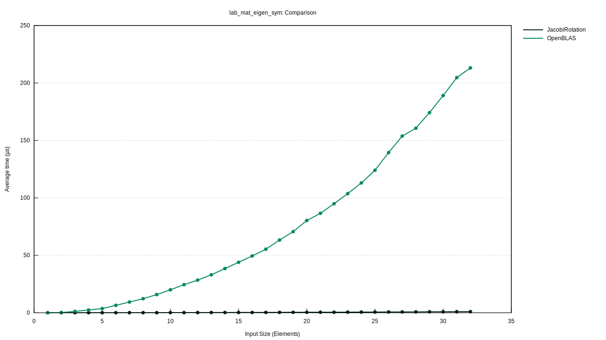

# Russell - Rust Scientific Library

[](https://codecov.io/gh/cpmech/russell)


([CC0](http://creativecommons.org/publicdomain/zero/1.0/deed.en). Photo: [Bertrand Russell](https://en.wikipedia.org/wiki/Bertrand_Russell))

**Russell** (Rust Scientific Library) assists in developing scientific computations using the Rust language. Our initial focus is on numerical methods and solvers for sparse linear systems and differential equations; however, anything is possible 😉.

The "main" crate here is [russell_lab](https://github.com/cpmech/russell/tree/main/russell_lab), a **mat**rix-vector **lab**oratory, which provides the fundamental `Vector` and `Matrix` structures and several functions to perform linear algebra computations. Thus, we recommend looking at [russell_lab](https://github.com/cpmech/russell/tree/main/russell_lab) first.

The next interesting crate is [russell_sparse](https://github.com/cpmech/russell/tree/main/russell_sparse), which implements sparse matrix structures such as COO (coordinates), CSC (compressed sparse column), and CSR (compressed sparse row) formats. `russell_sparse` also wraps powerful linear system solvers such as [UMFPACK](https://github.com/DrTimothyAldenDavis/SuiteSparse) and [MUMPS](https://mumps-solver.org).

This library aims to wrap the best solutions (e.g., UMFPACK) while maintaining a very **clean** and idiomatic Rust code. See our TODO list in [Appendix A](#todo) and some benchmarking results in [Appendix B](#benchmarks) below. The code must also be simple to use and thoroughly tested with a minimum coverage of 95%; see [Appendix C](#coverage) below.

Available crates:

- [](https://crates.io/crates/russell_lab) [lab (main)](https://github.com/cpmech/russell/tree/main/russell_lab) Matrix-vector laboratory including linear algebra tools (with OpenBLAS or Intel MKL)
- [](https://crates.io/crates/russell_sparse) [sparse](https://github.com/cpmech/russell/tree/main/russell_sparse) Sparse matrix tools and solvers (with MUMPS, UMFPACK, and Intel DSS)
- [](https://crates.io/crates/russell_stat) [stat](https://github.com/cpmech/russell/tree/main/russell_stat) Statistics calculations, probability distributions, and pseudo random numbers
- [](https://crates.io/crates/russell_tensor) [tensor](https://github.com/cpmech/russell/tree/main/russell_tensor) Tensor analysis structures and functions for continuum mechanics

External recommended/associated crates:

- [plotpy](https://github.com/cpmech/plotpy) Plotting tools using Python3/Matplotlib as an engine (for quality graphics)
- [tritet](https://github.com/cpmech/tritet) Triangle and tetrahedron mesh generators (with Triangle and Tetgen)
- [gemlab](https://github.com/cpmech/gemlab) Geometry, meshes, and numerical integration for finite element analyses

## Examples

### Compute a singular value decomposition

```rust
use russell_lab::{mat_svd, Matrix, Vector, StrError};

fn main() -> Result<(), StrError> {
    // set matrix
    let mut a = Matrix::from(&[
        [2.0, 4.0],
        [1.0, 3.0],
        [0.0, 0.0],
        [0.0, 0.0],
    ]);

    // allocate output structures
    let (m, n) = a.dims();
    let min_mn = if m < n { m } else { n };
    let mut s = Vector::new(min_mn);
    let mut u = Matrix::new(m, m);
    let mut vt = Matrix::new(n, n);

    // perform SVD
    mat_svd(&mut s, &mut u, &mut vt, &mut a)?;

    // check S
    let s_correct = "┌      ┐\n\
                     │ 5.46 │\n\
                     │ 0.37 │\n\
                     └      ┘";
    assert_eq!(format!("{:.2}", s), s_correct);

    // check SVD: a == u * s * vt
    let mut usv = Matrix::new(m, n);
    for i in 0..m {
        for j in 0..n {
            for k in 0..min_mn {
                usv.add(i, j, u.get(i, k) * s[k] * vt.get(k, j));
            }
        }
    }
    let usv_correct = "┌                   ┐\n\
                       │ 2.000000 4.000000 │\n\
                       │ 1.000000 3.000000 │\n\
                       │ 0.000000 0.000000 │\n\
                       │ 0.000000 0.000000 │\n\
                       └                   ┘";
    assert_eq!(format!("{:.6}", usv), usv_correct);
    Ok(())
}
```

### Solve a tiny (dense) linear system

```rust
use russell_lab::{solve_lin_sys, Matrix, Vector, StrError};

fn main() -> Result<(), StrError> {
    // set matrix and right-hand side
    let mut a = Matrix::from(&[
        [1.0,  3.0, -2.0],
        [3.0,  5.0,  6.0],
        [2.0,  4.0,  3.0],
    ]);
    let mut b = Vector::from(&[5.0, 7.0, 8.0]);

    // solve linear system b := a⁻¹⋅b
    solve_lin_sys(&mut b, &mut a)?;

    // check
    let x_correct = "┌         ┐\n\
                     │ -15.000 │\n\
                     │   8.000 │\n\
                     │   2.000 │\n\
                     └         ┘";
    assert_eq!(format!("{:.3}", b), x_correct);
    Ok(())
}
```

### Solve a small sparse linear system using UMFPACK

```rust
use russell_lab::*;
use russell_sparse::prelude::*;
use russell_sparse::StrError;

fn main() -> Result<(), StrError> {
    // constants
    let ndim = 5; // number of rows = number of columns
    let nnz = 13; // number of non-zero values, including duplicates

    // allocate solver
    let mut umfpack = SolverUMFPACK::new()?;

    // allocate the coefficient matrix
    //  2  3  .  .  .
    //  3  .  4  .  6
    //  . -1 -3  2  .
    //  .  .  1  .  .
    //  .  4  2  .  1
    let mut coo = SparseMatrix::new_coo(ndim, ndim, nnz, None, false)?;
    coo.put(0, 0, 1.0)?; // << (0, 0, a00/2) duplicate
    coo.put(0, 0, 1.0)?; // << (0, 0, a00/2) duplicate
    coo.put(1, 0, 3.0)?;
    coo.put(0, 1, 3.0)?;
    coo.put(2, 1, -1.0)?;
    coo.put(4, 1, 4.0)?;
    coo.put(1, 2, 4.0)?;
    coo.put(2, 2, -3.0)?;
    coo.put(3, 2, 1.0)?;
    coo.put(4, 2, 2.0)?;
    coo.put(2, 3, 2.0)?;
    coo.put(1, 4, 6.0)?;
    coo.put(4, 4, 1.0)?;

    // parameters
    let mut params = LinSolParams::new();
    params.verbose = false;
    params.compute_determinant = true;

    // call factorize
    umfpack.factorize(&mut coo, Some(params))?;

    // allocate x and rhs
    let mut x = Vector::new(ndim);
    let rhs = Vector::from(&[8.0, 45.0, -3.0, 3.0, 19.0]);

    // calculate the solution
    umfpack.solve(&mut x, &coo, &rhs, false)?;
    println!("x =\n{}", x);

    // check the results
    let correct = vec![1.0, 2.0, 3.0, 4.0, 5.0];
    vec_approx_eq(x.as_data(), &correct, 1e-14);

    // analysis
    let mut stats = StatsLinSol::new();
    umfpack.update_stats(&mut stats);
    let (mx, ex) = (stats.determinant.mantissa, stats.determinant.exponent);
    println!("det(a) = {:?}", mx * f64::powf(10.0, ex));
    println!("rcond  = {:?}", stats.output.umfpack_rcond_estimate);
    Ok(())
}
```

## <a name="todo"></a> Appendix A - Todo list

- [ ] Improve crate `russell_lab`
    - [x] Implement more integration tests for linear algebra
    - [x] Implement more examples
    - [ ] Implement more benchmarks
    - [x] Wrap Intel MKL (option for OpenBLAS)
    - [x] Add more complex numbers functions
    - [ ] Add fundamental functions to `russell_lab`
        - [ ] Implement the modified Bessel functions
    - [ ] Implement some numerical methods in `russell_lab`
        - [ ] Implement Brent's solver
        - [ ] Implement solver for the cubic equation
        - [x] Implement numerical derivation
        - [x] Implement numerical Jacobian function
        - [ ] Implement Newton's method for nonlinear systems
        - [ ] Implement numerical quadrature
    - [ ] Add interpolation and polynomials to `russell_lab`
        - [ ] Implement Chebyshev interpolation and polynomials
        - [ ] Implement Orthogonal polynomials
        - [ ] Implement Lagrange interpolation
    - [ ] Implement FFT
- [x] Improve the `russell_sparse` crate
    - [x] Implement the Compressed Sparse Column format (CSC)
    - [x] Implement the Compressed Sparse Row format (CSC)
    - [x] Improve the C-interface to UMFPACK and MUMPS
    - [x] Implement the C-interface to Intel DSS
    - [ ] Write the conversion from COO to CSC in Rust
    - [ ] Possibly re-write (after benchmarking) the conversion from COO to CSR
    - [ ] Re-study the possibility to wrap SuperLU (see deleted branch)
- [ ] Improve crate `russell_stat`
    - [x] Add probability distribution functions
    - [x] Implement drawing of ASCII histograms
- [ ] Improve the `russell_tensor` crate
    - [x] Implement functions to calculate invariants
    - [x] Implement first and second order derivatives of invariants
    - [x] Implement some high-order derivatives
    - [ ] Implement standard continuum mechanics tensors

## <a name="benchmarks"></a> Appendix B - Benchmarks

### Jacobi Rotation versus LAPACK DSYEV

Comparison of the performances of `mat_eigen_sym_jacobi` (Jacobi rotation) versus `mat_eigen_sym` (calling LAPACK DSYEV).




## <a name="coverage"></a> Appendix C - Code coverage

### Sunburst

The inner-most circle is the entire project, moving away from the center are folders then, finally, a single file. The size and color of each slice is representing the number of statements and the coverage, respectively.


### Grid

Each block represents a single file in the project. The size and color of each block is represented by the number of statements and the coverage, respectively.


### Icicle

The top section represents the entire project. Proceeding with folders and finally individual files. The size and color of each slice is representing the number of statements and the coverage, respectively.


