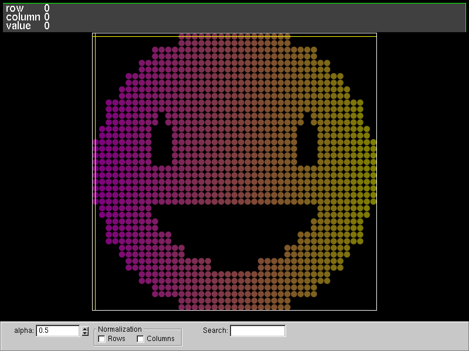
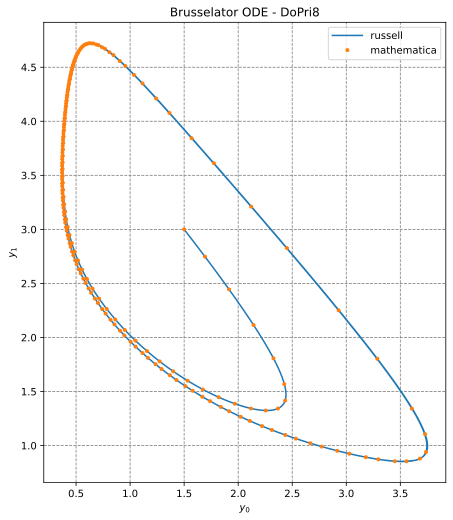
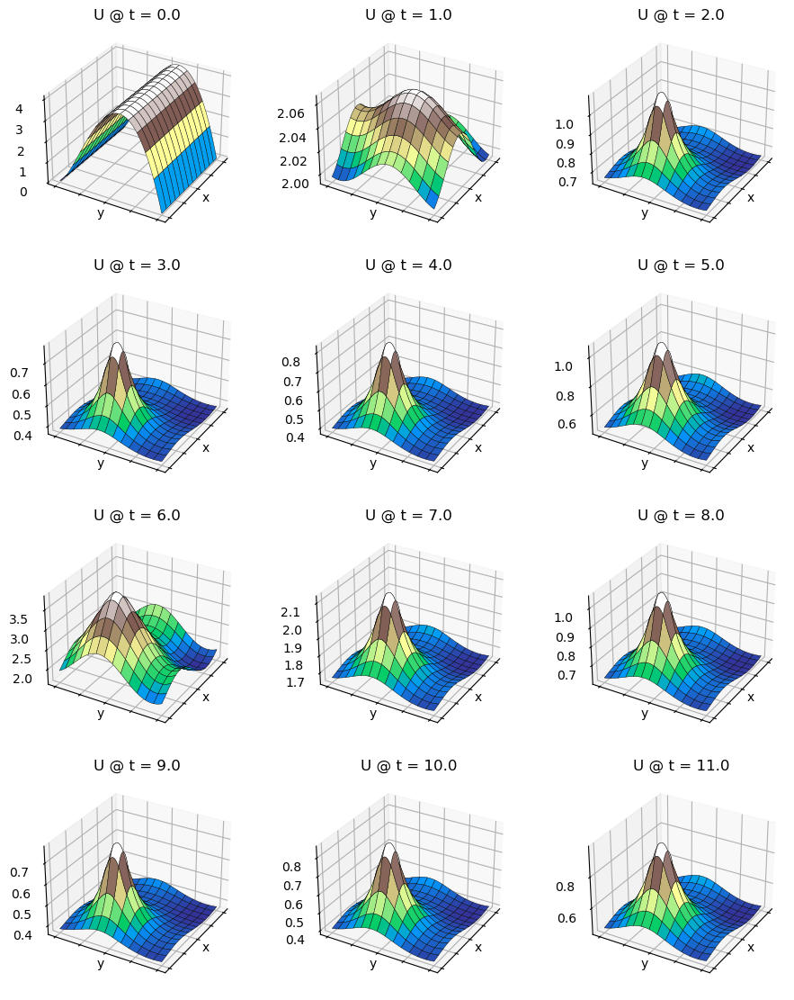
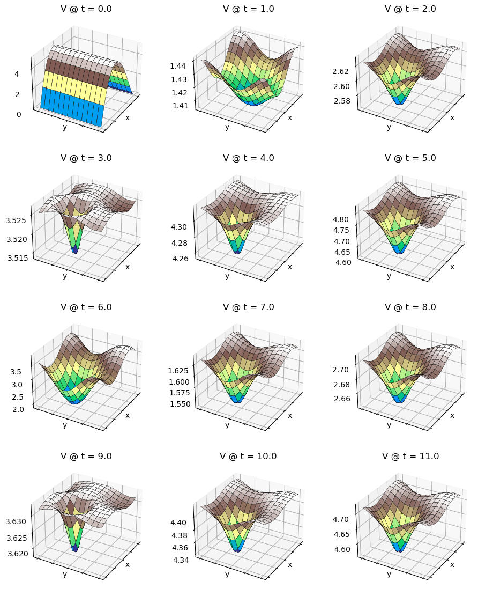
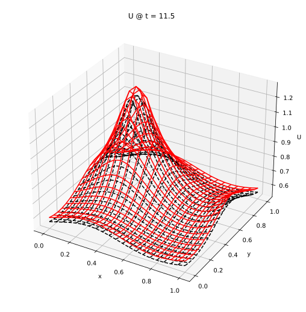
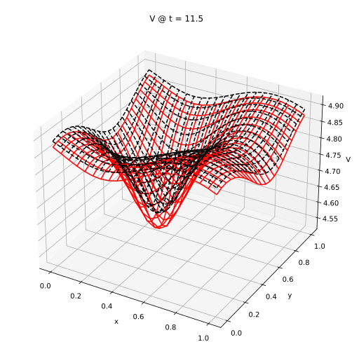

# Russell - Rust Scientific Library <!-- omit from toc --> 

[](https://codecov.io/gh/cpmech/russell)
[](https://github.com/cpmech/russell/actions/workflows/test_and_coverage.yml)
[](https://github.com/cpmech/russell/actions/workflows/test_with_local_libs.yml)
[](https://github.com/cpmech/russell/actions/workflows/test_with_intel_mkl.yml)
[](https://github.com/cpmech/russell/actions/workflows/test_on_arch_linux.yml)
[](https://github.com/cpmech/russell/actions/workflows/test_on_rocky_linux.yml)
[](https://github.com/cpmech/russell/actions/workflows/test_on_macos.yml)

[](https://docs.rs/russell_lab)
[](https://docs.rs/russell_ode)
[](https://docs.rs/russell_sparse)
[](https://docs.rs/russell_stat)
[](https://docs.rs/russell_tensor)


## Contents <!-- omit from toc --> 

- [Introduction](#introduction)
- [Installation](#installation)
  - [Debian/Ubuntu Linux](#debianubuntu-linux)
  - [Rocky Linux](#rocky-linux)
  - [Arch Linux](#arch-linux)
  - [macOS](#macos)
  - [Optional feature "local\_suitesparse"](#optional-feature-local_suitesparse)
  - [Optional feature "with\_mumps"](#optional-feature-with_mumps)
  - [Optional feature "intel\_mkl"](#optional-feature-intel_mkl)
  - [Number of threads](#number-of-threads)
- [Examples](#examples)
  - [(lab) Numerical integration (quadrature)](#lab-numerical-integration-quadrature)
  - [(lab) Solution of PDEs using spectral collocation](#lab-solution-of-pdes-using-spectral-collocation)
  - [(lab) Matrix visualization](#lab-matrix-visualization)
  - [(lab) Singular value decomposition](#lab-singular-value-decomposition)
  - [(lab) Cholesky factorization](#lab-cholesky-factorization)
  - [(lab) Solution of a (dense) linear system](#lab-solution-of-a-dense-linear-system)
  - [(lab) Reading table-formatted data files](#lab-reading-table-formatted-data-files)
  - [(sparse) Solution of a sparse linear system](#sparse-solution-of-a-sparse-linear-system)
  - [(ode) Solution of the Brusselator ODE](#ode-solution-of-the-brusselator-ode)
  - [(ode) Solution of the Brusselator PDE](#ode-solution-of-the-brusselator-pde)
  - [(stat) Generate the Frechet distribution](#stat-generate-the-frechet-distribution)
  - [(tensor) Allocate second-order tensors](#tensor-allocate-second-order-tensors)
- [Roadmap](#roadmap)


## Introduction

**Russell** (Rust Scientific Library) assists in developing high-performance computations involving linear algebra, sparse linear systems, differential equations, statistics, and continuum mechanics using the Rust programming language. The applications built with Russell revolve around the computational mechanics discipline; however, since Russell deals with fundamental mathematics and numerics, it is also helpful for other disciplines.


Available libraries:

- [](https://crates.io/crates/russell_lab) [russell_lab](https://github.com/cpmech/russell/tree/main/russell_lab) Scientific laboratory with special math functions, linear algebra, interpolation, quadrature, numerical derivation, and more
- [](https://crates.io/crates/russell_ode) [russell_ode](https://github.com/cpmech/russell/tree/main/russell_ode) Solvers for ordinary differential equations (ODEs) and differential algebraic equations (DAEs) 
- [](https://crates.io/crates/russell_sparse) [russell_sparse](https://github.com/cpmech/russell/tree/main/russell_sparse) Solvers for large sparse linear systems (wraps MUMPS and UMFPACK)
- [](https://crates.io/crates/russell_stat) [russell_stat](https://github.com/cpmech/russell/tree/main/russell_stat) Statistics calculations and (engineering) probability distributions
- [](https://crates.io/crates/russell_tensor) [russell_tensor](https://github.com/cpmech/russell/tree/main/russell_tensor) Tensor analysis, calculus, and functions for continuum mechanics

👆 Check the crate version and update your Cargo.toml accordingly. Examples:

```toml
[dependencies]
russell_lab = "*"
russell_sparse = "*"
russell_ode = "*"
russell_stat = "*"
russell_tensor = "*"
```

All crates have an option to use [Intel MKL](https://www.intel.com/content/www/us/en/developer/tools/oneapi/onemkl.html) instead of the default [OpenBLAS](https://github.com/OpenMathLib/OpenBLAS). For instance, the `features` keyword may be configured as follows:


```toml
[dependencies]
russell_lab = { version = "*", features = ["intel_mkl"] }
russell_sparse = { version = "*", features = ["intel_mkl"] }
russell_ode = { version = "*", features = ["intel_mkl"] }
russell_stat = { version = "*", features = ["intel_mkl"] }
russell_tensor = { version = "*", features = ["intel_mkl"] }
```

External associated and recommended crates:

- [plotpy](https://github.com/cpmech/plotpy) Plotting tools using Python3/Matplotlib as an engine (for quality graphics)
- [tritet](https://github.com/cpmech/tritet) Triangle and tetrahedron mesh generators (with Triangle and Tetgen)
- [gemlab](https://github.com/cpmech/gemlab) Geometry, meshes, and numerical integration for finite element analyses


## Installation

Russell requires some non-Rust libraries (e.g., [OpenBLAS](https://github.com/OpenMathLib/OpenBLAS), [Intel MKL](https://www.intel.com/content/www/us/en/developer/tools/oneapi/onemkl.html), [MUMPS](https://mumps-solver.org), [SuiteSparse](https://github.com/DrTimothyAldenDavis/SuiteSparse)) to achieve the max performance. These libraries can be installed as explained in each subsection next.

After installing the dependencies, you may add each crate using:

```bash
cargo add russell_lab
cargo add russell_sparse # etc.
```

### Debian/Ubuntu Linux

Required libraries:

```bash
# install libraries for russell
sudo apt-get update -y && \
sudo apt-get install -y --no-install-recommends \
    liblapacke-dev \
    libopenblas-dev \
    libsuitesparse-dev
```

### Rocky Linux

Required libraries:

```bash
# initialize
dnf update -y
dnf install epel-release -y
crb enable

# required by rust
dnf install cmake gcc make curl clang -y

# install libraries for russell
dnf install -y \
  lapack-devel \
  openblas-devel \
  suitesparse-devel
```

### Arch Linux

Required libraries:

```bash
# install libraries for russell
yay -Y --gendb --noconfirm && yay -Y --devel --save
yay -Syu blas-openblas --noconfirm
yay -Syu suitesparse --noconfirm
```

### macOS

First, install [Homebrew](https://brew.sh/). Then, run:

```bash
brew install lapack openblas suite-sparse
```

### Optional feature "local_suitesparse"

`russell_sparse` allows the use of a locally compiled SuiteSparse, installed in `/usr/local/include/suitesparse` and `/usr/local/lib/suitesparse`. This option is defined by the `local_suitesparse` feature. The [compile-and-install-suitesparse](https://github.com/cpmech/russell/blob/main/zscripts/compile-and-install-suitesparse.bash) script may be used in this case:

```bash
bash zscripts/compile-and-install-suitesparse.bash
```

### Optional feature "with_mumps"

`russell_sparse` has an optional feature named `with_mumps` which enables the MUMPS solver. To use this feature, MUMPS needs to be locally compiled first. The [compile-and-install-mumps](https://github.com/cpmech/russell/blob/main/zscripts/compile-and-install-mumps.bash) script may be used in this case:

```bash
bash zscripts/compile-and-install-mumps.bash
```

### Optional feature "intel_mkl"

To enable Intel MKL (and disable OpenBLAS), the optional `intel_mkl` feature may be used. In this case SuiteSparse (and MUMPS) must be locally compiled (with Intel MKL). This step can be easily accomplished by the [compile-and-install-suitesparse](https://github.com/cpmech/russell/blob/main/zscripts/compile-and-install-suitesparse.bash) and [compile-and-install-mumps](https://github.com/cpmech/russell/blob/main/zscripts/compile-and-install-mumps.bash) scripts, called with the **mkl** argument. For example:

```bash
bash zscripts/compile-and-install-suitesparse.bash mkl
bash zscripts/compile-and-install-mumps.bash mkl
```

### Number of threads

By default, OpenBLAS will use all available threads, including Hyper-Threads that may worsen the performance. Thus, it is recommended to set the following environment variable:

```bash
export OPENBLAS_NUM_THREADS=<real-core-number>
```

Substitute `<real-core-number>` with the correct value from your system.

Furthermore, if working on a multi-threaded application where the solver should not be multi-threaded on its own (e.g., running parallel calculations in an optimization tool), you may set:

```bash
export OPENBLAS_NUM_THREADS=1
```


## Examples

See also:

* [russell_lab/examples](https://github.com/cpmech/russell/tree/main/russell_lab/examples)
* [russell_sparse/examples](https://github.com/cpmech/russell/tree/main/russell_sparse/examples)
* [russell_ode/examples](https://github.com/cpmech/russell/tree/main/russell_ode/examples)
* [russell_stat/examples](https://github.com/cpmech/russell/tree/main/russell_stat/examples)
* [russell_tensor/examples](https://github.com/cpmech/russell/tree/main/russell_tensor/examples)


### (lab) Numerical integration (quadrature)

The code below approximates the area of a semicircle of unitary radius.

```rust
use russell_lab::math::PI;
use russell_lab::{approx_eq, Quadrature, StrError};

fn main() -> Result<(), StrError> {
    let mut quad = Quadrature::new();
    let args = &mut 0;
    let (a, b) = (-1.0, 1.0);
    let (area, stats) = quad.integrate(a, b, args, |x, _| Ok(f64::sqrt(1.0 - x * x)))?;
    println!("\narea = {}", area);
    println!("\n{}", stats);
    approx_eq(area, PI / 2.0, 1e-13);
    Ok(())
}
```


### (lab) Solution of PDEs using spectral collocation

This example illustrates the solution of a 1D PDE using the spectral collocation method. It employs the InterpLagrange struct.

```text
d²u     du          x
——— - 4 —— + 4 u = e  + C
dx²     dx

    -4 e
C = ——————
    1 + e²

x ∈ [-1, 1]
```

Boundary conditions:

```text
u(-1) = 0  and  u(1) = 0
```

Reference solution:

```text
        x   sinh(1)  2x   C
u(x) = e  - ——————— e   + —
            sinh(2)       4
```

[See the code](https://github.com/cpmech/russell/tree/main/russell_lab/examples/algo_lorene_1d_pde_spectral_collocation.rs)

Results:


### (lab) Matrix visualization

We can use the fantastic tool named [vismatrix](https://github.com/cpmech/vismatrix/) to visualize the pattern of non-zero values of a matrix. With `vismatrix`, we can click on each circle and investigate the numeric values as well.

The function `mat_write_vismatrix` writes the input data file for `vismatrix`.

[See the code](https://github.com/cpmech/russell/tree/main/russell_lab/examples/matrix_visualization.rs)

After generating the "dot-smat" file, run the following command:

```bash
vismatrix /tmp/russell_lab/matrix_visualization.smat
```

Output:




### (lab) Singular value decomposition

```rust
use russell_lab::{mat_svd, Matrix, Vector, StrError};

fn main() -> Result<(), StrError> {
    // set matrix
    let mut a = Matrix::from(&[
        [2.0, 4.0],
        [1.0, 3.0],
        [0.0, 0.0],
        [0.0, 0.0],
    ]);

    // allocate output structures
    let (m, n) = a.dims();
    let min_mn = if m < n { m } else { n };
    let mut s = Vector::new(min_mn);
    let mut u = Matrix::new(m, m);
    let mut vt = Matrix::new(n, n);

    // perform SVD
    mat_svd(&mut s, &mut u, &mut vt, &mut a)?;

    // check S
    let s_correct = "┌      ┐\n\
                     │ 5.46 │\n\
                     │ 0.37 │\n\
                     └      ┘";
    assert_eq!(format!("{:.2}", s), s_correct);

    // check SVD: a == u * s * vt
    let mut usv = Matrix::new(m, n);
    for i in 0..m {
        for j in 0..n {
            for k in 0..min_mn {
                usv.add(i, j, u.get(i, k) * s[k] * vt.get(k, j));
            }
        }
    }
    let usv_correct = "┌                   ┐\n\
                       │ 2.000000 4.000000 │\n\
                       │ 1.000000 3.000000 │\n\
                       │ 0.000000 0.000000 │\n\
                       │ 0.000000 0.000000 │\n\
                       └                   ┘";
    assert_eq!(format!("{:.6}", usv), usv_correct);
    Ok(())
}
```


### (lab) Cholesky factorization

```rust
use russell_lab::*;

fn main() -> Result<(), StrError> {
    // set matrix (full)
    #[rustfmt::skip]
    let a_full = Matrix::from(&[
        [ 3.0, 0.0,-3.0, 0.0],
        [ 0.0, 3.0, 1.0, 2.0],
        [-3.0, 1.0, 4.0, 1.0],
        [ 0.0, 2.0, 1.0, 3.0],
    ]);

    // set matrix (lower)
    #[rustfmt::skip]
    let mut a_lower = Matrix::from(&[
        [ 3.0, 0.0, 0.0, 0.0],
        [ 0.0, 3.0, 0.0, 0.0],
        [-3.0, 1.0, 4.0, 0.0],
        [ 0.0, 2.0, 1.0, 3.0],
    ]);

    // set matrix (upper)
    #[rustfmt::skip]
    let mut a_upper = Matrix::from(&[
        [3.0, 0.0,-3.0, 0.0],
        [0.0, 3.0, 1.0, 2.0],
        [0.0, 0.0, 4.0, 1.0],
        [0.0, 0.0, 0.0, 3.0],
    ]);

    // perform Cholesky factorization (lower)
    mat_cholesky(&mut a_lower, false)?;
    let l = &a_lower;

    // perform Cholesky factorization (upper)
    mat_cholesky(&mut a_upper, true)?;
    let u = &a_upper;

    // check:  l ⋅ lᵀ = a
    let m = a_full.nrow();
    let mut l_lt = Matrix::new(m, m);
    for i in 0..m {
        for j in 0..m {
            for k in 0..m {
                l_lt.add(i, j, l.get(i, k) * l.get(j, k));
            }
        }
    }
    mat_approx_eq(&l_lt, &a_full, 1e-14);

    // check:   uᵀ ⋅ u = a
    let mut ut_u = Matrix::new(m, m);
    for i in 0..m {
        for j in 0..m {
            for k in 0..m {
                ut_u.add(i, j, u.get(k, i) * u.get(k, j));
            }
        }
    }
    mat_approx_eq(&ut_u, &a_full, 1e-14);
    Ok(())
}
```


### (lab) Solution of a (dense) linear system

```rust
use russell_lab::{solve_lin_sys, Matrix, Vector, StrError};

fn main() -> Result<(), StrError> {
    // set matrix and right-hand side
    let mut a = Matrix::from(&[
        [1.0,  3.0, -2.0],
        [3.0,  5.0,  6.0],
        [2.0,  4.0,  3.0],
    ]);
    let mut b = Vector::from(&[5.0, 7.0, 8.0]);

    // solve linear system b := a⁻¹⋅b
    solve_lin_sys(&mut b, &mut a)?;

    // check
    let x_correct = "┌         ┐\n\
                     │ -15.000 │\n\
                     │   8.000 │\n\
                     │   2.000 │\n\
                     └         ┘";
    assert_eq!(format!("{:.3}", b), x_correct);
    Ok(())
}
```


### (lab) Reading table-formatted data files

The goal is to read the following file (`clay-data.txt`):

```text
# Fujinomori clay test results

     sr        ea        er   # header
1.00000  -6.00000   0.10000   
2.00000   7.00000   0.20000   
3.00000   8.00000   0.20000   # << look at this line

# comments plus new lines are OK

4.00000   9.00000   0.40000   
5.00000  10.00000   0.50000   

# bye
```

The code below illustrates how to do it.

Each column (`sr`, `ea`, `er`) is accessible via the `get` method of the [HashMap].

```rust
use russell_lab::{read_table, StrError};
use std::collections::HashMap;
use std::env;
use std::path::PathBuf;

fn main() -> Result<(), StrError> {
    // get the asset's full path
    let root = PathBuf::from(env::var("CARGO_MANIFEST_DIR").unwrap());
    let full_path = root.join("data/tables/clay-data.txt");

    // read the file
    let labels = &["sr", "ea", "er"];
    let table: HashMap<String, Vec<f64>> = read_table(&full_path, Some(labels))?;

    // check the columns
    assert_eq!(table.get("sr").unwrap(), &[1.0, 2.0, 3.0, 4.0, 5.0]);
    assert_eq!(table.get("ea").unwrap(), &[-6.0, 7.0, 8.0, 9.0, 10.0]);
    assert_eq!(table.get("er").unwrap(), &[0.1, 0.2, 0.2, 0.4, 0.5]);
    Ok(())
}
```


### (sparse) Solution of a sparse linear system

```rust
use russell_lab::*;
use russell_sparse::prelude::*;
use russell_sparse::StrError;

fn main() -> Result<(), StrError> {
    // constants
    let ndim = 5; // number of rows = number of columns
    let nnz = 13; // number of non-zero values, including duplicates

    // allocate solver
    let mut umfpack = SolverUMFPACK::new()?;

    // allocate the coefficient matrix
    //  2  3  .  .  .
    //  3  .  4  .  6
    //  . -1 -3  2  .
    //  .  .  1  .  .
    //  .  4  2  .  1
    let mut coo = SparseMatrix::new_coo(ndim, ndim, nnz, Sym::No)?;
    coo.put(0, 0, 1.0)?; // << (0, 0, a00/2) duplicate
    coo.put(0, 0, 1.0)?; // << (0, 0, a00/2) duplicate
    coo.put(1, 0, 3.0)?;
    coo.put(0, 1, 3.0)?;
    coo.put(2, 1, -1.0)?;
    coo.put(4, 1, 4.0)?;
    coo.put(1, 2, 4.0)?;
    coo.put(2, 2, -3.0)?;
    coo.put(3, 2, 1.0)?;
    coo.put(4, 2, 2.0)?;
    coo.put(2, 3, 2.0)?;
    coo.put(1, 4, 6.0)?;
    coo.put(4, 4, 1.0)?;

    // parameters
    let mut params = LinSolParams::new();
    params.verbose = false;
    params.compute_determinant = true;

    // call factorize
    umfpack.factorize(&mut coo, Some(params))?;

    // allocate x and rhs
    let mut x = Vector::new(ndim);
    let rhs = Vector::from(&[8.0, 45.0, -3.0, 3.0, 19.0]);

    // calculate the solution
    umfpack.solve(&mut x, &coo, &rhs, false)?;
    println!("x =\n{}", x);

    // check the results
    let correct = vec![1.0, 2.0, 3.0, 4.0, 5.0];
    vec_approx_eq(&x, &correct, 1e-14);

    // analysis
    let mut stats = StatsLinSol::new();
    umfpack.update_stats(&mut stats);
    let (mx, ex) = (stats.determinant.mantissa_real, stats.determinant.exponent);
    println!("det(a) = {:?}", mx * f64::powf(10.0, ex));
    println!("rcond  = {:?}", stats.output.umfpack_rcond_estimate);
    Ok(())
}
```


### (ode) Solution of the Brusselator ODE

The system is:

```text
y0' = 1 - 4 y0 + y0² y1
y1' = 3 y0 - y0² y1

with  y0(x=0) = 3/2  and  y1(x=0) = 3
```

Solving with DoPri8 -- 8(5,3):

```rust
use russell_lab::StrError;
use russell_ode::prelude::*;

fn main() -> Result<(), StrError> {
    // get the ODE system
    let (system, x0, mut y0, mut args, y_ref) = Samples::brusselator_ode();

    // final x
    let x1 = 20.0;

    // solver
    let params = Params::new(Method::DoPri8);
    let mut solver = OdeSolver::new(params, &system)?;

    // enable dense output
    let mut out = Output::new();
    let h_out = 0.01;
    let selected_y_components = &[0, 1];
    out.set_dense_recording(true, h_out, selected_y_components)?;

    // solve the problem
    solver.solve(&mut y0, x0, x1, None, Some(&mut out), &mut args)?;

    // print the results and stats
    println!("y_russell     = {:?}", y0.as_data());
    println!("y_mathematica = {:?}", y_ref.as_data());
    println!("{}", solver.stats());
    Ok(())
}
```

A plot of the (dense) solution is shown below:




### (ode) Solution of the Brusselator PDE

This example solves the Brusselator PDE described in (Hairer E, Wanner G (2002) Solving Ordinary Differential Equations II Stiff and Differential-Algebraic Problems. Second Revised Edition. Corrected 2nd printing 2002. Springer Series in Computational Mathematics, 614p).

See the code [brusselator_pde_radau5_2nd.rs](https://github.com/cpmech/russell/tree/main/russell_ode/examples/brusselator_pde_radau5_2nd.rs).

The results are shown below for the `U` field:



And below for the `V` field:



The code [brusselator_pde_2nd_comparison.rs](https://github.com/cpmech/russell/tree/main/russell_ode/examples/brusselator_pde_2nd_comparison.rs) compares `russell` results with Mathematica results.

The figure below shows the `russell` (black dashed lines) and Mathematica (red solid lines) results for the `U` field:



The figure below shows the `russell` (black dashed lines) and Mathematica (red solid lines) results for the `V` field:




### (stat) Generate the Frechet distribution

Code:

```rust
use russell_stat::*;

fn main() -> Result<(), StrError> {
    // generate samples
    let mut rng = get_rng();
    let dist = DistributionFrechet::new(0.0, 1.0, 1.0)?;
    let nsamples = 10_000;
    let mut data = vec![0.0; nsamples];
    for i in 0..nsamples {
        data[i] = dist.sample(&mut rng);
    }
    println!("{}", statistics(&data));

    // text-plot
    let stations = (0..20).map(|i| (i as f64) * 0.5).collect::<Vec<f64>>();
    let mut hist = Histogram::new(&stations)?;
    hist.count(&data);
    println!("{}", hist);
    Ok(())
}
```

Sample output:

```text
min = 0.11845731988882305
max = 26248.036672205748
mean = 12.268212841918867
std_dev = 312.7131690782321

[  0,0.5) | 1370 🟦🟦🟦🟦🟦🟦🟦🟦🟦🟦🟦🟦🟦🟦🟦🟦🟦
[0.5,  1) | 2313 🟦🟦🟦🟦🟦🟦🟦🟦🟦🟦🟦🟦🟦🟦🟦🟦🟦🟦🟦🟦🟦🟦🟦🟦🟦🟦🟦🟦🟦🟦
[  1,1.5) | 1451 🟦🟦🟦🟦🟦🟦🟦🟦🟦🟦🟦🟦🟦🟦🟦🟦🟦🟦
[1.5,  2) |  971 🟦🟦🟦🟦🟦🟦🟦🟦🟦🟦🟦🟦
[  2,2.5) |  659 🟦🟦🟦🟦🟦🟦🟦🟦
[2.5,  3) |  460 🟦🟦🟦🟦🟦
[  3,3.5) |  345 🟦🟦🟦🟦
[3.5,  4) |  244 🟦🟦🟦
[  4,4.5) |  216 🟦🟦
[4.5,  5) |  184 🟦🟦
[  5,5.5) |  133 🟦
[5.5,  6) |  130 🟦
[  6,6.5) |  115 🟦
[6.5,  7) |  108 🟦
[  7,7.5) |   70 
[7.5,  8) |   75 
[  8,8.5) |   57 
[8.5,  9) |   48 
[  9,9.5) |   59 
      sum = 9008
```


### (tensor) Allocate second-order tensors

```rust
use russell_tensor::*;

fn main() -> Result<(), StrError> {
    // general
    let a = Tensor2::from_matrix(
        &[
            [1.0, SQRT_2 * 2.0, SQRT_2 * 3.0],
            [SQRT_2 * 4.0, 5.0, SQRT_2 * 6.0],
            [SQRT_2 * 7.0, SQRT_2 * 8.0, 9.0],
        ],
        Mandel::General,
    )?;
    assert_eq!(
        format!("{:.1}", a.vec),
        "┌      ┐\n\
         │  1.0 │\n\
         │  5.0 │\n\
         │  9.0 │\n\
         │  6.0 │\n\
         │ 14.0 │\n\
         │ 10.0 │\n\
         │ -2.0 │\n\
         │ -2.0 │\n\
         │ -4.0 │\n\
         └      ┘"
    );

    // symmetric-3D
    let b = Tensor2::from_matrix(
        &[
            [1.0, 4.0 / SQRT_2, 6.0 / SQRT_2],
            [4.0 / SQRT_2, 2.0, 5.0 / SQRT_2],
            [6.0 / SQRT_2, 5.0 / SQRT_2, 3.0],
        ],
        Mandel::Symmetric,
    )?;
    assert_eq!(
        format!("{:.1}", b.vec),
        "┌     ┐\n\
         │ 1.0 │\n\
         │ 2.0 │\n\
         │ 3.0 │\n\
         │ 4.0 │\n\
         │ 5.0 │\n\
         │ 6.0 │\n\
         └     ┘"
    );

    // symmetric-2D
    let c = Tensor2::from_matrix(
        &[[1.0, 4.0 / SQRT_2, 0.0], [4.0 / SQRT_2, 2.0, 0.0], [0.0, 0.0, 3.0]],
        Mandel::Symmetric2D,
    )?;
    assert_eq!(
        format!("{:.1}", c.vec),
        "┌     ┐\n\
         │ 1.0 │\n\
         │ 2.0 │\n\
         │ 3.0 │\n\
         │ 4.0 │\n\
         └     ┘"
    );
    Ok(())
}
```


## Roadmap

- [ ] Improve `russell_lab`
    - [x] Implement more integration tests for linear algebra
    - [x] Implement more examples
    - [ ] Implement more benchmarks
    - [x] Wrap more BLAS/LAPACK functions
        - [x] Implement dggev, zggev, zheev, and zgeev
    - [x] Wrap Intel MKL (option for OpenBLAS)
    - [x] Add more complex number functions
    - [x] Add fundamental functions to `russell_lab`
        - [x] Implement the Bessel functions
        - [x] Implement the modified Bessel functions
        - [x] Implement the elliptical integral functions
        - [x] Implement Beta, Gamma and Erf functions (and associated)
        - [ ] Implement orthogonal polynomial functions
    - [ ] Implement some numerical methods in `russell_lab`
        - [x] Implement Brent's solver
        - [ ] Implement a solver for the cubic equation
        - [x] Implement numerical derivation
        - [x] Implement numerical Jacobian function
        - [ ] Implement line search
        - [ ] Implement Newton's method for nonlinear systems
        - [x] Implement numerical quadrature
        - [ ] Implement multidimensional data interpolation
    - [ ] Add interpolation and polynomials to `russell_lab`
        - [x] Implement Chebyshev polynomials
        - [ ] Implement Chebyshev interpolation
        - [ ] Implement Orthogonal polynomials
        - [x] Implement Lagrange interpolation
        - [ ] Implement Fourier interpolation
- [x] Improve `russell_sparse`
    - [x] Wrap the KLU solver (in addition to MUMPS and UMFPACK)
    - [x] Implement the Compressed Sparse Column format (CSC)
    - [x] Implement the Compressed Sparse Row format (CSC)
    - [x] Improve the C-interface to UMFPACK and MUMPS
    - [x] Write the conversion from COO to CSC in Rust
- [x] Improve `russell_ode`
    - [x] Implement explicit Runge-Kutta solvers
    - [x] Implement Radau5 for DAEs
    - [ ] Implement extrapolation methods
    - [ ] Implement multi-step methods
    - [ ] Implement general linear methods
- [ ] Improve `russell_stat`
    - [x] Add probability distribution functions
    - [x] Implement drawing of ASCII histograms
    - [ ] Implement FORM (first-order reliability method)
    - [ ] Add more examples
- [ ] Improve `russell_tensor`
    - [x] Implement functions to calculate invariants
    - [x] Implement first and second-order derivatives of invariants
    - [x] Implement some high-order derivatives
    - [ ] Implement standard continuum mechanics tensors
- [ ] General improvements
    - [x] Compile on macOS
    - [ ] Study the possibility to install Russell on Windows
