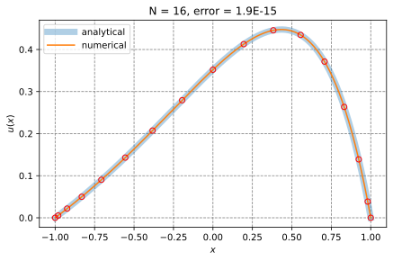
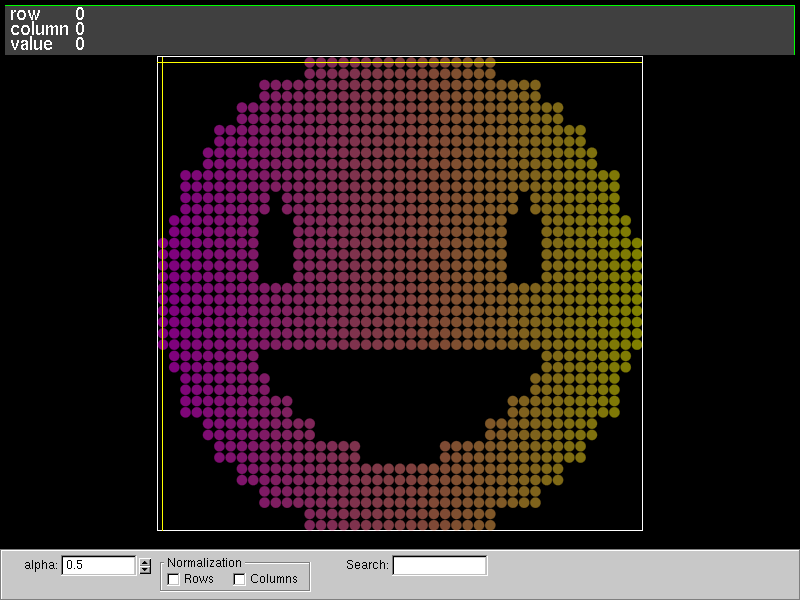
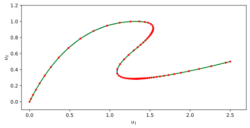
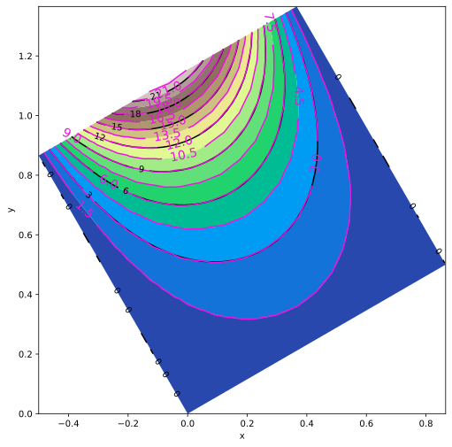

# Russell - Rust Scientific Library <!-- omit from toc --> 

<h1 align="center">
  <a href="https://github.com/cpmech/russell"></a>
<br>
</h1>

<p align="center">
  <b>Numerical mathematics, numerical continuation, differential equations, special math functions, high-performance (sparse) linear algebra, statistics.</b><br />
</p>

---

[](https://codecov.io/gh/cpmech/russell)
[](https://www.trackawesomelist.com/rust-unofficial/awesome-rust/)

---

[](https://github.com/cpmech/russell/actions/workflows/arch.yml)
[](https://github.com/cpmech/russell/actions/workflows/ubuntu.yml)
[](https://github.com/cpmech/russell/actions/workflows/rocky.yml)
[](https://github.com/cpmech/russell/actions/workflows/macos.yml)
[](https://github.com/cpmech/russell/actions/workflows/windows.yml)

---

[](https://docs.rs/russell_lab)
[](https://docs.rs/russell_nonlin)
[](https://docs.rs/russell_ode)
[](https://docs.rs/russell_pde)
[](https://docs.rs/russell_sparse)
[](https://docs.rs/russell_stat)
[](https://docs.rs/russell_tensor)

---

## Contents <!-- omit from toc --> 

- [Introduction](#introduction)
  - [Features](#features)
  - [External associated and recommended crates](#external-associated-and-recommended-crates)
  - [Crates overview](#crates-overview)
  - [Code style](#code-style)
- [Installation](#installation)
  - [Arch Linux](#arch-linux)
    - [Option 1: (default) OpenBLAS and SuiteSparse from the package manager](#option-1-default-openblas-and-suitesparse-from-the-package-manager)
    - [Option 2: Locally compiled SuiteSparse and MUMPS with OpenBLAS](#option-2-locally-compiled-suitesparse-and-mumps-with-openblas)
    - [Option 3: Locally compiled SuiteSparse and MUMPS with Intel MKL](#option-3-locally-compiled-suitesparse-and-mumps-with-intel-mkl)
  - [Debian/Ubuntu Linux](#debianubuntu-linux)
    - [Option 1: (default) OpenBLAS and SuiteSparse from the package manager](#option-1-default-openblas-and-suitesparse-from-the-package-manager-1)
    - [Option 2: Locally compiled SuiteSparse and MUMPS with OpenBLAS](#option-2-locally-compiled-suitesparse-and-mumps-with-openblas-1)
    - [Option 3: Locally compiled SuiteSparse and MUMPS with Intel MKL](#option-3-locally-compiled-suitesparse-and-mumps-with-intel-mkl-1)
  - [Rocky Linux](#rocky-linux)
    - [Option 1: (default) OpenBLAS and SuiteSparse from the package manager](#option-1-default-openblas-and-suitesparse-from-the-package-manager-2)
  - [macOS](#macos)
    - [Option 1: (default) OpenBLAS and SuiteSparse from the package manager](#option-1-default-openblas-and-suitesparse-from-the-package-manager-3)
  - [Windows](#windows)
  - [Number of threads](#number-of-threads)
- [🌟 Examples](#-examples)
  - [(lab) Numerical integration (quadrature)](#lab-numerical-integration-quadrature)
  - [(lab) Solution of PDEs using spectral collocation](#lab-solution-of-pdes-using-spectral-collocation)
  - [(lab) Matrix visualization](#lab-matrix-visualization)
  - [(lab) Singular value decomposition](#lab-singular-value-decomposition)
  - [(lab) Cholesky factorization](#lab-cholesky-factorization)
  - [(lab) Solution of a (dense) linear system](#lab-solution-of-a-dense-linear-system)
  - [(lab) Reading table-formatted data files](#lab-reading-table-formatted-data-files)
  - [(lab) Line search for optimization](#lab-line-search-for-optimization)
  - [(nonlin) Numerical continuation of a B-spline curve](#nonlin-numerical-continuation-of-a-b-spline-curve)
  - [(sparse) Solution of a sparse linear system](#sparse-solution-of-a-sparse-linear-system)
  - [(ode) Solution of the Brusselator ODE](#ode-solution-of-the-brusselator-ode)
  - [(ode) Solution of the Brusselator PDE](#ode-solution-of-the-brusselator-pde)
  - [(pde) Spectral collocation in 2D with transfinite mapping](#pde-spectral-collocation-in-2d-with-transfinite-mapping)
  - [(stat) Generate the Frechet distribution](#stat-generate-the-frechet-distribution)
  - [(tensor) Allocate second-order tensors](#tensor-allocate-second-order-tensors)
- [Roadmap](#roadmap)


## Introduction

**Russell** (Rust Scientific Library) helps develop high-performance computations involving linear algebra, sparse linear systems, numerical mathematics (continuation), differential equations, statistics, and continuum mechanics using the Rust programming language. While applications built with Russell mainly focus on computational mechanics, its foundation in fundamental mathematics and numerics makes it useful for other disciplines as well.

This project aims to deliver efficient, reliable, and easy-to-maintain code. To support this, Russell includes unit and integration tests, with test coverage required to be over 95%. For better code maintenance, Russell avoids overly complex Rust constructions. However, it still makes use of Rust features such as generics, traits, enums, options, and results. Another goal of Russell is to provide examples of all computations in the documentation to assist users and developers.

This project is split into the following crates:

- [](https://crates.io/crates/russell_lab) [russell_lab](https://github.com/cpmech/russell/tree/main/russell_lab) Scientific laboratory with special math functions, linear algebra, interpolation, quadrature, numerical derivation, and more
- [](https://crates.io/crates/russell_nonlin) [russell_nonlin](https://github.com/cpmech/russell/tree/main/russell_nonlin) Numerical Continuation methods to solve nonlinear systems of equations
- [](https://crates.io/crates/russell_ode) [russell_ode](https://github.com/cpmech/russell/tree/main/russell_ode) Solvers for ordinary differential equations (ODEs) and differential algebraic equations (DAEs) 
- [](https://crates.io/crates/russell_pde) [russell_pde](https://github.com/cpmech/russell/tree/main/russell_pde) Essential tools to solve partial differential equations; not a full-fledged PDE solver
- [](https://crates.io/crates/russell_sparse) [russell_sparse](https://github.com/cpmech/russell/tree/main/russell_sparse) Solvers for large sparse linear systems (wraps MUMPS and UMFPACK)
- [](https://crates.io/crates/russell_stat) [russell_stat](https://github.com/cpmech/russell/tree/main/russell_stat) Statistics calculations and (engineering) probability distributions
- [](https://crates.io/crates/russell_tensor) [russell_tensor](https://github.com/cpmech/russell/tree/main/russell_tensor) Tensor analysis, calculus, and functions for continuum mechanics

### Features

This project employs [OpenBLAS](https://github.com/OpenMathLib/OpenBLAS) (or [Intel MKL](https://www.intel.com/content/www/us/en/developer/tools/oneapi/onemkl.html)) for linear algebra computations and [SuiteSparse](https://github.com/DrTimothyAldenDavis/SuiteSparse) (or [MUMPS](https://mumps-solver.org)) for the solution of large (sparse) linear systems of equations. See the [Installation](#installation) section for instructions on how to install these libraries on different platforms.

To use Intel MKL, the `intel_mkl` feature must be selected. There is also an option to compile SuiteSparse and MUMPS locally, which may yield better performance. When local compilation is used, the `local_sparse` feature is selected. The table below summarizes the features of each crate:

| Crate            | feature: `intel_mkl` | feature: `local_sparse` |
| ---------------- | :------------------: | :---------------------: |
| `russell_lab`    |          ✓           |                         |
| `russell_nonlin` |          ✓           |            ✓            |
| `russell_ode`    |          ✓           |            ✓            |
| `russell_pde`    |          ✓           |            ✓            |
| `russell_sparse` |          ✓           |            ✓            |
| `russell_stat`   |          ✓           |                         |
| `russell_tensor` |          ✓           |                         |

Below is an example of how to enable the `intel_mkl` and `local_sparse` features with the `russell_sparse` crate in the `Cargo.toml` file:

```toml
[dependencies]
russell_lab = { version = "*", features = ["intel_mkl"] }
russell_sparse = { version = "*", features = ["intel_mkl", "local_sparse"] }
```

Replace "*" with the desired version. Note that `russell_sparse` (and all other crates in this project) require `russell_lab` as a dependency.

### External associated and recommended crates

The following crates are not part of `russell` but are associated with it and recommended:

- [plotpy](https://github.com/cpmech/plotpy) Plotting tools using Python3/Matplotlib as an engine (for quality graphics)
- [tritet](https://github.com/cpmech/tritet) Triangle and tetrahedron mesh generators (with Triangle and Tetgen)
- [gemlab](https://github.com/cpmech/gemlab) Geometry, meshes, and numerical integration for finite element analyses

### Crates overview

| Crate            | Purpose                                                                                                      | Key dependencies                                |
| ---------------- | ------------------------------------------------------------------------------------------------------------ | ----------------------------------------------- |
| `russell_lab`    | Foundation: matrices/vectors (col-major), BLAS/LAPACK, interpolation, quadrature, root-finding, special math | `num-complex`, `serde`                          |
| `russell_sparse` | Sparse linear solvers (UMFPACK, KLU, MUMPS) + COO/CSC/CSR formats                                            | `russell_lab`                                   |
| `russell_stat`   | Probability distributions + statistics (Frechet, Gumbel, Normal, etc.)                                       | `russell_lab`, `rand`                           |
| `russell_tensor` | Continuum mechanics tensors (Mandel basis)                                                                   | `russell_lab`, `serde`                          |
| `russell_pde`    | PDE tools: spectral collocation + finite differences (1D/2D)                                                 | `russell_lab`, `russell_sparse`                 |
| `russell_ode`    | ODE/DAE solvers (DoPri5/8, Radau5, Euler)                                                                    | `russell_lab`, `russell_sparse`, `russell_pde`  |
| `russell_nonlin` | Numerical continuation (natural + pseudo-arclength)                                                          | `russell_lab`, `russell_sparse`, `russell_stat` |

Internal dependency graph (all crates depend on `russell_lab`):

```
russell_lab  <-- fundamental
  ^
  |
  +--- russell_sparse
  +--- russell_stat
  +--- russell_tensor
  +--- russell_pde ----+
  +--- russell_ode ----+--- russell_sparse
  +--- russell_nonlin -+--- russell_sparse, russell_stat
```

### Code style

(This subsection was generated using [DeepSeek](https://www.deepseek.com))

- **Error handling:** `pub type StrError = &'static str;` — simple static string slice used consistently across all crates. No `thiserror` or `anyhow`.
- **Synchronous:** No async runtime; the project is fully synchronous.
- **Testing:** Over 1,000 unit tests per crate. Tests are inline in `#[cfg(test)] mod tests { ... }` blocks at the bottom of source files, plus integration tests in `tests/`. Numeric assertion helpers (`approx_eq`, `vec_approx_eq`, `mat_approx_eq`) validate floating-point results with tolerance. `serial_test` is used for tests that require MUMPS (not thread-safe). Doc-tests run README code examples via `#[cfg(doctest)]`. Coverage target >95% (enforced by CI).
- **Modules:** Flat per-feature module structure under `src/`. Everything re-exported from `lib.rs` via `pub use foo::*`. `prelude` modules in select crates for ergonomic imports.
- **Derives:** `Clone`, `Copy`, `Debug` on small types; `Serialize`/`Deserialize` on data types. Manual `Display` implementations for formatted output.
- **Naming:** `snake_case` functions with domain prefixes (`vec_*`, `mat_*`, `complex_*`); `PascalCase` structs/enums; type aliases for common generics (`Vector = NumVector<f64>`, `Matrix = NumMatrix<f64>`).
- **Logging:** Custom `Logger` struct (no `log`/`tracing` crate). Writes to stdout or file.
- **Build:** `build.rs` with `cc` for C FFI. Feature flags: `intel_mkl` (use Intel MKL instead of OpenBLAS), `local_sparse` (compile SuiteSparse and MUMPS locally).


## Installation

Russell requires some non-Rust libraries ([OpenBLAS](https://github.com/OpenMathLib/OpenBLAS) and [SuiteSparse](https://github.com/DrTimothyAldenDavis/SuiteSparse)) to achieve the maximum performance. These libraries can be installed as explained in each subsection next. Alternatively, [Intel MKL](https://www.intel.com/content/www/us/en/developer/tools/oneapi/onemkl.html) may be used instead of OpenBLAS. In this case, the **feature** named `intel_mkl` must be enabled.

In addition to SuiteSparse (UMFPACK and KLU), the [MUMPS solver](https://mumps-solver.org) may be used as an optional feature. In this case, MUMPS must be locally compiled and installed and the **feature** named `local_sparse` must be enabled. Note that we could possibly use MUMPS from the package manager of your Linux distribution, however, MUMPS is typically only available as an *extra* package and often outdated. Moreover, the distributions do not always provide the *sequential* version (without OpenMPI) of MUMPS which is leaner than the parallel version (not used in this project). Thus, we recommend compiling MUMPS locally. 

It is important to highlight that, when MUMPS is enabled, SuiteSparse must also be compiled locally. This requirement is mostly for convenience and does not cause many problems since the build tools will be required for MUMPS anyway. Furthermore, there is an advantage of having consistency since the linear algebra library (OpenBLAS or Intel MKL) will be the same for both MUMPS and SuiteSparse. 

Note that, while it is possible to use Intel MKL with `russell_lab` and OpenBLAS with `russell_sparse`, this is not advantageous since Intel MKL is slightly more performant than OpenBLAS [(see this article)](https://onlinelibrary.wiley.com/doi/full/10.1002/nme.7545). Thus, if you have already installed Intel MKL, it is easy to compile SuiteSparse and MUMPS (Option 3 below). Thus, we do not consider a fourth option with MKL for `russell_lab` and OpenBLAS for `russell_sparse`.


### Arch Linux

#### Option 1: (default) OpenBLAS and SuiteSparse from the package manager

Run the following command to install OpenBLAS and SuiteSparse:

```bash
pacman -Syu rust blas-openblas suitesparse
```

(no feature flags required in `Cargo.toml`)

#### Option 2: Locally compiled SuiteSparse and MUMPS with OpenBLAS

Run the following commands to compile and install SuiteSparse and MUMPS with OpenBLAS (*use these scripts at your own risk; carefully check the scripts before running them*):

```bash
bash zscripts/arch-compile-mumps.bash 
bash zscripts/arch-compile-suitesparse.bash 
```

Set `Cargo.toml` as follows:

```toml
russell_sparse = { version = "*", features = ["local_sparse"] }
```

#### Option 3: Locally compiled SuiteSparse and MUMPS with Intel MKL

Run the following commands to compile and install SuiteSparse and MUMPS with Intel MKL (*use these scripts at your own risk; carefully check the scripts before running them*):

```bash
bash zscripts/arch-install-intel-toolkit.bash
bash zscripts/arch-compile-mumps.bash 1
bash zscripts/arch-compile-suitesparse.bash 1
```

Set `Cargo.toml` as follows:

```toml
russell_sparse = { version = "*", features = ["intel_mkl", "local_sparse"] }
```


### Debian/Ubuntu Linux

#### Option 1: (default) OpenBLAS and SuiteSparse from the package manager

Run the following command to install OpenBLAS and SuiteSparse:

```bash
sudo apt-get install -y --no-install-recommends \
    liblapacke-dev \
    libopenblas-dev \
    libsuitesparse-dev
```

(no feature flags required in `Cargo.toml`)

#### Option 2: Locally compiled SuiteSparse and MUMPS with OpenBLAS

Run the following commands to compile and install SuiteSparse and MUMPS with OpenBLAS (*use these scripts at your own risk; carefully check the scripts before running them*):

```bash
bash zscripts/debian-compile-mumps.bash 
bash zscripts/debian-compile-suitesparse.bash 
```

Set `Cargo.toml` as follows:

```toml
russell_sparse = { version = "*", features = ["local_sparse"] }
```

#### Option 3: Locally compiled SuiteSparse and MUMPS with Intel MKL

Run the following commands to compile and install SuiteSparse and MUMPS with Intel MKL (*use these scripts at your own risk; carefully check the scripts before running them*):

```bash
bash zscripts/debian-install-intel-toolkit.bash
bash zscripts/debian-compile-mumps.bash 1
bash zscripts/debian-compile-suitesparse.bash 1
```

Set `Cargo.toml` as follows:

```toml
russell_sparse = { version = "*", features = ["intel_mkl", "local_sparse"] }
```


### Rocky Linux

#### Option 1: (default) OpenBLAS and SuiteSparse from the package manager

```bash
dnf update -y
dnf install epel-release -y
crb enable
dnf install -y \
  lapack-devel \
  openblas-devel \
  suitesparse-devel
```

The other options have not been tested yet.


### macOS

First, install [Homebrew](https://brew.sh/).

#### Option 1: (default) OpenBLAS and SuiteSparse from the package manager

```bash
brew install lapack openblas suite-sparse
```

The other options have not been tested yet.


### Windows

The installation process on Windows requires the [MSYS2 environment](https://www.msys2.org), which provides a Unix-like terminal and package manager. After installing MSYS2, you can use the `pacman` package manager to install the necessary libraries.

See [windows.md](https://github.com/cpmech/russell/blob/main/windows.md) for detailed instructions on how to set up the MSYS2 environment and install the required libraries on Windows.


### Number of threads

By default, OpenBLAS will use all available threads, including Hyper-Threads that may worsen the performance. Thus, it is recommended to set the following environment variable:

```bash
export OPENBLAS_NUM_THREADS=<real-core-number>
```

Substitute `<real-core-number>` with the correct value from your system.

Furthermore, if working on a multi-threaded application where the solver should not be multi-threaded on its own (e.g., running parallel calculations in an optimization tool), you may set:

```bash
export OPENBLAS_NUM_THREADS=1
```


## 🌟 Examples

See also:

* [russell_lab/examples](https://github.com/cpmech/russell/tree/main/russell_lab/examples)
* [russell_sparse/examples](https://github.com/cpmech/russell/tree/main/russell_sparse/examples)
* [russell_ode/examples](https://github.com/cpmech/russell/tree/main/russell_ode/examples)
* [russell_stat/examples](https://github.com/cpmech/russell/tree/main/russell_stat/examples)
* [russell_tensor/examples](https://github.com/cpmech/russell/tree/main/russell_tensor/examples)


### (lab) Numerical integration (quadrature)

The code below approximates the area of a semicircle of unitary radius.

```rust
use russell_lab::math::PI;
use russell_lab::{approx_eq, Quadrature, StrError};

fn main() -> Result<(), StrError> {
    let mut quad = Quadrature::new();
    let args = &mut 0;
    let (a, b) = (-1.0, 1.0);
    let (area, stats) = quad.integrate(a, b, args, |x, _| Ok(f64::sqrt(1.0 - x * x)))?;
    println!("\narea = {}", area);
    println!("\n{}", stats);
    approx_eq(area, PI / 2.0, 1e-13);
    Ok(())
}
```


### (lab) Solution of PDEs using spectral collocation

This example illustrates the solution of a 1D PDE using the spectral collocation method. It employs the InterpLagrange struct.

```text
d²u     du          x
——— - 4 —— + 4 u = e  + C
dx²     dx

    -4 e
C = ——————
    1 + e²

x ∈ [-1, 1]
```

Boundary conditions:

```text
u(-1) = 0  and  u(1) = 0
```

Reference solution:

```text
        x   sinh(1)  2x   C
u(x) = e  - ——————— e   + —
            sinh(2)       4
```

[See the code](https://github.com/cpmech/russell/tree/main/russell_lab/examples/algo_lorene_1d_pde_spectral_collocation.rs)

Results:




### (lab) Matrix visualization

We can use the fantastic tool named [vismatrix](https://github.com/cpmech/vismatrix/) to visualize the pattern of non-zero values of a matrix. With `vismatrix`, we can click on each circle and investigate the numeric values as well.

The function `mat_write_vismatrix` writes the input data file for `vismatrix`.

[See the code](https://github.com/cpmech/russell/tree/main/russell_lab/examples/matrix_visualization.rs)

After generating the "dot-smat" file, run the following command:

```bash
vismatrix /tmp/russell_lab/matrix_visualization.smat
```

Output:




### (lab) Singular value decomposition

```rust
use russell_lab::{mat_svd, Matrix, Vector, StrError};

fn main() -> Result<(), StrError> {
    // set matrix
    let mut a = Matrix::from(&[
        [2.0, 4.0],
        [1.0, 3.0],
        [0.0, 0.0],
        [0.0, 0.0],
    ]);

    // allocate output structures
    let (m, n) = a.dims();
    let min_mn = if m < n { m } else { n };
    let mut s = Vector::new(min_mn);
    let mut u = Matrix::new(m, m);
    let mut vt = Matrix::new(n, n);

    // perform SVD
    mat_svd(&mut s, &mut u, &mut vt, &mut a)?;

    // check S
    let s_correct = "┌      ┐\n\
                     │ 5.46 │\n\
                     │ 0.37 │\n\
                     └      ┘";
    assert_eq!(format!("{:.2}", s), s_correct);

    // check SVD: a == u * s * vt
    let mut usv = Matrix::new(m, n);
    for i in 0..m {
        for j in 0..n {
            for k in 0..min_mn {
                usv.add(i, j, u.get(i, k) * s[k] * vt.get(k, j));
            }
        }
    }
    let usv_correct = "┌                   ┐\n\
                       │ 2.000000 4.000000 │\n\
                       │ 1.000000 3.000000 │\n\
                       │ 0.000000 0.000000 │\n\
                       │ 0.000000 0.000000 │\n\
                       └                   ┘";
    assert_eq!(format!("{:.6}", usv), usv_correct);
    Ok(())
}
```


### (lab) Cholesky factorization

```rust
use russell_lab::*;

fn main() -> Result<(), StrError> {
    // set matrix (full)
    #[rustfmt::skip]
    let a_full = Matrix::from(&[
        [ 3.0, 0.0,-3.0, 0.0],
        [ 0.0, 3.0, 1.0, 2.0],
        [-3.0, 1.0, 4.0, 1.0],
        [ 0.0, 2.0, 1.0, 3.0],
    ]);

    // set matrix (lower)
    #[rustfmt::skip]
    let mut a_lower = Matrix::from(&[
        [ 3.0, 0.0, 0.0, 0.0],
        [ 0.0, 3.0, 0.0, 0.0],
        [-3.0, 1.0, 4.0, 0.0],
        [ 0.0, 2.0, 1.0, 3.0],
    ]);

    // set matrix (upper)
    #[rustfmt::skip]
    let mut a_upper = Matrix::from(&[
        [3.0, 0.0,-3.0, 0.0],
        [0.0, 3.0, 1.0, 2.0],
        [0.0, 0.0, 4.0, 1.0],
        [0.0, 0.0, 0.0, 3.0],
    ]);

    // perform Cholesky factorization (lower)
    mat_cholesky(&mut a_lower, false)?;
    let l = &a_lower;

    // perform Cholesky factorization (upper)
    mat_cholesky(&mut a_upper, true)?;
    let u = &a_upper;

    // check:  l ⋅ lᵀ = a
    let m = a_full.nrow();
    let mut l_lt = Matrix::new(m, m);
    for i in 0..m {
        for j in 0..m {
            for k in 0..m {
                l_lt.add(i, j, l.get(i, k) * l.get(j, k));
            }
        }
    }
    mat_approx_eq(&l_lt, &a_full, 1e-14);

    // check:   uᵀ ⋅ u = a
    let mut ut_u = Matrix::new(m, m);
    for i in 0..m {
        for j in 0..m {
            for k in 0..m {
                ut_u.add(i, j, u.get(k, i) * u.get(k, j));
            }
        }
    }
    mat_approx_eq(&ut_u, &a_full, 1e-14);
    Ok(())
}
```


### (lab) Solution of a (dense) linear system

```rust
use russell_lab::{solve_lin_sys, Matrix, Vector, StrError};

fn main() -> Result<(), StrError> {
    // set matrix and right-hand side
    let mut a = Matrix::from(&[
        [1.0,  3.0, -2.0],
        [3.0,  5.0,  6.0],
        [2.0,  4.0,  3.0],
    ]);
    let mut b = Vector::from(&[5.0, 7.0, 8.0]);

    // solve linear system b := a⁻¹⋅b
    solve_lin_sys(&mut b, &mut a)?;

    // check
    let x_correct = "┌         ┐\n\
                     │ -15.000 │\n\
                     │   8.000 │\n\
                     │   2.000 │\n\
                     └         ┘";
    assert_eq!(format!("{:.3}", b), x_correct);
    Ok(())
}
```


### (lab) Reading table-formatted data files

The goal is to read the following file (`clay-data.txt`):

```text
# Fujinomori clay test results

     sr        ea        er   # header
1.00000  -6.00000   0.10000   
2.00000   7.00000   0.20000   
3.00000   8.00000   0.20000   # << look at this line

# comments plus new lines are OK

4.00000   9.00000   0.40000   
5.00000  10.00000   0.50000   

# bye
```

The code below illustrates how to do it.

Each column (`sr`, `ea`, `er`) is accessible via the `get` method of the [HashMap].

```rust
use russell_lab::{read_data, StrError};
use std::env;
use std::path::PathBuf;

fn main() -> Result<(), StrError> {
    // get the asset's full path
    let root = PathBuf::from(env::var("CARGO_MANIFEST_DIR").unwrap());
    let full_path = root.join("data/tables/clay-data.txt");

    // read the file
    let data = read_data(&full_path, &["sr", "ea", "er"])?;

    // check the columns
    assert_eq!(data.get("sr").unwrap(), &[1.0, 2.0, 3.0, 4.0, 5.0]);
    assert_eq!(data.get("ea").unwrap(), &[-6.0, 7.0, 8.0, 9.0, 10.0]);
    assert_eq!(data.get("er").unwrap(), &[0.1, 0.2, 0.2, 0.4, 0.5]);
    Ok(())
}
```


### (lab) Line search for optimization

Line search is used in gradient-based optimization methods to find an appropriate step size.

```rust
use russell_lab::{line_search, LineSearcher, StrError};

fn main() -> Result<(), StrError> {
    // Objective function: f(x) = (1-x)⁴ + (1-x)², minimum at x = 1
    let f = |x: f64, _: &mut ()| {
        let d = x - 1.0;
        Ok(d.powi(4) + d.powi(2))
    };

    let args = &mut ();

    // Starting point: x = 0, f(0) = 2
    // Gradient = -6, direction = 1 (descent direction)
    let x = 0.0;
    let fx = 2.0;
    let direction = 1.0;
    let slope = -6.0; // grad^T * direction

    // Simple interface
    let alpha = line_search(x, direction, fx, slope, args, f)?;
    let x_new = x + alpha * direction;

    // With custom parameters
    let mut searcher = LineSearcher::new();
    searcher.c1 = 1e-3; // Less strict Armijo condition
    let (alpha2, n_iter) = searcher.search(x, direction, fx, slope, args, f)?;
    println!("alpha = {:.4}, iterations = {}", alpha2, n_iter);
    Ok(())
}
```


### (nonlin) Numerical continuation of a B-spline curve

This example traces a B-spline curve defined by `G(u, λ) = 0` using the Pseudo-arclength continuation method.

The nonlinear problem is defined as follows:

```text
G(u, λ) = u - C(λ)
```

where C(λ) is a point on a 2D B-spline curve parametrized by λ ∈ `[0,1]`.

[See the code](https://github.com/cpmech/russell/tree/main/russell_nonlin/examples/arclength_bspline.rs)

The plot looks like this:




### (sparse) Solution of a sparse linear system

```rust
use russell_lab::*;
use russell_sparse::prelude::*;
use russell_sparse::StrError;

fn main() -> Result<(), StrError> {
    // constants
    let ndim = 5; // number of rows = number of columns
    let nnz = 13; // number of non-zero values, including duplicates

    // allocate solver
    let mut umfpack = SolverUMFPACK::new()?;

    // allocate the coefficient matrix
    //  2  3  .  .  .
    //  3  .  4  .  6
    //  . -1 -3  2  .
    //  .  .  1  .  .
    //  .  4  2  .  1
    let mut coo = SparseMatrix::new_coo(ndim, ndim, nnz, Sym::No)?;
    coo.put(0, 0, 1.0)?; // << (0, 0, a00/2) duplicate
    coo.put(0, 0, 1.0)?; // << (0, 0, a00/2) duplicate
    coo.put(1, 0, 3.0)?;
    coo.put(0, 1, 3.0)?;
    coo.put(2, 1, -1.0)?;
    coo.put(4, 1, 4.0)?;
    coo.put(1, 2, 4.0)?;
    coo.put(2, 2, -3.0)?;
    coo.put(3, 2, 1.0)?;
    coo.put(4, 2, 2.0)?;
    coo.put(2, 3, 2.0)?;
    coo.put(1, 4, 6.0)?;
    coo.put(4, 4, 1.0)?;

    // parameters
    let mut params = LinSolParams::new();
    params.verbose = false;
    params.compute_determinant = true;

    // call factorize
    umfpack.factorize(&mut coo, Some(params))?;

    // allocate x and rhs
    let mut x = Vector::new(ndim);
    let rhs = Vector::from(&[8.0, 45.0, -3.0, 3.0, 19.0]);

    // calculate the solution
    umfpack.solve(&mut x, &coo, &rhs, false)?;
    println!("x =\n{}", x);

    // check the results
    let correct = vec![1.0, 2.0, 3.0, 4.0, 5.0];
    vec_approx_eq(&x, &correct, 1e-14);

    // analysis
    let mut stats = StatsLinSol::new();
    umfpack.update_stats(&mut stats);
    let (mx, ex) = (stats.determinant.mantissa_real, stats.determinant.exponent);
    println!("det(a) = {:?}", mx * f64::powf(10.0, ex));
    println!("rcond  = {:?}", stats.output.umfpack_rcond_estimate);
    Ok(())
}
```


### (ode) Solution of the Brusselator ODE

The system is:

```text
y0' = 1 - 4 y0 + y0² y1
y1' = 3 y0 - y0² y1

with  y0(x=0) = 3/2  and  y1(x=0) = 3
```

Solving with DoPri8 -- 8(5,3):

```rust
use russell_lab::StrError;
use russell_ode::prelude::*;

fn main() -> Result<(), StrError> {
    // get the ODE system
    let (system, x0, mut y0, mut args, y_ref) = Samples::brusselator_ode();

    // final x
    let x1 = 20.0;

    // solver
    let params = Params::new(Method::DoPri8);
    let mut solver = OdeSolver::new(params, system)?;

    // enable dense output
    let h_out = 0.01;
    let selected_y_components = &[0, 1];
    solver.enable_output().set_dense_recording(true, h_out, selected_y_components)?;

    // solve the problem
    solver.solve(&mut y0, x0, x1, None, Some(&mut out), &mut args)?;

    // print the results and stats
    println!("y_russell     = {:?}", y0.as_data());
    println!("y_mathematica = {:?}", y_ref.as_data());
    println!("{}", solver.stats());
    Ok(())
}
```

A plot of the (dense) solution is shown below:


### (ode) Solution of the Brusselator PDE

This example solves the Brusselator PDE described in (Hairer E, Wanner G (2002) Solving Ordinary Differential Equations II Stiff and Differential-Algebraic Problems. Second Revised Edition. Corrected 2nd printing 2002. Springer Series in Computational Mathematics, 614p).

See the code [brusselator_pde_radau5_2nd.rs](https://github.com/cpmech/russell/tree/main/russell_ode/examples/brusselator_pde_radau5_2nd.rs).

The results are shown below for the `U` field:


And below for the `V` field:


The code [brusselator_pde_2nd_comparison.rs](https://github.com/cpmech/russell/tree/main/russell_ode/examples/brusselator_pde_2nd_comparison.rs) compares `russell` results with Mathematica results.

The figure below shows the `russell` (black dashed lines) and Mathematica (red solid lines) results for the `U` field:


The figure below shows the `russell` (black dashed lines) and Mathematica (red solid lines) results for the `V` field:


### (pde) Spectral collocation in 2D with transfinite mapping

Example: Solving a 2D Poisson equation on a rotated square domain

This example employs spectral collocation with transfinite mapping to solve the Poisson equation:

```text
  -k · ∇²u = f    on a unit square rotated by angle α
  u = g           on the boundary (Dirichlet conditions)
```

The analytical solution used for verification is:
```text
  u(x,y) = sin(π·x·cos(α) + π·y·sin(α)) · exp(π·y·cos(α) - π·x·sin(α))
```

The domain is mapped from the reference square (r,s) ∈ [-1,1]×[-1,1] to the physical rotated square via transfinite interpolation.

[See the code](https://github.com/cpmech/russell/tree/main/russell_pde/examples/doc_example_spc_map.rs)

The plot looks like this:




### (stat) Generate the Frechet distribution

Code:

```rust
use russell_stat::*;

fn main() -> Result<(), StrError> {
    // generate samples
    let mut rng = get_rng();
    let dist = DistributionFrechet::new(0.0, 1.0, 1.0)?;
    let nsamples = 10_000;
    let mut data = vec![0.0; nsamples];
    for i in 0..nsamples {
        data[i] = dist.sample(&mut rng);
    }
    println!("{}", statistics(&data));

    // text-plot
    let stations = (0..20).map(|i| (i as f64) * 0.5).collect::<Vec<f64>>();
    let mut hist = Histogram::new(&stations)?;
    hist.count(&data);
    println!("{}", hist);
    Ok(())
}
```

Sample output:

```text
min = 0.11845731988882305
max = 26248.036672205748
mean = 12.268212841918867
std_dev = 312.7131690782321

[  0,0.5) | 1370 🟦🟦🟦🟦🟦🟦🟦🟦🟦🟦🟦🟦🟦🟦🟦🟦🟦
[0.5,  1) | 2313 🟦🟦🟦🟦🟦🟦🟦🟦🟦🟦🟦🟦🟦🟦🟦🟦🟦🟦🟦🟦🟦🟦🟦🟦🟦🟦🟦🟦🟦🟦
[  1,1.5) | 1451 🟦🟦🟦🟦🟦🟦🟦🟦🟦🟦🟦🟦🟦🟦🟦🟦🟦🟦
[1.5,  2) |  971 🟦🟦🟦🟦🟦🟦🟦🟦🟦🟦🟦🟦
[  2,2.5) |  659 🟦🟦🟦🟦🟦🟦🟦🟦
[2.5,  3) |  460 🟦🟦🟦🟦🟦
[  3,3.5) |  345 🟦🟦🟦🟦
[3.5,  4) |  244 🟦🟦🟦
[  4,4.5) |  216 🟦🟦
[4.5,  5) |  184 🟦🟦
[  5,5.5) |  133 🟦
[5.5,  6) |  130 🟦
[  6,6.5) |  115 🟦
[6.5,  7) |  108 🟦
[  7,7.5) |   70 
[7.5,  8) |   75 
[  8,8.5) |   57 
[8.5,  9) |   48 
[  9,9.5) |   59 
      sum = 9008
```


### (tensor) Allocate second-order tensors

```rust
use russell_tensor::*;

fn main() -> Result<(), StrError> {
    // general
    let a = Tensor2::from_matrix(
        &[
            [1.0, SQRT_2 * 2.0, SQRT_2 * 3.0],
            [SQRT_2 * 4.0, 5.0, SQRT_2 * 6.0],
            [SQRT_2 * 7.0, SQRT_2 * 8.0, 9.0],
        ],
        Mandel::General,
    )?;
    assert_eq!(
        format!("{:.1}", a.vec),
        "┌      ┐\n\
         │  1.0 │\n\
         │  5.0 │\n\
         │  9.0 │\n\
         │  6.0 │\n\
         │ 14.0 │\n\
         │ 10.0 │\n\
         │ -2.0 │\n\
         │ -2.0 │\n\
         │ -4.0 │\n\
         └      ┘"
    );

    // symmetric-3D
    let b = Tensor2::from_matrix(
        &[
            [1.0, 4.0 / SQRT_2, 6.0 / SQRT_2],
            [4.0 / SQRT_2, 2.0, 5.0 / SQRT_2],
            [6.0 / SQRT_2, 5.0 / SQRT_2, 3.0],
        ],
        Mandel::Symmetric,
    )?;
    assert_eq!(
        format!("{:.1}", b.vec),
        "┌     ┐\n\
         │ 1.0 │\n\
         │ 2.0 │\n\
         │ 3.0 │\n\
         │ 4.0 │\n\
         │ 5.0 │\n\
         │ 6.0 │\n\
         └     ┘"
    );

    // symmetric-2D
    let c = Tensor2::from_matrix(
        &[[1.0, 4.0 / SQRT_2, 0.0], [4.0 / SQRT_2, 2.0, 0.0], [0.0, 0.0, 3.0]],
        Mandel::Symmetric2D,
    )?;
    assert_eq!(
        format!("{:.1}", c.vec),
        "┌     ┐\n\
         │ 1.0 │\n\
         │ 2.0 │\n\
         │ 3.0 │\n\
         │ 4.0 │\n\
         └     ┘"
    );
    Ok(())
}
```


## Roadmap

- [ ] Improve `russell_lab`
    - [x] Implement more integration tests for linear algebra
    - [x] Implement more examples
    - [ ] Implement more performance benchmarks
    - [x] Wrap more BLAS/LAPACK functions
        - [x] Implement dggev, zggev, zheev, and zgeev
    - [x] Wrap Intel MKL (alternative to OpenBLAS)
    - [x] Add more complex number functions
    - [x] Add fundamental functions to `russell_lab`
        - [x] Implement the Bessel functions
        - [x] Implement the modified Bessel functions
        - [x] Implement the elliptical integral functions
        - [x] Implement Beta, Gamma and Erf functions (and associated)
        - [x] Implement orthogonal polynomial functions
    - [ ] Implement some numerical methods in `russell_lab`
        - [x] Implement Brent's solver
        - [x] Implement a solver for the cubic equation
        - [x] Implement numerical derivation
        - [x] Implement numerical Jacobian function
        - [x] Implement line search
        - [x] Implement Newton's method for nonlinear systems
        - [x] Implement numerical quadrature
        - [ ] Implement multidimensional data interpolation
    - [ ] Add interpolation and polynomials to `russell_lab`
        - [x] Implement Chebyshev polynomials
        - [x] Implement Chebyshev interpolation
        - [x] Implement Orthogonal polynomials
        - [x] Implement Lagrange interpolation
        - [ ] Implement Fourier interpolation
- [x] Improve `russell_sparse`
    - [x] Wrap the KLU solver (in addition to MUMPS and UMFPACK)
    - [x] Implement the Compressed Sparse Column format (CSC)
    - [x] Implement the Compressed Sparse Row format (CSR)
    - [x] Improve the C-interface to UMFPACK and MUMPS
    - [x] Write the conversion from COO to CSC in Rust
- [x] Improve `russell_ode`
    - [x] Implement explicit Runge-Kutta solvers
    - [x] Implement Radau5 for DAEs
    - [ ] Implement extrapolation methods
    - [ ] Implement multi-step methods
    - [ ] Implement general linear methods
- [x] Implement `russell_pde`
    - [x] Implement 1D and 2D spectral collocation methods
    - [x] Implement 1D and 2D finite difference methods
- [x] Implement `russell_nonlin`
    - [x] Implement natural continuation for nonlinear systems
    - [x] Implement pseudo-arc-length continuation for nonlinear systems
    - [x] Study better methods for step size control in continuation methods
- [ ] Improve `russell_stat`
    - [x] Add probability distribution functions
    - [x] Implement drawing of ASCII histograms
    - [ ] Implement FORM (first-order reliability method)
    - [ ] Add more examples
- [ ] Improve `russell_tensor`
    - [x] Implement functions to calculate invariants
    - [x] Implement first and second-order derivatives of invariants
    - [x] Implement some high-order derivatives
    - [ ] Implement standard continuum mechanics tensors
- [ ] General improvements
    - [x] Compile on Linux (Arch, Debian/Ubuntu, Rocky)
    - [x] Compile on macOS
    - [x] Compile on Windows
    - [x] Study the compilation of MUMPS on Windows
    - [x] Write scripts to compile on Windows
