# Russell Lab - Scientific laboratory for linear algebra and numerical mathematics <!-- omit from toc --> 

[](https://docs.rs/russell_lab/)


_This crate is part of [Russell - Rust Scientific Library](https://github.com/cpmech/russell)_


## Contents <!-- omit from toc --> 

- [Introduction](#introduction)
  - [Documentation](#documentation)
- [Installation](#installation)
  - [Setting Cargo.toml up](#setting-cargotoml-up)
  - [Optional features](#optional-features)
- [🌟 Examples](#-examples)
  - [Running an example with Intel MKL](#running-an-example-with-intel-mkl)
  - [Sorting small tuples](#sorting-small-tuples)
  - [Check first and second derivatives](#check-first-and-second-derivatives)
  - [Bessel functions](#bessel-functions)
  - [Linear fitting](#linear-fitting)
  - [Chebyshev adaptive interpolation (given function)](#chebyshev-adaptive-interpolation-given-function)
  - [Chebyshev adaptive interpolation (given data)](#chebyshev-adaptive-interpolation-given-data)
  - [Chebyshev adaptive interpolation (given noisy data)](#chebyshev-adaptive-interpolation-given-noisy-data)
  - [Lagrange interpolation](#lagrange-interpolation)
  - [Solution of a 1D PDE using spectral collocation](#solution-of-a-1d-pde-using-spectral-collocation)
  - [Numerical integration: perimeter of ellipse](#numerical-integration-perimeter-of-ellipse)
  - [Finding a local minimum and a root](#finding-a-local-minimum-and-a-root)
  - [Finding all roots in an interval](#finding-all-roots-in-an-interval)
  - [Computing the pseudo-inverse matrix](#computing-the-pseudo-inverse-matrix)
  - [Matrix visualization](#matrix-visualization)
  - [Computing eigenvalues and eigenvectors](#computing-eigenvalues-and-eigenvectors)
  - [Cholesky factorization](#cholesky-factorization)
  - [Read a table-formatted data file](#read-a-table-formatted-data-file)
- [About the column major representation](#about-the-column-major-representation)
- [Benchmarks](#benchmarks)
  - [Chebyshev polynomial evaluation](#chebyshev-polynomial-evaluation)
  - [Jacobi Rotation versus LAPACK DSYEV](#jacobi-rotation-versus-lapack-dsyev)
- [Notes for developers](#notes-for-developers)


## Introduction

This library implements specialized mathematical functions (e.g., Bessel, Erf, Gamma) and functions to perform linear algebra computations (e.g., Matrix, Vector, Matrix-Vector, Eigen-decomposition, SVD). This library also implements a set of helpful function for comparing floating-point numbers, measuring computer time, reading table-formatted data, and more.

The code shall be implemented in *native Rust* code as much as possible. However, light interfaces ("wrappers") are implemented for some of the best tools available in numerical mathematics, including [OpenBLAS](https://github.com/OpenMathLib/OpenBLAS) and [Intel MKL](https://www.intel.com/content/www/us/en/docs/onemkl/developer-reference-c/2023-2/overview.html).

The code is organized in modules:

* `algo` — algorithms that depend on the other modules (e.g, Lagrange interpolation)
* `base` — "base" functionality to help other modules
* `check` — functions to assist in unit and integration testing
* `math` — mathematical (specialized) functions and constants
* `matrix` — [NumMatrix] struct and associated functions
* `matvec` — functions operating on matrices and vectors
* `vector` — [NumVector] struct and associated functions

For linear algebra, the main structures are `NumVector` and `NumMatrix`, that are generic Vector and Matrix structures. The Matrix data is stored as [column-major](#col-major). The `Vector` and `Matrix` are `f64` and `Complex64` aliases of `NumVector` and `NumMatrix`, respectively.

The linear algebra functions currently handle only `(f64, i32)` pairs, i.e., accessing the `(double, int)` C functions. We also consider `(Complex64, i32)` pairs.

There are many functions for linear algebra, such as (for Real and Complex types):

* Vector addition, copy, inner and outer products, norms, and more
* Matrix addition, multiplication, copy, singular-value decomposition, eigenvalues, pseudo-inverse, inverse, norms, and more
* Matrix-vector multiplication, and more
* Solution of dense linear systems with symmetric or non-symmetric coefficient matrices, and more
* Reading writing files, `linspace`, grid generators, Stopwatch, linear fitting, and more
* Checking results, comparing floating point numbers, and verifying the correctness of derivatives; see `russell_lab::check`

### Documentation

* [](https://docs.rs/russell_lab/) — [russell_lab documentation](https://docs.rs/russell_lab/)


## Installation

This crate depends on some non-rust high-performance libraries. [See the main README file for the steps to install these dependencies.](https://github.com/cpmech/russell)


### Setting Cargo.toml up

[](https://crates.io/crates/russell_lab)

👆 Check the crate version and update your Cargo.toml accordingly:

```toml
[dependencies]
russell_lab = "*"
```

### Optional features

The following (Rust) features are available:

* `intel_mkl`: Use Intel MKL instead of OpenBLAS

Note that the [main README file](https://github.com/cpmech/russell) presents the steps to compile the required libraries according to each feature.


## 🌟 Examples

This section illustrates how to use `russell_lab`. See also:

* [More examples on the documentation](https://docs.rs/russell_lab/)
* [Examples directory](https://github.com/cpmech/russell/tree/main/russell_lab/examples)


### Running an example with Intel MKL

Consider the following [code](https://github.com/cpmech/russell/tree/main/russell_lab/examples/base_auxiliary_blas.rs):

```rust
use russell_lab::*;

fn main() -> Result<(), StrError> {
    println!("Using Intel MKL  = {}", using_intel_mkl());
    println!("BLAS num threads = {}", get_num_threads());
    set_num_threads(2);
    println!("BLAS num threads = {}", get_num_threads());
    Ok(())
}
```

First, run the example without Intel MKL (default):

```bash
cargo run --example base_auxiliary_blas
```

The output looks like this:

```text
Using Intel MKL  = false
BLAS num threads = 24
BLAS num threads = 2
```

Second, run the code with the `intel_mkl` feature:

```bash
cargo run --example base_auxiliary_blas --features intel_mk
```

Then, the output looks like this:

```text
Using Intel MKL  = true
BLAS num threads = 24
BLAS num threads = 2
```


### Sorting small tuples

[See the code](https://github.com/cpmech/russell/tree/main/russell_lab/examples/base_sort_small_tuples.rs)

```rust
use russell_lab::base::{sort2, sort3, sort4};
use russell_lab::StrError;

fn main() -> Result<(), StrError> {
    // sorting slices with the standard function
    let mut u2 = vec![2.0, 1.0];
    let mut u3 = vec![3.0, 1.0, 2.0];
    let mut u4 = vec![3.0, 1.0, 4.0, 2.0];
    u2.sort_by(|a, b| a.partial_cmp(b).unwrap());
    u3.sort_by(|a, b| a.partial_cmp(b).unwrap());
    u4.sort_by(|a, b| a.partial_cmp(b).unwrap());
    println!("u2 = {:?}", u2);
    println!("u3 = {:?}", u3);
    println!("u4 = {:?}", u4);
    assert_eq!(&u2, &[1.0, 2.0]);
    assert_eq!(&u3, &[1.0, 2.0, 3.0]);
    assert_eq!(&u4, &[1.0, 2.0, 3.0, 4.0]);

    // sorting small tuples
    let mut v2 = (2.0, 1.0);
    let mut v3 = (3.0, 1.0, 2.0);
    let mut v4 = (3.0, 1.0, 4.0, 2.0);
    sort2(&mut v2);
    sort3(&mut v3);
    sort4(&mut v4);
    println!("v2 = {:?}", v2);
    println!("v3 = {:?}", v3);
    println!("v4 = {:?}", v4);
    assert_eq!(v2, (1.0, 2.0));
    assert_eq!(v3, (1.0, 2.0, 3.0));
    assert_eq!(v4, (1.0, 2.0, 3.0, 4.0));
    Ok(())
}

```


### Check first and second derivatives

Check the implementation of the first and second derivatives of f(x) (illustrated below).

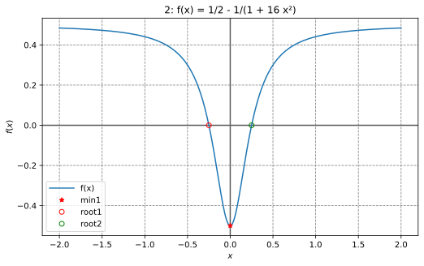

[See the code](https://github.com/cpmech/russell/tree/main/russell_lab/examples/check_1st_and_2nd_derivatives.rs)

```rust
use russell_lab::algo::NoArgs;
use russell_lab::check::{deriv1_approx_eq, deriv2_approx_eq};
use russell_lab::{StrError, Vector};

fn main() -> Result<(), StrError> {
    // f(x)
    let f = |x: f64, _: &mut NoArgs| Ok(1.0 / 2.0 - 1.0 / (1.0 + 16.0 * x * x));

    // g(x) = df/dx(x)
    let g = |x: f64, _: &mut NoArgs| Ok((32.0 * x) / f64::powi(1.0 + 16.0 * f64::powi(x, 2), 2));

    // h(x) = d²f/dx²(x)
    let h = |x: f64, _: &mut NoArgs| {
        Ok((-2048.0 * f64::powi(x, 2)) / f64::powi(1.0 + 16.0 * f64::powi(x, 2), 3)
            + 32.0 / f64::powi(1.0 + 16.0 * f64::powi(x, 2), 2))
    };

    let xx = Vector::linspace(-2.0, 2.0, 9)?;
    let args = &mut 0;
    println!("{:>4}{:>23}{:>23}", "x", "df/dx", "d²f/dx²");
    for x in xx {
        let dfdx = g(x, args)?;
        let d2dfx2 = h(x, args)?;
        println!("{:>4}{:>23}{:>23}", x, dfdx, d2dfx2);
        deriv1_approx_eq(dfdx, x, args, 1e-10, f);
        deriv2_approx_eq(d2dfx2, x, args, 1e-9, f);
    }
    Ok(())
}
```

Output:

```text
   x                  df/dx                d²f/dx²
  -2   -0.01514792899408284  -0.022255803368229403
-1.5   -0.03506208911614317   -0.06759718081851025
  -1   -0.11072664359861592   -0.30612660289029103
-0.5                  -0.64                 -2.816
   0                      0                     32
 0.5                   0.64                 -2.816
   1    0.11072664359861592   -0.30612660289029103
 1.5    0.03506208911614317   -0.06759718081851025
   2    0.01514792899408284  -0.022255803368229403
```


### Bessel functions

Plotting the Bessel J0, J1, and J2 functions:

```rust
use plotpy::{Curve, Plot};
use russell_lab::math::{bessel_j0, bessel_j1, bessel_jn, GOLDEN_RATIO};
use russell_lab::{StrError, Vector};

const OUT_DIR: &str = "/tmp/russell_lab/";

fn main() -> Result<(), StrError> {
    // values
    let xx = Vector::linspace(0.0, 15.0, 101)?;
    let j0 = xx.get_mapped(|x| bessel_j0(x));
    let j1 = xx.get_mapped(|x| bessel_j1(x));
    let j2 = xx.get_mapped(|x| bessel_jn(2, x));
    // plot
    if false { // <<< remove this condition
    let mut curve_j0 = Curve::new();
    let mut curve_j1 = Curve::new();
    let mut curve_j2 = Curve::new();
    curve_j0.set_label("J0").draw(xx.as_data(), j0.as_data());
    curve_j1.set_label("J1").draw(xx.as_data(), j1.as_data());
    curve_j2.set_label("J2").draw(xx.as_data(), j2.as_data());
    let mut plot = Plot::new();
    let path = format!("{}/math_bessel_functions_1.svg", OUT_DIR);
    plot.add(&curve_j0)
        .add(&curve_j1)
        .add(&curve_j2)
        .grid_labels_legend("$x$", "$J_0(x),\\,J_1(x),\\,J_2(x)$")
        .set_figure_size_points(GOLDEN_RATIO * 280.0, 280.0)
        .save(&path)?;
    }
    Ok(())
}
```

Output:

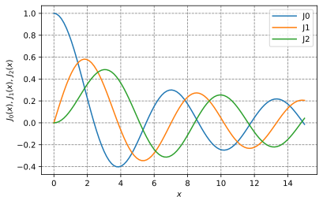


### Linear fitting

Fit a line through a set of points. The line has slope `m` and intercepts the y axis at `x=0` with `y(x=0) = c`.

```rust
use russell_lab::algo::linear_fitting;
use russell_lab::{approx_eq, StrError, Vector};

fn main() -> Result<(), StrError> {
    // model: c is the y value @ x = 0; m is the slope
    let x = Vector::from(&[0.0, 1.0, 3.0, 5.0]);
    let y = Vector::from(&[1.0, 0.0, 2.0, 4.0]);
    let (c, m) = linear_fitting(&x, &y, false)?;
    println!("c = {}, m = {}", c, m);
    approx_eq(c, 0.1864406779661015, 1e-15);
    approx_eq(m, 0.6949152542372882, 1e-15);
    Ok(())
}
```

Results:

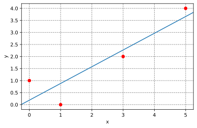


### Chebyshev adaptive interpolation (given function)

This example illustrates the use of `InterpChebyshev` to interpolate data given a function.

[See the code](https://github.com/cpmech/russell/tree/main/russell_lab/examples/algo_interp_chebyshev_adapt.rs)

Results:

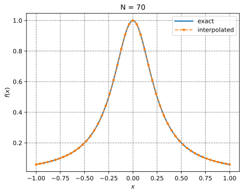


### Chebyshev adaptive interpolation (given data)

This example illustrates the use of `InterpChebyshev` to interpolate discrete data.

[See the code](https://github.com/cpmech/russell/tree/main/russell_lab/examples/algo_interp_chebyshev_data.rs)

Results:

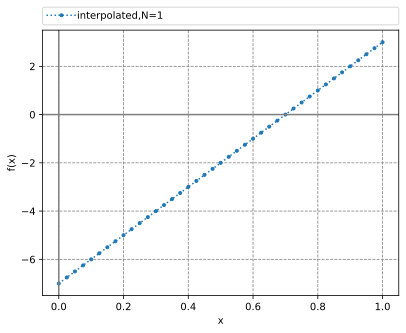


### Chebyshev adaptive interpolation (given noisy data)

This example illustrates the use of `InterpChebyshev` to interpolate noisy data.

[See the code](https://github.com/cpmech/russell/tree/main/russell_lab/examples/algo_interp_chebyshev_noisy_data.rs)

Results:

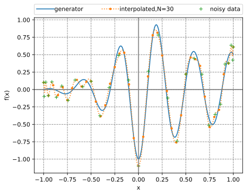


### Lagrange interpolation

This example illustrates the use of `InterpLagrange` with at Chebyshev-Gauss-Lobatto grid to interpolate Runge's equation.

[See the code](https://github.com/cpmech/russell/tree/main/russell_lab/examples/algo_interp_lagrange.rs)

Results:

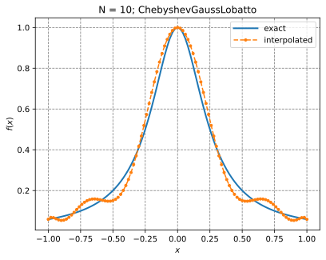


### Solution of a 1D PDE using spectral collocation

This example illustrates the solution of a 1D PDE using the spectral collocation method. It employs the InterpLagrange struct.

```text
d²u     du          x
——— - 4 —— + 4 u = e  + C
dx²     dx

    -4 e
C = ——————
    1 + e²

x ∈ [-1, 1]
```

Boundary conditions:

```text
u(-1) = 0  and  u(1) = 0
```

Reference solution:

```text
        x   sinh(1)  2x   C
u(x) = e  - ——————— e   + —
            sinh(2)       4
```

[See the code](https://github.com/cpmech/russell/tree/main/russell_lab/examples/algo_lorene_1d_pde_spectral_collocation.rs)

Results:


### Numerical integration: perimeter of ellipse

```rust
use russell_lab::algo::Quadrature;
use russell_lab::math::{elliptic_e, PI};
use russell_lab::{approx_eq, StrError};

fn main() -> Result<(), StrError> {
    //  Determine the perimeter P of an ellipse of length 2 and width 1
    //
    //      2π
    //     ⌠   ____________________
    // P = │ \╱ ¼ sin²(θ) + cos²(θ)  dθ
    //     ⌡
    //    0

    let mut quad = Quadrature::new();
    let args = &mut 0;
    let (perimeter, _) = quad.integrate(0.0, 2.0 * PI, args, |theta, _| {
        Ok(f64::sqrt(
            0.25 * f64::powi(f64::sin(theta), 2) + f64::powi(f64::cos(theta), 2),
        ))
    })?;
    println!("\nperimeter = {}", perimeter);

    // complete elliptic integral of the second kind E(0.75)
    let ee = elliptic_e(PI / 2.0, 0.75)?;

    // reference solution
    let ref_perimeter = 4.0 * ee;
    approx_eq(perimeter, ref_perimeter, 1e-14);
    Ok(())
}
```


### Finding a local minimum and a root

This example finds the local minimum between 0.1 and 0.3 and the root between 0.3 and 0.4 for the function illustrated below

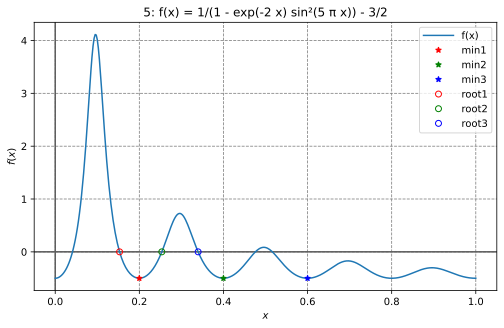

[See the code](https://github.com/cpmech/russell/tree/main/russell_lab/examples/algo_min_and_root_solver_brent.rs)

The output looks like:

```text
x_optimal = 0.20000000003467466

Number of function evaluations   = 18
Number of Jacobian evaluations   = 0
Number of iterations             = 18
Error estimate                   = unavailable
Total computation time           = 6.11µs

x_root = 0.3397874957748173

Number of function evaluations   = 10
Number of Jacobian evaluations   = 0
Number of iterations             = 9
Error estimate                   = unavailable
Total computation time           = 907ns
```


### Finding all roots in an interval

This example employs a Chebyshev interpolant to find all roots of a function in an interval. The method uses adaptive interpolation followed by calculating the eigenvalues of the companion matrix. These eigenvalues equal the roots of the polynomial. After that, a simple Newton refining (polishing) algorithm is applied.

[See the code](https://github.com/cpmech/russell/tree/main/russell_lab/examples/algo_multi_root_solver_cheby.rs)

The output looks like:

```text
N = 184
roots =
┌                     ┐
│ 0.04109147217011577 │
│  0.1530172326889439 │
│ 0.25340124027487965 │
│ 0.33978749525956276 │
│ 0.47590538542276967 │
│  0.5162732673126048 │
└                     ┘
f @ roots =
┌           ┐
│  1.84E-08 │
│ -1.51E-08 │
│ -2.40E-08 │
│  9.53E-09 │
│ -1.16E-08 │
│ -5.80E-09 │
└           ┘
refined roots =
┌                     ┐
│ 0.04109147155278252 │
│ 0.15301723213859994 │
│ 0.25340124149692184 │
│   0.339787495774806 │
│ 0.47590538689192813 │
│  0.5162732665558162 │
└                     ┘
f @ refined roots =
┌           ┐
│  6.66E-16 │
│ -2.22E-16 │
│ -2.22E-16 │
│  1.33E-15 │
│  4.44E-16 │
│ -2.22E-16 │
└           ┘
```

The function and the roots are illustrated in the figure below.


**References**

1. Boyd JP (2002) Computing zeros on a real interval through Chebyshev expansion
   and polynomial rootfinding, SIAM Journal of Numerical Analysis, 40(5):1666-1682
2. Boyd JP (2013) Finding the zeros of a univariate equation: proxy rootfinders,
   Chebyshev interpolation, and the companion matrix, SIAM Journal of Numerical
   Analysis, 55(2):375-396.
3. Boyd JP (2014) Solving Transcendental Equations: The Chebyshev Polynomial Proxy
   and Other Numerical Rootfinders, Perturbation Series, and Oracles, SIAM, pp460


### Computing the pseudo-inverse matrix

```rust
use russell_lab::{mat_pseudo_inverse, Matrix, StrError};

fn main() -> Result<(), StrError> {
    // set matrix
    let mut a = Matrix::from(&[
      [1.0, 0.0], //
      [0.0, 1.0], //
      [0.0, 1.0], //
    ]);
    let a_copy = a.clone();

    // compute pseudo-inverse matrix
    let mut ai = Matrix::new(2, 3);
    mat_pseudo_inverse(&mut ai, &mut a)?;

    // compare with solution
    let ai_correct = "┌                ┐\n\
                      │ 1.00 0.00 0.00 │\n\
                      │ 0.00 0.50 0.50 │\n\
                      └                ┘";
    assert_eq!(format!("{:.2}", ai), ai_correct);

    // compute a ⋅ ai
    let (m, n) = a.dims();
    let mut a_ai = Matrix::new(m, m);
    for i in 0..m {
        for j in 0..m {
            for k in 0..n {
                a_ai.add(i, j, a_copy.get(i, k) * ai.get(k, j));
            }
        }
    }

    // check: a ⋅ ai ⋅ a = a
    let mut a_ai_a = Matrix::new(m, n);
    for i in 0..m {
        for j in 0..n {
            for k in 0..m {
                a_ai_a.add(i, j, a_ai.get(i, k) * a_copy.get(k, j));
            }
        }
    }
    let a_ai_a_correct = "┌           ┐\n\
                          │ 1.00 0.00 │\n\
                          │ 0.00 1.00 │\n\
                          │ 0.00 1.00 │\n\
                          └           ┘";
    assert_eq!(format!("{:.2}", a_ai_a), a_ai_a_correct);
    Ok(())
}
```


### Matrix visualization

We can use the fantastic tool named [vismatrix](https://github.com/cpmech/vismatrix/) to visualize the pattern of non-zero values of a matrix. With `vismatrix`, we can click on each circle and investigate the numeric values as well.

The function `mat_write_vismatrix` writes the input data file for `vismatrix`.

[See the code](https://github.com/cpmech/russell/tree/main/russell_lab/examples/matrix_visualization.rs)

After generating the "dot-smat" file, run the following command:

```bash
vismatrix /tmp/russell_lab/matrix_visualization.smat
```

Output:


### Computing eigenvalues and eigenvectors

```rust
use russell_lab::*;

fn main() -> Result<(), StrError> {
    // set matrix
    let data = [[2.0, 0.0, 0.0], [0.0, 3.0, 4.0], [0.0, 4.0, 9.0]];
    let mut a = Matrix::from(&data);

    // allocate output arrays
    let m = a.nrow();
    let mut l_real = Vector::new(m);
    let mut l_imag = Vector::new(m);
    let mut v_real = Matrix::new(m, m);
    let mut v_imag = Matrix::new(m, m);

    // perform the eigen-decomposition
    mat_eigen(&mut l_real, &mut l_imag, &mut v_real, &mut v_imag, &mut a)?;

    // check results
    assert_eq!(
        format!("{:.1}", l_real),
        "┌      ┐\n\
         │ 11.0 │\n\
         │  1.0 │\n\
         │  2.0 │\n\
         └      ┘"
    );
    assert_eq!(
        format!("{}", l_imag),
        "┌   ┐\n\
         │ 0 │\n\
         │ 0 │\n\
         │ 0 │\n\
         └   ┘"
    );

    // check eigen-decomposition (similarity transformation) of a
    // symmetric matrix with real-only eigenvalues and eigenvectors
    let a_copy = Matrix::from(&data);
    let lam = Matrix::diagonal(l_real.as_data());
    let mut a_v = Matrix::new(m, m);
    let mut v_l = Matrix::new(m, m);
    let mut err = Matrix::filled(m, m, f64::MAX);
    mat_mat_mul(&mut a_v, 1.0, &a_copy, &v_real, 0.0)?;
    mat_mat_mul(&mut v_l, 1.0, &v_real, &lam, 0.0)?;
    mat_add(&mut err, 1.0, &a_v, -1.0, &v_l)?;
    approx_eq(mat_norm(&err, Norm::Max), 0.0, 1e-15);
    Ok(())
}
```


### Cholesky factorization

```rust
use russell_lab::*;

fn main() -> Result<(), StrError> {
    // set matrix
    let sym = 0.0;
    #[rustfmt::skip]
    let mut a = Matrix::from(&[
        [  4.0,   sym,   sym],
        [ 12.0,  37.0,   sym],
        [-16.0, -43.0,  98.0],
    ]);

    // perform factorization
    mat_cholesky(&mut a, false)?;

    // define alias (for convenience)
    let l = &a;

    // compare with solution
    let l_correct = "┌          ┐\n\
                     │  2  0  0 │\n\
                     │  6  1  0 │\n\
                     │ -8  5  3 │\n\
                     └          ┘";
    assert_eq!(format!("{}", l), l_correct);

    // check:  l ⋅ lᵀ = a
    let m = a.nrow();
    let mut l_lt = Matrix::new(m, m);
    for i in 0..m {
        for j in 0..m {
            for k in 0..m {
                l_lt.add(i, j, l.get(i, k) * l.get(j, k));
            }
        }
    }
    let l_lt_correct = "┌             ┐\n\
                        │   4  12 -16 │\n\
                        │  12  37 -43 │\n\
                        │ -16 -43  98 │\n\
                        └             ┘";
    assert_eq!(format!("{}", l_lt), l_lt_correct);
    Ok(())
}
```


### Read a table-formatted data file

The goal is to read the following file (`clay-data.txt`):

```text
# Fujinomori clay test results

     sr        ea        er   # header
1.00000  -6.00000   0.10000   
2.00000   7.00000   0.20000   
3.00000   8.00000   0.20000   # << look at this line

# comments plus new lines are OK

4.00000   9.00000   0.40000   
5.00000  10.00000   0.50000   

# bye
```

The code below illustrates how to do it.

Each column (`sr`, `ea`, `er`) is accessible via the `get` method of the [HashMap].

```rust
use russell_lab::{read_table, StrError};
use std::collections::HashMap;
use std::env;
use std::path::PathBuf;

fn main() -> Result<(), StrError> {
    // get the asset's full path
    let root = PathBuf::from(env::var("CARGO_MANIFEST_DIR").unwrap());
    let full_path = root.join("data/tables/clay-data.txt");

    // read the file
    let labels = &["sr", "ea", "er"];
    let table: HashMap<String, Vec<f64>> = read_table(&full_path, Some(labels))?;

    // check the columns
    assert_eq!(table.get("sr").unwrap(), &[1.0, 2.0, 3.0, 4.0, 5.0]);
    assert_eq!(table.get("ea").unwrap(), &[-6.0, 7.0, 8.0, 9.0, 10.0]);
    assert_eq!(table.get("er").unwrap(), &[0.1, 0.2, 0.2, 0.4, 0.5]);
    Ok(())
}
```


## About the column major representation

Only the COL-MAJOR representation is considered here.

```text
    ┌     ┐  row_major = {0, 3,
    │ 0 3 │               1, 4,
A = │ 1 4 │               2, 5};
    │ 2 5 │
    └     ┘  col_major = {0, 1, 2,
    (m × n)               3, 4, 5}

Aᵢⱼ = col_major[i + j·m] = row_major[i·n + j]
        ↑
COL-MAJOR IS ADOPTED HERE
```

The main reason to use the **col-major** representation is to make the code work better with BLAS/LAPACK written in Fortran. Although those libraries have functions to handle row-major data, they usually add an overhead due to temporary memory allocation and copies, including transposing matrices. Moreover, the row-major versions of some BLAS/LAPACK libraries produce incorrect results (notably the DSYEV).


## Benchmarks

Need to install:

```bash
cargo install cargo-criterion
```

Run the benchmarks with:

```bash
bash ./zscripts/benchmark.bash
```

### Chebyshev polynomial evaluation

Comparison of the performances of `InterpChebyshev::eval` implementing the Clenshaw algorithm and `InterpChebyshev::eval_using_trig` using the trigonometric functions.

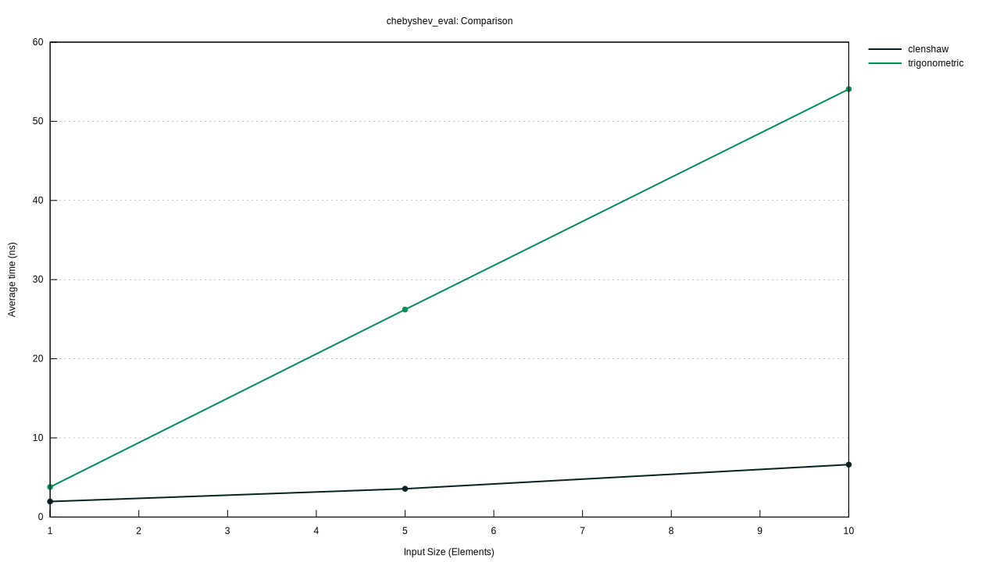

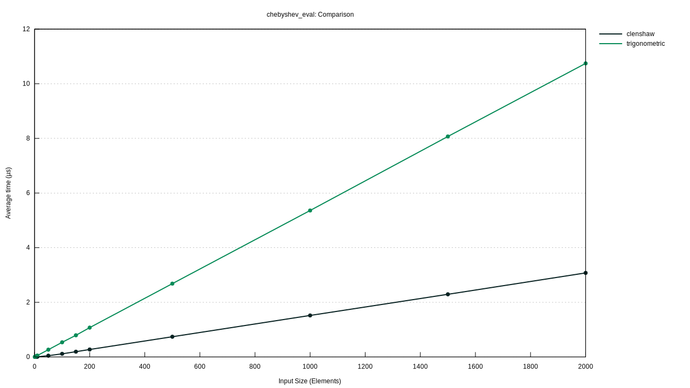


### Jacobi Rotation versus LAPACK DSYEV

Comparison of the performances of `mat_eigen_sym_jacobi` (Jacobi rotation) versus `mat_eigen_sym` (calling LAPACK DSYEV).

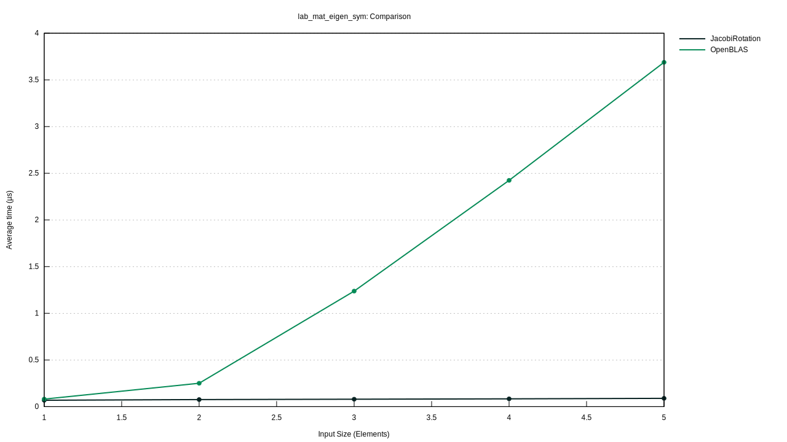


## Notes for developers

* The `c_code` directory contains a thin wrapper to the BLAS libraries (OpenBLAS or Intel MKL)
* The `c_code` directory also contains a wrapper to the C math functions
* The `build.rs` file uses the crate `cc` to build the C-wrappers
