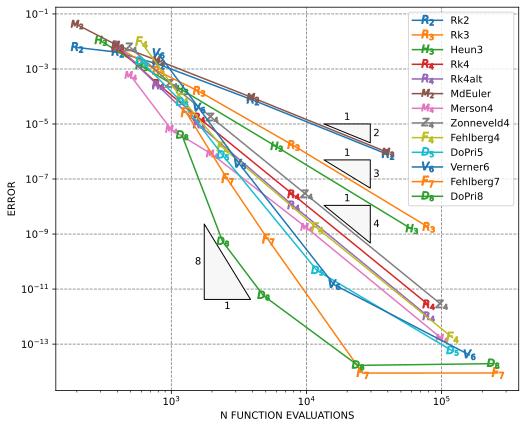

# Russell ODE - Solvers for Ordinary Differential Equations and Differential Algebraic Systems

_This crate is part of [Russell - Rust Scientific Library](https://github.com/cpmech/russell)_

## Contents

* [Introduction](#introduction)
* [Installation](#installation)
* [Setting Cargo.toml](#cargo)
* [Examples](#examples)

## <a name="introduction"></a> Introduction

Work in progress...

## <a name="installation"></a> Installation

## <a name="cargo"></a> Setting Cargo.toml

[](https://crates.io/crates/russell_ode)

👆 Check the crate version and update your Cargo.toml accordingly:

```toml
[dependencies]
russell_ode = "*"
```

## <a name="examples"></a> Examples

See also:

* [russell_ode/examples](https://github.com/cpmech/russell/tree/main/russell_ode/examples)

### Solve the Brusselator ODE with explicit Runge-Kutta methods and constant step sizes

See the code [brusselator_ode_fix_step.rs](https://github.com/cpmech/russell/tree/main/russell_ode/examples/brusselator_ode_fix_step.rs)

The output is reproduced below:

```text
━━━━━━━━━━━━━━━━━━━━━━━━━━━━━━━━━━━━━━━━━━━━━━━━━━━━━━━━
        h = 2.00E-01 1.00E-01 5.00E-02 1.00E-02 1.00E-03
     Method    Error    Error    Error    Error    Error
────────────────────────────────────────────────────────
        Rk2  6.1E-03  4.1E-03  1.5E-03  7.4E-05  7.8E-07
        Rk3  6.1E-03  8.2E-04  1.5E-04  1.7E-06  1.8E-09
      Heun3  1.1E-02  1.3E-03  1.7E-04  1.5E-06  1.5E-09
        Rk4  5.9E-03  2.8E-04  1.7E-05  2.7E-08  2.7E-12
     Rk4alt  7.0E-03  2.4E-04  9.3E-06  1.1E-08  9.9E-13
    MdEuler  4.1E-02  7.2E-03  2.0E-03  9.0E-05  9.2E-07
    Merson4  5.7E-04  6.3E-06  7.9E-07  1.7E-09  1.6E-13
 Zonneveld4  5.9E-03  2.8E-04  1.7E-05  2.7E-08  2.7E-12
  Fehlberg4  9.4E-03  8.1E-05  1.4E-06  1.7E-09  1.7E-13
     DoPri5  1.9E-03  6.1E-05  7.3E-07  4.7E-11  5.7E-14
    Verner6  3.6E-03  3.8E-05  3.5E-07  1.4E-11  4.1E-14
  Fehlberg7  2.5E-05  9.9E-08  6.3E-10  8.9E-15  8.9E-15
     DoPri8  3.9E-06  5.3E-10  5.8E-12  1.7E-14  2.0E-14
━━━━━━━━━━━━━━━━━━━━━━━━━━━━━━━━━━━━━━━━━━━━━━━━━━━━━━━━
```

And the convergence plot is shown below:



