# Russell ODE - Solvers for ordinary differential equations and differential algebraic equations <!-- omit from toc --> 

[](https://docs.rs/russell_ode/)

_This crate is part of [Russell - Rust Scientific Library](https://github.com/cpmech/russell)_

## Contents <!-- omit from toc --> 

- [Introduction](#introduction)
  - [Documentation](#documentation)
  - [References](#references)
- [Installation](#installation)
  - [Setting Cargo.toml](#setting-cargotoml)
  - [Optional features](#optional-features)
- [🌟 Examples](#-examples)
  - [Simple ODE with a single equation](#simple-ode-with-a-single-equation)
  - [Simple system with mass matrix](#simple-system-with-mass-matrix)
  - [Brusselator ODE](#brusselator-ode)
    - [Solving with DoPri8 -- 8(5,3) -- dense output](#solving-with-dopri8----853----dense-output)
    - [Variable step sizes](#variable-step-sizes)
    - [Fixed step sizes](#fixed-step-sizes)
  - [Brusselator PDE](#brusselator-pde)
    - [First book](#first-book)
    - [Second book](#second-book)
  - [Arenstorf orbits](#arenstorf-orbits)
  - [Hairer-Wanner Equation (1.1)](#hairer-wanner-equation-11)
  - [Robertson's Equation](#robertsons-equation)
  - [Van der Pol's Equation](#van-der-pols-equation)
    - [DoPri5](#dopri5)
    - [Radau5](#radau5)
  - [One-transistor amplifier](#one-transistor-amplifier)
  - [PDE: discrete Laplacian operator in 2D](#pde-discrete-laplacian-operator-in-2d)
    - [Laplace equation](#laplace-equation)
    - [Poisson equation 1](#poisson-equation-1)
    - [Poisson equation 2](#poisson-equation-2)
    - [Poisson equation 3](#poisson-equation-3)


## Introduction

This library implements (in native Rust) solvers for ordinary differential equations (ODEs) and differential algebraic equations (DAEs). Specifically, it implements several explicit Runge-Kutta methods (e.g., Dormand-Prince formulae) and two implicit Runge-Kutta methods, namely the Backward Euler and the Radau IIA of fifth-order (aka Radau5). The Radau5 solver can solve DAEs of Index-1 by accepting the so-called mass matrix.

The code in this library is based on Hairer-Nørsett-Wanner books and respective Fortran codes (see references [1] and [2]). However, the implementations of Dormand-Prince 5(4) and Dormand-Prince 8(5,3) are different from the Fortran counterparts. The code for Radau5 follows closely reference [2]; however, some minor differences are considered. Despite the coding differences, the numeric results match the Fortran results quite well.

The recommended methods are:

* `DoPri5` for ODE systems and non-stiff problems using moderate tolerances
* `DoPri8` for ODE systems and non-stiff problems using strict tolerances
* `Radau5` for ODE and DAE systems, possibly stiff, with moderate to strict tolerances

The ODE/DAE system can be easily defined using the System data structure; [see the examples below](#examples).

### Documentation

* [](https://docs.rs/russell_ode/) — [russell_ode documentation](https://docs.rs/russell_ode/)

### References

1. Hairer E, Nørsett, SP, Wanner G (2008) Solving Ordinary Differential Equations I.
   Non-stiff Problems. Second Revised Edition. Corrected 3rd printing 2008. Springer Series
   in Computational Mathematics, 528p
2. Hairer E, Wanner G (2002) Solving Ordinary Differential Equations II.
   Stiff and Differential-Algebraic Problems. Second Revised Edition.
   Corrected 2nd printing 2002. Springer Series in Computational Mathematics, 614p
3. Kreyszig, E (2011) Advanced engineering mathematics; in collaboration with Kreyszig H,
   Edward JN 10th ed 2011, Hoboken, New Jersey, Wiley


## Installation

This crate depends on some non-rust high-performance libraries. [See the main README file for the steps to install these dependencies.](https://github.com/cpmech/russell)


### Setting Cargo.toml

[](https://crates.io/crates/russell_ode)

👆 Check the crate version and update your Cargo.toml accordingly:

```toml
[dependencies]
russell_ode = "*"
```

### Optional features

The following (Rust) features are available:

* `intel_mkl`: Use Intel MKL instead of OpenBLAS

Note that the [main README file](https://github.com/cpmech/russell) presents the steps to compile the required libraries according to each feature.


## 🌟 Examples

This section illustrates how to use `russell_ode`. See also:

* [More examples on the documentation](https://docs.rs/russell_ode/)
* [Examples on how to define the ODE/DAE system](https://github.com/cpmech/russell/tree/main/russell_ode/src/samples.rs)
* [Examples directory](https://github.com/cpmech/russell/tree/main/russell_ode/examples)


### Simple ODE with a single equation

Solve the simple ODE with Dormand-Prince 8(5,3):

```text
      dy
y' = —— = 1   with   y(x=0)=0    thus   y(x) = x
      dx
```

See the code [simple_ode_single_equation.rs](https://github.com/cpmech/russell/tree/main/russell_ode/examples/simple_ode_single_equation.rs); reproduced below:

```rust
use russell_lab::{vec_approx_eq, StrError, Vector};
use russell_ode::prelude::*;

fn main() -> Result<(), StrError> {
    // system
    let ndim = 1;
    let system = System::new(
        ndim,
        |f, x, y, _args: &mut NoArgs| {
            f[0] = x + y[0];
            Ok(())
        },
        no_jacobian,
        HasJacobian::No,
        None,
        None,
    );

    // solver
    let params = Params::new(Method::DoPri8);
    let mut solver = OdeSolver::new(params, &system)?;

    // initial values
    let x = 0.0;
    let mut y = Vector::from(&[0.0]);

    // solve from x = 0 to x = 1
    let x1 = 1.0;
    let mut args = 0;
    solver.solve(&mut y, x, x1, None, None, &mut args)?;
    println!("y =\n{}", y);

    // check the results
    let y_ana = Vector::from(&[f64::exp(x1) - x1 - 1.0]);
    vec_approx_eq(&y, &y_ana, 1e-7);

    // print stats
    println!("{}", solver.stats());
    Ok(())
}
```

The output looks like:

```text
y =
┌                   ┐
│ 0.718281815054018 │
└                   ┘
DoPri8: Dormand-Prince method (explicit, order 8(5,3), embedded)
Number of function evaluations   = 84
Number of performed steps        = 7
Number of accepted steps         = 7
Number of rejected steps         = 0
Last accepted/suggested stepsize = 0.40139999999999776
Max time spent on a step         = 7.483µs
Total time                       = 65.462µs
```


### Simple system with mass matrix

Solve with Radau5:

```text
y0' + y1'     = -y0 + y1
y0' - y1'     =  y0 + y1
          y2' = 1/(1 + x)

y0(0) = 1,  y1(0) = 0,  y2(0) = 0
```

Thus:

```text
M y' = f(x, y)
```

with:

```text
    ┌          ┐       ┌           ┐
    │  1  1  0 │       │ -y0 + y1  │
M = │  1 -1  0 │   f = │  y0 + y1  │
    │  0  0  1 │       │ 1/(1 + x) │
    └          ┘       └           ┘
```

The Jacobian matrix is:

```text
         ┌          ┐
    df   │ -1  1  0 │
J = —— = │  1  1  0 │
    dy   │  0  0  0 │
         └          ┘
```

The analytical solution is:

```text
y0(x) = cos(x)
y1(x) = -sin(x)
y2(x) = log(1 + x)
```

Reference: [Numerical Solution of Differential-Algebraic Equations: Solving Systems with a Mass Matrix](https://reference.wolfram.com/language/tutorial/NDSolveDAE.html).

See the code [simple_system_with_mass.rs](https://github.com/cpmech/russell/tree/main/russell_ode/examples/simple_system_with_mass.rs); reproduced below:

```rust
use russell_lab::{vec_approx_eq, StrError, Vector};
use russell_ode::prelude::*;
use russell_sparse::CooMatrix;

fn main() -> Result<(), StrError> {
    // ODE system
    let ndim = 3;
    let jac_nnz = 4;
    let mut system = System::new(
        ndim,
        |f: &mut Vector, x: f64, y: &Vector, _args: &mut NoArgs| {
            f[0] = -y[0] + y[1];
            f[1] = y[0] + y[1];
            f[2] = 1.0 / (1.0 + x);
            Ok(())
        },
        move |jj: &mut CooMatrix, alpha: f64, _x: f64, _y: &Vector, _args: &mut NoArgs| {
            jj.reset();
            jj.put(0, 0, alpha * (-1.0)).unwrap();
            jj.put(0, 1, alpha * (1.0)).unwrap();
            jj.put(1, 0, alpha * (1.0)).unwrap();
            jj.put(1, 1, alpha * (1.0)).unwrap();
            Ok(())
        },
        HasJacobian::Yes,
        Some(jac_nnz),
        None,
    );

    // mass matrix
    let mass_nnz = 5;
    system.init_mass_matrix(mass_nnz).unwrap();
    system.mass_put(0, 0, 1.0).unwrap();
    system.mass_put(0, 1, 1.0).unwrap();
    system.mass_put(1, 0, 1.0).unwrap();
    system.mass_put(1, 1, -1.0).unwrap();
    system.mass_put(2, 2, 1.0).unwrap();

    // solver
    let params = Params::new(Method::Radau5);
    let mut solver = OdeSolver::new(params, &system)?;

    // initial values
    let x = 0.0;
    let mut y = Vector::from(&[1.0, 0.0, 0.0]);

    // solve from x = 0 to x = 20
    let x1 = 20.0;
    let mut args = 0;
    solver.solve(&mut y, x, x1, None, None, &mut args)?;
    println!("y =\n{}", y);

    // check the results
    let y_ana = Vector::from(&[f64::cos(x1), -f64::sin(x1), f64::ln(1.0 + x1)]);
    vec_approx_eq(&y, &y_ana, 1e-3);

    // print stats
    println!("{}", solver.stats());
    Ok(())
}
```

The output looks like:

```text
y =
┌                     ┐
│ 0.40864108577398206 │
│ -0.9136567566808349 │
│   3.044521229909652 │
└                     ┘
Radau5: Radau method (Radau IIA) (implicit, order 5, embedded)
Number of function evaluations   = 203
Number of Jacobian evaluations   = 1
Number of factorizations         = 8
Number of lin sys solutions      = 52
Number of performed steps        = 46
Number of accepted steps         = 46
Number of rejected steps         = 0
Number of iterations (maximum)   = 2
Number of iterations (last step) = 1
Last accepted/suggested stepsize = 0.5055117216674699
Max time spent on a step         = 40.817µs
Max time spent on the Jacobian   = 558ns
Max time spent on factorization  = 199.895µs
Max time spent on lin solution   = 53.101µs
Total time                       = 2.653323ms
```


### Brusselator ODE

This example corresponds to Fig 16.4 on page 116 of Reference #1. The problem is defined in Eq (16.12) on page 116 of Reference #1.

The system is:

```text
y0' = 1 - 4 y0 + y0² y1
y1' = 3 y0 - y0² y1

with  y0(x=0) = 3/2  and  y1(x=0) = 3
```

The Jacobian matrix is:

```text
         ┌                     ┐
    df   │ -4 + 2 y0 y1    y0² │
J = —— = │                     │
    dy   │  3 - 2 y0 y1   -y0² │
         └                     ┘
```

#### Solving with DoPri8 -- 8(5,3) -- dense output

This is a system of two ODEs, well explained in Reference #1. This problem is solved with the DoPri8 method (it has a hybrid error estimator of 5th and 3rd order; see Reference #1).

This example also shows how to enable the *dense output*.

See the code [brusselator_ode_dopri8.rs](https://github.com/cpmech/russell/tree/main/russell_ode/examples/brusselator_ode_dopri8.rs); reproduced below (without the plotting commands):

The output looks like this:

```text
y_russell     = [0.4986435155366857, 4.596782273713258]
y_mathematica = [0.49863707126834783, 4.596780349452011]
DoPri8: Dormand-Prince method (explicit, order 8(5,3), embedded)
Number of function evaluations   = 647
Number of performed steps        = 45
Number of accepted steps         = 38
Number of rejected steps         = 7
Last accepted/suggested stepsize = 2.1617616186304227
Max time spent on a step         = 47.643µs
Total time                       = 898.347µs
```

A plot of the (dense) solution is shown below:


#### Variable step sizes

This example solves the Brusselator ODE with variable step sizes for different tolerances. In this example, `tol = abs_tol = rel_tol`. The global error is the difference between Russell's results and Mathematica's results obtained with high accuracy. The Mathematica code is:

```Mathematica
Needs["DifferentialEquations`NDSolveProblems`"];
Needs["DifferentialEquations`NDSolveUtilities`"];
sys = GetNDSolveProblem["BrusselatorODE"];
sol = NDSolve[sys, Method -> "StiffnessSwitching", WorkingPrecision -> 32];
ref = First[FinalSolutions[sys, sol]]
```

See the code [brusselator_ode_var_step.rs](https://github.com/cpmech/russell/tree/main/russell_ode/examples/brusselator_ode_var_step.rs)

The results are:

```text
━━━━━━━━━━━━━━━━━━━━━━━━━━━━━━━━━━━━━━━━━━━━━━━━━━━━
       tol =  1.00E-02  1.00E-04  1.00E-06  1.00E-08
      Method     Error     Error     Error     Error
────────────────────────────────────────────────────
      Radau5   1.9E-03   7.9E-06   1.3E-07   3.2E-09
     Merson4   3.8E-02   2.1E-04   9.9E-06   7.1E-08
      DoPri5   8.0E-03   1.7E-04   1.8E-06   2.0E-08
      DoPri8   1.4E-02   6.4E-06   2.7E-07   4.2E-09
━━━━━━━━━━━━━━━━━━━━━━━━━━━━━━━━━━━━━━━━━━━━━━━━━━━━
```

And the convergence plot is:

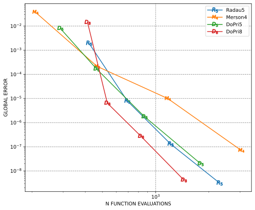

#### Fixed step sizes

This example solves the Brusselator ODE with fixed step sizes and explicit Runge-Kutta methods. The global error is also the difference between Russell and Mathematica as in the previous section.

See the code [brusselator_ode_fix_step.rs](https://github.com/cpmech/russell/tree/main/russell_ode/examples/brusselator_ode_fix_step.rs)

The results are:

```text
━━━━━━━━━━━━━━━━━━━━━━━━━━━━━━━━━━━━━━━━━━━━━━━━━━━━━━━━
        h = 2.00E-01 1.00E-01 5.00E-02 1.00E-02 1.00E-03
     Method    Error    Error    Error    Error    Error
────────────────────────────────────────────────────────
        Rk2  6.1E-03  4.1E-03  1.5E-03  7.4E-05  7.8E-07
        Rk3  6.1E-03  8.2E-04  1.5E-04  1.7E-06  1.8E-09
      Heun3  1.1E-02  1.3E-03  1.7E-04  1.5E-06  1.5E-09
        Rk4  5.9E-03  2.8E-04  1.7E-05  2.7E-08  2.7E-12
     Rk4alt  7.0E-03  2.4E-04  9.3E-06  1.1E-08  9.9E-13
    MdEuler  4.1E-02  7.2E-03  2.0E-03  9.0E-05  9.2E-07
    Merson4  5.7E-04  6.3E-06  7.9E-07  1.7E-09  1.6E-13
 Zonneveld4  5.9E-03  2.8E-04  1.7E-05  2.7E-08  2.7E-12
  Fehlberg4  9.4E-03  8.1E-05  1.4E-06  1.7E-09  1.7E-13
     DoPri5  1.9E-03  6.1E-05  7.3E-07  4.7E-11  5.7E-14
    Verner6  3.6E-03  3.8E-05  3.5E-07  1.4E-11  4.1E-14
  Fehlberg7  2.5E-05  9.9E-08  6.3E-10  8.9E-15  8.9E-15
     DoPri8  3.9E-06  5.3E-10  5.8E-12  1.7E-14  2.0E-14
━━━━━━━━━━━━━━━━━━━━━━━━━━━━━━━━━━━━━━━━━━━━━━━━━━━━━━━━
```

And the convergence plot is:

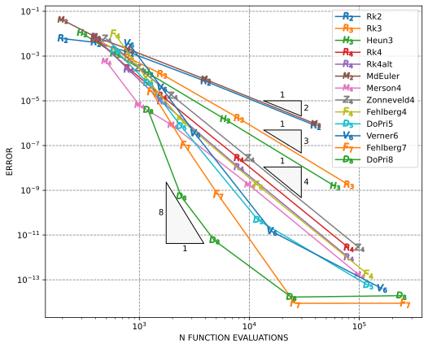


### Brusselator PDE

This example corresponds to Fig 10.4(a,b) on pages 250 and 251 of Reference #1.
The problem is defined in Eqs (10.10-10.14) on pages 248 and 249 of Reference #1.

If `second_book` is true, this example corresponds to Fig 10.7 on page 151 of Reference #2.
Also, in this case, the problem is defined in Eqs (10.15-10.16) on pages 151 and 152 of Reference #2.

While in the first book the boundary conditions are Neumann-type, in the second book the
boundary conditions are periodic. Also the initial values in the second book are different
that those in the first book.

The model is given by:

```text
∂u                         ⎛ ∂²u   ∂²u ⎞
——— = 1 - 4.4 u + u² v + α ⎜ ——— + ——— ⎟ + I(t,x,y)
∂t                         ⎝ ∂x²   ∂y² ⎠

∂v                         ⎛ ∂²v   ∂²v ⎞
——— =     3.4 u - u² v + α ⎜ ——— + ——— ⎟
∂t                         ⎝ ∂x²   ∂y² ⎠

with:  t ≥ 0,  0 ≤ x ≤ 1,  0 ≤ y ≤ 1
```

where `I(t,x,y)` is the inhomogeneity function (second book) given by:

```text
            ⎧ 5  if (x-0.3)²+(y-0.6)² ≤ 0.1² and t ≥ 1.1
I(t,x,y) =  ⎨
            ⎩ 0  otherwise
```

The first book considers the following Neumann boundary conditions:

```text
∂u          ∂v     
——— = 0     ——— = 0
 →           →
∂n          ∂n     
```

and the following initial conditions (first book):

```text
u(t=0,x,y) = 0.5 + y    v(t=0,x,y) = 1 + 5 x
```

The second book considers periodic boundary conditions on `u`.
However, here we assume periodic on `u` and `v`:

```text
u(t, 0, y) = u(t, 1, y)
u(t, x, 0) = u(t, x, 1)
v(t, 0, y) = v(t, 1, y)   ← Not in the book
v(t, x, 0) = v(t, x, 1)   ← Not in the book
```

The second book considers the following initial conditions:

```text
u(0, x, y) = 22 y pow(1 - y, 1.5)
v(0, x, y) = 27 x pow(1 - x, 1.5)
```

The scalar fields u(x, y) and v(x, y) are mapped over a rectangular grid with
their discrete counterparts represented by:

```text
pᵢⱼ(t) := u(t, xᵢ, yⱼ)
qᵢⱼ(t) := v(t, xᵢ, yⱼ)
```

Thus `ndim = 2 npoint²` with npoint being the number of points along the x or y line.

The second partial derivatives over x and y (Laplacian) are approximated using the
Finite Differences Method (FDM).

The pᵢⱼ and qᵢⱼ values are mapped onto the vectors `U` and `V` as follows:

```text
pᵢⱼ → Uₘ
qᵢⱼ → Vₘ

with m = i + j nx
```

Then, they are stored in a single vector `Y`:

```text
    ┌   ┐
    │ U │
Y = │   │
    │ V │
    └   ┘
```

Thus:

```text
Uₘ = Yₘ  and  Vₘ = Yₛ₊ₘ

where  0 ≤ m ≤ s - 1  and (shift)  s = npoint²
```

In terms of components, we can write:

```text
      ⎧ Uₐ    if a < s
Yₐ =  ⎨
      ⎩ Vₐ₋ₛ  if a ≥ s

where  0 ≤ a ≤ ndim - 1  and  ndim = 2 s
```

The components of the resulting system of equations are defined by:
(the prime indicates time-derivative; no summation over repeated indices):

```text
Uₘ' = 1 - 4.4 Uₘ + Uₘ² Vₘ + Σ Aₘₖ Uₖ
                           k
Vₘ' =     3.4 Uₘ - Uₘ² Vₘ + Σ Aₘₖ Uₖ
                           k

where Aₘₖ are the elements of the discrete Laplacian matrix
```

The components to build the Jacobian matrix are:
(no summation over repeated indices):

```text
∂Uₘ'
———— = -4.4 δₘₙ + 2 Uₘ δₘₙ Vₘ + Aₘₙ
∂Uₙ

∂Uₘ'
———— = Uₘ² δₘₙ
∂Vₙ

∂Vₘ'
———— = 3.4 δₘₙ - 2 Uₘ δₘₙ Vₘ
∂Uₙ

∂Vₘ'
———— = -Uₘ² δₘₙ + Aₘₙ
∂Vₙ

where δₘₙ is the Kronecker delta
```

With `Fₐ := ∂Yₐ/∂t`, the components of the Jacobian matrix can be "assembled" as follows:

```text
      ⎧  ⎧ ∂Uₐ'/∂Uₑ      if e < s
      │  ⎨                          if a < s
∂Fₐ   │  ⎩ ∂Uₐ'/∂Vₑ₋ₛ    if e ≥ s
——— = ⎨
∂Yₑ   │  ⎧ ∂Vₐ₋ₛ'/∂Uₑ    if e < s
      │  ⎨                          if a ≥ s
      ⎩  ⎩ ∂Vₐ₋ₛ'/∂Vₑ₋ₛ  if e ≥ s

where  0 ≤ a ≤ ndim - 1  and  0 ≤ e ≤ ndim - 1
```

#### First book

We solve this problem with Radau5. The approximated solution is generated with `npoint = 21` and is implemented in [brusselator_pde_radau5.rs](https://github.com/cpmech/russell/tree/main/russell_ode/examples/brusselator_pde_radau5.rs). This code will generate a series of files, one for each (dense) output time with `h_out = 0.5`.

The results can then be plotted with [brusselator_pde_plot.rs](https://github.com/cpmech/russell/tree/main/russell_ode/examples/brusselator_pde_plot.rs)

The results are shown below for the `U` field:

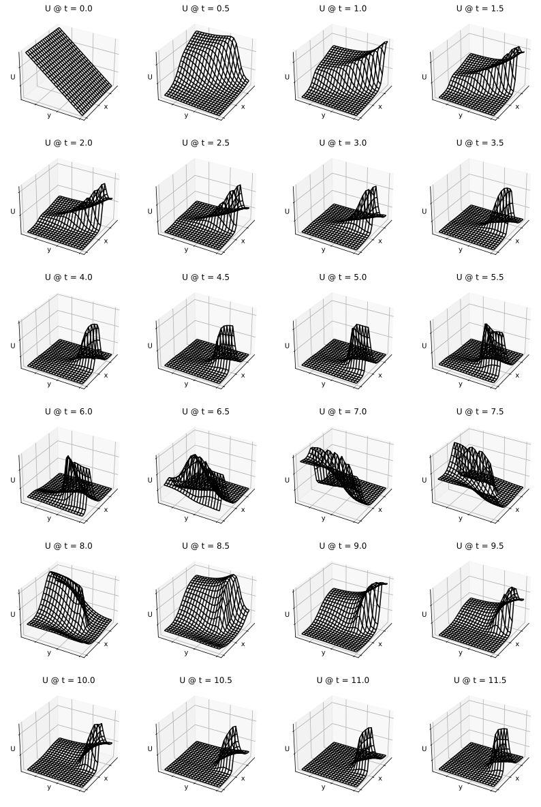

And below for the `V` field:

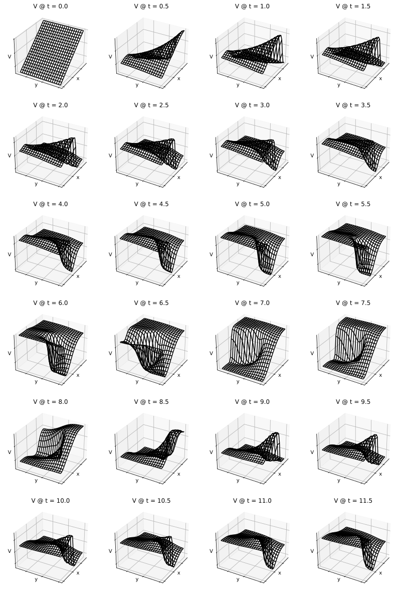

These figures compare well with the corresponding ones on pages 250 and 251 of Reference #1.

The computations with `russell` are also compared with values obtained with Mathematica. The verification is implemented in [test_radau5_brusselator_pde](https://github.com/cpmech/russell/tree/main/russell_ode/tests/test_radau5_brusselator_pde.rs).

The figure below shows the `russell` (black dashed lines) and Mathematica (red solid lines) results for the `U` field:

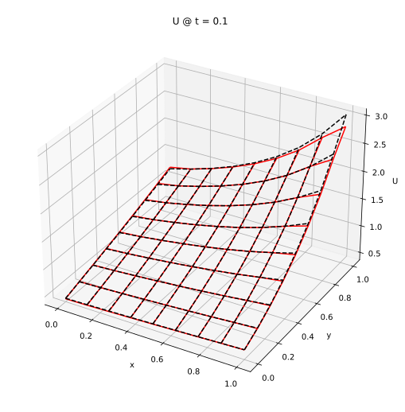

The figure below shows the `russell` (black dashed lines) and Mathematica (red solid lines) results for the `V` field:

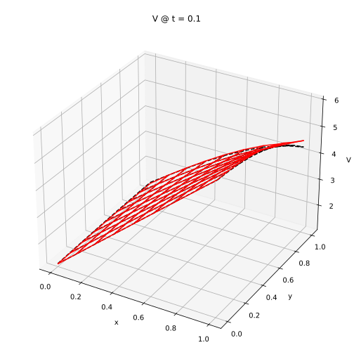

#### Second book

For the problem in the second book, we run [brusselator_pde_radau5_2nd.rs](https://github.com/cpmech/russell/tree/main/russell_ode/examples/brusselator_pde_radau5_2nd.rs) with `npoint = 129` and `h_out = 1.0`.

The results are shown below for the `U` field:


And below for the `V` field:


The code [brusselator_pde_2nd_comparison.rs](https://github.com/cpmech/russell/tree/main/russell_ode/examples/brusselator_pde_2nd_comparison.rs) compares `russell` results with Mathematica results.

The figure below shows the `russell` (black dashed lines) and Mathematica (red solid lines) results for the `U` field:


The figure below shows the `russell` (black dashed lines) and Mathematica (red solid lines) results for the `V` field:


### Arenstorf orbits

This example corresponds to Fig 0.1 on page 130 of Reference #1. The problem is defined in Eqs (0.1) and (0.2) on page 129 and 130 of Reference #1.

From Hairer-Nørsett-Wanner:

"(...) an example from Astronomy, the restricted three body problem. (...) two bodies of masses μ' = 1 − μ and μ in circular rotation in a plane and a third body of negligible mass moving around in the same plane. (...)"

The system equations are:

```text
y0'' = y0 + 2 y1' - μ' (y0 + μ) / d0 - μ (y0 - μ') / d1
y1'' = y1 - 2 y0' - μ' y1 / d0 - μ y1 / d1
```

With the assignments:

```text
y2 := y0'  ⇒  y2' = y0''
y3 := y1'  ⇒  y3' = y1''
```

We obtain a 4-dim problem:

```text
f0 := y0' = y2
f1 := y1' = y3
f2 := y2' = y0 + 2 y3 - μ' (y0 + μ) / d0 - μ (y0 - μ') / d1
f3 := y3' = y1 - 2 y2 - μ' y1 / d0 - μ y1 / d1
```

See the code [arenstorf_dopri8.rs](https://github.com/cpmech/russell/tree/main/russell_ode/examples/arenstorf_dopri8.rs)

The code output is:

```text
y_russell     = [0.9943002573065823, 0.000505756322923528, 0.07893182893575335, -1.9520617089599261]
y_mathematica = [0.9939999999999928, 2.4228439406717e-14, 3.6631563591513e-12, -2.0015851063802006]
DoPri8: Dormand-Prince method (explicit, order 8(5,3), embedded)
Number of function evaluations   = 870
Number of performed steps        = 62
Number of accepted steps         = 47
Number of rejected steps         = 15
Last accepted/suggested stepsize = 0.005134142939114363
Max time spent on a step         = 10.538µs
Total time                       = 1.399021ms
```

The results are plotted below:

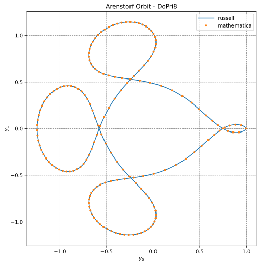


### Hairer-Wanner Equation (1.1)

This example corresponds to Fig 1.1 and Fig 1.2 on page 2 of Reference #2. The problem is defined in Eq (1.1) on page 2 of Reference #2.

The system is:

```text
y0' = -50 (y0 - cos(x))

with  y0(x=0) = 0
```

The Jacobian matrix is:

```text
    df   ┌     ┐
J = —— = │ -50 │
    dy   └     ┘
```

This example illustrates the instability of the forward Euler method with step sizes above the stability limit. The equation is (reference # 2, page 2):

This example also shows how to enable the output of accepted steps.

See the code [hairer_wanner_eq1.rs](https://github.com/cpmech/russell/tree/main/russell_ode/examples/hairer_wanner_eq1.rs)

The results are show below:

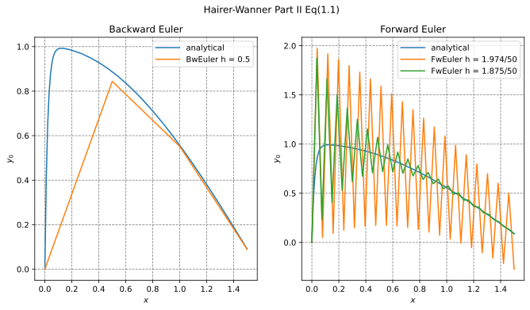


### Robertson's Equation

This example corresponds to Fig 1.3 on page 4 of Reference #2. The problem is defined in Eq (1.4) on page 3 of Reference #2.

The system is:

```text
y0' = -0.04 y0 + 1.0e4 y1 y2
y1' =  0.04 y0 - 1.0e4 y1 y2 - 3.0e7 y1²
y2' =                          3.0e7 y1²

with  y0(0) = 1, y1(0) = 0, y2(0) = 0
```

This example illustrates the Robertson's equation. In this problem DoPri5 uses many steps (about 200). On the other hand, Radau5 solves the problem with 17 accepted steps.

This example also shows how to enable the output of accepted steps.

See the code [robertson.rs](https://github.com/cpmech/russell/tree/main/russell_ode/examples/robertson.rs)

The solution is approximated with Radau5 and DoPri5 using two sets of tolerances.

The output is:

```text
Radau5: Radau method (Radau IIA) (implicit, order 5, embedded)
Number of function evaluations   = 88
Number of Jacobian evaluations   = 8
Number of factorizations         = 15
Number of lin sys solutions      = 24
Number of performed steps        = 17
Number of accepted steps         = 15
Number of rejected steps         = 1
Number of iterations (maximum)   = 2
Number of iterations (last step) = 1
Last accepted/suggested stepsize = 0.8160578540023586
Max time spent on a step         = 117.916µs
Max time spent on the Jacobian   = 1.228µs
Max time spent on factorization  = 199.151µs
Max time spent on lin solution   = 56.767µs
Total time                       = 1.922108ms

Tol = 1e-2
DoPri5: Dormand-Prince method (explicit, order 5(4), embedded)
Number of function evaluations   = 1585
Number of performed steps        = 264
Number of accepted steps         = 209
Number of rejected steps         = 55
Last accepted/suggested stepsize = 0.0017137362591141277
Max time spent on a step         = 2.535µs
Total time                       = 2.997516ms

Tol = 1e-3
DoPri5: Dormand-Prince method (explicit, order 5(4), embedded)
Number of function evaluations   = 1495
Number of performed steps        = 249
Number of accepted steps         = 205
Number of rejected steps         = 44
Last accepted/suggested stepsize = 0.0018175194753331549
Max time spent on a step         = 1.636µs
Total time                       = 3.705391ms
```

The results are illustrated below:

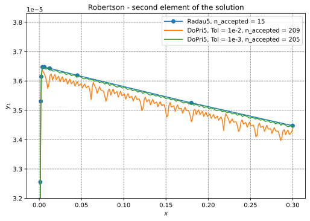

The step sizes from the DoPri solution with Tol = 1e-2 are illustrated below:

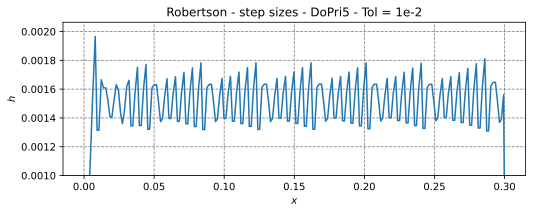


### Van der Pol's Equation

This example corresponds Eq (1.5') on page 5 of Reference #2.

The system is:

```text
y0' = y1
y1' = ((1.0 - y[0] * y[0]) * y[1] - y[0]) / ε
```

where ε defines the *stiffness* of the problem + conditions (equation + initial conditions + step size + method).

#### DoPri5

This example corresponds to Fig 2.6 on page 23 of Reference #2. The problem is defined in Eq (1.5') on page 5 of Reference #2.

This example illustrated the *stiffness* of the Van der Pol problem with ε = 0.003. In this example, DoPri5 with Tol = 1e-3 is used.

This example also shows how to enable the stiffness detection.

See the code [van_der_pol_dopri5.rs](https://github.com/cpmech/russell/tree/main/russell_ode/examples/van_der_pol_dopri5.rs)

The output is given below:

```text
y =
┌                     ┐
│   1.819918013289893 │
│ -0.7863062155442466 │
└                     ┘
DoPri5: Dormand-Prince method (explicit, order 5(4), embedded)
Number of function evaluations   = 3133
Number of performed steps        = 522
Number of accepted steps         = 498
Number of rejected steps         = 24
Last accepted/suggested stepsize = 0.004363549192919735
Max time spent on a step         = 2.558µs
Total time                       = 1.715917ms
```

The results are show below:

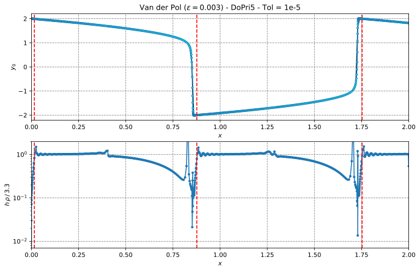

The figure's red dashed lines mark the moment when stiffness has been detected first. The stiffness is confirmed after 15 accepted steps with repeated stiffness thresholds being reached. The positive thresholds are counted when h·ρ becomes greater than the corresponding factor·max(h·ρ)---the value on the stability limit (3.3 for DoPri5; factor ~= 0.976). Note that ρ is the approximation of the dominant eigenvalue of the Jacobian. After 6 accepted steps, if the thresholds are not reached, the stiffness detection flag is set to false.

#### Radau5

This example corresponds to Fig 8.1 on page 125 of Reference #2. The problem is defined in Eq (1.5') on page 5 of Reference #2.

This example uses a smaller ε = 1e-6, making the problem + conditions much more stiff. It is solved with the Radau5 solver, which can handle stiff problems quite well. Note that DoPri5 would not solve this problem with such small ε, unless a very high number of steps (and oder configurations) were considered.

The output is given below:

```text
y =
┌                    ┐
│ 1.7061626037853908 │
│ -0.892799551109113 │
└                    ┘
Radau5: Radau method (Radau IIA) (implicit, order 5, embedded)
Number of function evaluations   = 2237
Number of Jacobian evaluations   = 160
Number of factorizations         = 252
Number of lin sys solutions      = 663
Number of performed steps        = 280
Number of accepted steps         = 241
Number of rejected steps         = 7
Number of iterations (maximum)   = 6
Number of iterations (last step) = 3
Last accepted/suggested stepsize = 0.2466642610579514
Max time spent on a step         = 136.487µs
Max time spent on the Jacobian   = 949ns
Max time spent on factorization  = 223.917µs
Max time spent on lin solution   = 4.010536ms
Total time                       = 37.8697ms
```

The results are show below:

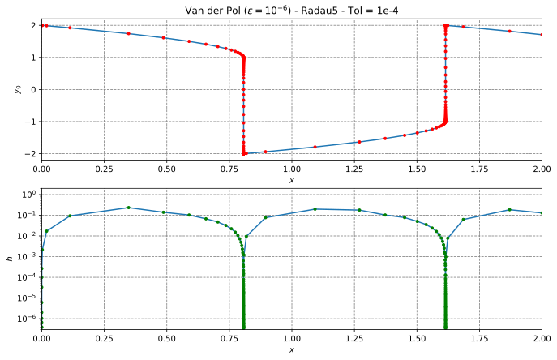


### One-transistor amplifier

This example corresponds to Fig 1.3 on page 377 and Fig 1.4 on page 379 of Reference #2. The problem is defined in Eq (1.14) on page 377 of Reference #2.

This is a differential-algebraic problem modelling the nodal voltages of a one-transistor amplifier.

The DAE is expressed in the so-called *mass-matrix* form (ndim = 5):

```text
M y' = f(x, y)

with: y0(0)=0, y1(0)=Ub/2, y2(0)=Ub/2, y3(0)=Ub, y4(0)=0
```

where the elements of the right-hand side function are:

```text
f0 = (y0 - ue) / R
f1 = (2 y1 - UB) / S + γ g12
f2 = y2 / S - g12
f3 = (y3 - UB) / S + α g12
f4 = y4 / S

with:

ue = A sin(ω x)
g12 = β (exp((y1 - y2) / UF) - 1)
```

Compared to Eq (1.14), we set all resistances Rᵢ to S, except the first one (R := R₀).

The mass matrix is:

```text
    ┌                     ┐
    │ -C1  C1             │
    │  C1 -C1             │
M = │         -C2         │
    │             -C3  C3 │
    │              C3 -C3 │
    └                     ┘
```

and the Jacobian matrix is:

```text
    ┌                                           ┐
    │ 1/R                                       │
    │       2/S + γ h12      -γ h12             │
J = │              -h12   1/S + h12             │
    │             α h12      -α h12             │
    │                                 1/S       │
    │                                       1/S │
    └                                           ┘

with:

h12 = β exp((y1 - y2) / UF) / UF
```

**Note:** In this library, only **Radau5** can solve such DAE.

See the code [amplifier1t_radau5.rs](https://github.com/cpmech/russell/tree/main/russell_ode/examples/amplifier1t_radau5.rs)

The output is given below:

```text
y_russell     = [-0.022267, 3.068709, 2.898349, 1.499405, -1.735090]
y_mathematica = [-0.022267, 3.068709, 2.898349, 1.499439, -1.735057]
Radau5: Radau method (Radau IIA) (implicit, order 5, embedded)
Number of function evaluations   = 6007
Number of Jacobian evaluations   = 480
Number of factorizations         = 666
Number of lin sys solutions      = 1840
Number of performed steps        = 666
Number of accepted steps         = 481
Number of rejected steps         = 39
Number of iterations (maximum)   = 6
Number of iterations (last step) = 1
Last accepted/suggested stepsize = 0.00007705697843645314
Max time spent on a step         = 55.281µs
Max time spent on the Jacobian   = 729ns
Max time spent on factorization  = 249.11µs
Max time spent on lin solution   = 241.201µs
Total time                       = 97.951021ms
```

The results are plotted below:

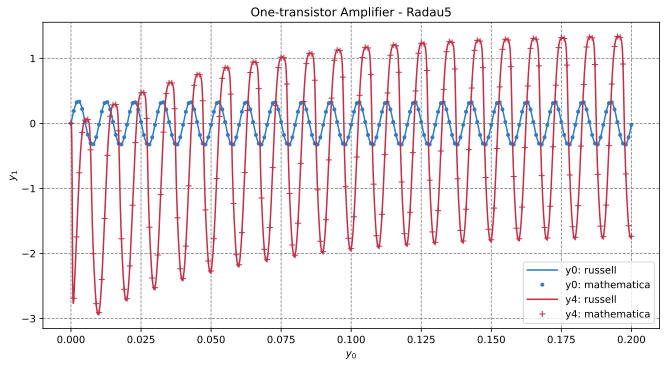


### PDE: discrete Laplacian operator in 2D

For convenience (e.g., in benchmarks), `russell_ode` implements a discrete Laplacian operator (2D) based on the Finite Differences Method.

This operator can be used to solve simple partial differential equation (PDE) problems.

#### Laplace equation

Approximate (with the Finite Differences Method, FDM) the solution of

```text
∂²ϕ     ∂²ϕ
———  +  ——— = 0
∂x²     ∂y²
```

on a (1.0 × 1.0) rectangle with the following essential (Dirichlet) boundary conditions:

```text
left:    ϕ(0.0, y) = 50.0
right:   ϕ(1.0, y) =  0.0
bottom:  ϕ(x, 0.0) =  0.0
top:     ϕ(x, 1.0) = 50.0
```

See the code [pde_laplace_equation.rs](https://github.com/cpmech/russell/tree/main/russell_ode/examples/pde_laplace_equation.rs)

The results are illustrated below:

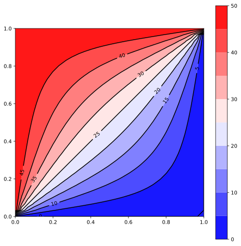

#### Poisson equation 1

Approximate (with the Finite Differences Method, FDM) the solution of

```text
∂²ϕ   ∂²ϕ
——— + ——— = 2 x (y - 1) (y - 2 x + x y + 2) exp(x - y)
∂x²   ∂y²
```

on a (1.0 × 1.0) square with the homogeneous boundary conditions.

The analytical solution is:

```text
ϕ(x, y) = x y (x - 1) (y - 1) exp(x - y)
```

See the code [test_pde_poisson_1.rs](https://github.com/cpmech/russell/tree/main/russell_ode/tests/test_pde_poisson_1.rs)

The results are illustrated below:

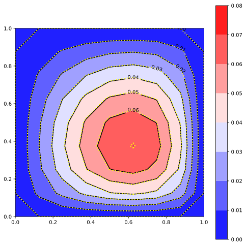

#### Poisson equation 2

Approximate (with the Finite Differences Method, FDM) the solution of

```text
∂²ϕ   ∂²ϕ
——— + ——— = - π² y sin(π x)
∂x²   ∂y²
```

on a (1.0 × 1.0) square with the following essential boundary conditions:

```text
left:    ϕ(0.0, y) = 0.0
right:   ϕ(1.0, y) = 0.0
bottom:  ϕ(x, 0.0) = 0.0
top:     ϕ(x, 1.0) = sin(π x)
```

The analytical solution is:

```text
ϕ(x, y) = y sin(π x)
```

Reference: Olver PJ (2020) - page 210 - Introduction to Partial Differential Equations, Springer

See the code [test_pde_poisson_2.rs](https://github.com/cpmech/russell/tree/main/russell_ode/tests/test_pde_poisson_2.rs)

The results are illustrated below:

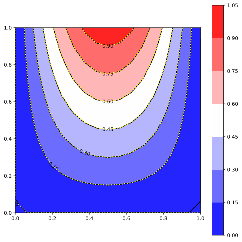

#### Poisson equation 3

Approximate (with the Finite Differences Method, FDM) the solution of

```text
∂²ϕ     ∂²ϕ
———  +  ——— =  source(x, y)
∂x²     ∂y²
```

on a (1.0 × 1.0) square with homogeneous essential boundary conditions

The source term is given by (for a manufactured solution):

```text
source(x, y) = 14y³ - (16 - 12x) y² - (-42x² + 54x - 2) y + 4x³ - 16x² + 12x
```

The analytical solution is:

```text
ϕ(x, y) = x (1 - x) y (1 - y) (1 + 2x + 7y)
```

See the code [test_pde_poisson_3.rs](https://github.com/cpmech/russell/tree/main/russell_ode/tests/test_pde_poisson_3.rs)

The results are illustrated below:

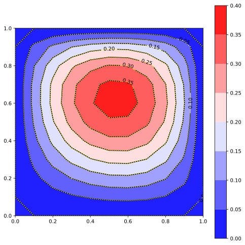
