# Russell PDE - Essential tools to solve partial differential equations; not a full-fledged PDE solver

[](https://docs.rs/russell_pde/)

_This crate is part of [Russell - Rust Scientific Library](https://github.com/cpmech/russell)_

## Contents <!-- omit from toc --> 

- [Russell PDE - Essential tools to solve partial differential equations; not a full-fledged PDE solver](#russell-pde---essential-tools-to-solve-partial-differential-equations-not-a-full-fledged-pde-solver)
  - [Introduction](#introduction)
    - [Documentation](#documentation)
  - [Installation](#installation)
    - [Setting Cargo.toml](#setting-cargotoml)
    - [Optional features](#optional-features)
  - [🌟 Examples](#-examples)
    - [Example 1: Solving 1D Poisson equation with Finite Differences](#example-1-solving-1d-poisson-equation-with-finite-differences)
    - [Example 2: Solving 1D problems with Spectral Collocation](#example-2-solving-1d-problems-with-spectral-collocation)
    - [Example 3: Spectral collocation in 2D with transfinite mapping](#example-3-spectral-collocation-in-2d-with-transfinite-mapping)
  - [Test Problems](#test-problems)
    - [Problem 01 — 2D Poisson with mixed BCs](#problem-01--2d-poisson-with-mixed-bcs)
    - [Problem 02 — 2D Poisson `ϕ = y·sin(πx)`](#problem-02--2d-poisson-ϕ--ysinπx)
    - [Problem 03 — 2D Helmholtz/Poisson with mixed BCs](#problem-03--2d-helmholtzpoisson-with-mixed-bcs)
    - [Problem 04 — 2D Poisson on `[-1,1]²` (benchmark)](#problem-04--2d-poisson-on--11-benchmark)
    - [Problem 05 — 2D Poisson polynomial](#problem-05--2d-poisson-polynomial)
    - [Problem 06 — 2D Poisson `ϕ = tanh(1−x+y)`](#problem-06--2d-poisson-ϕ--tanh1xy)
    - [Problem 08 — 2D Poisson on curvilinear domains](#problem-08--2d-poisson-on-curvilinear-domains)
    - [Problem 09 — 2D Laplace (potential flow)](#problem-09--2d-laplace-potential-flow)
    - [1D Problem 02 — Helmholtz heat conduction-convection](#1d-problem-02--helmholtz-heat-conduction-convection)
    - [1D Problem 03 — Helmholtz with flux BC](#1d-problem-03--helmholtz-with-flux-bc)
    - [1D Problem 04 — Trefethen programs 13 and 33](#1d-problem-04--trefethen-programs-13-and-33)
    - [1D Problem 05 — Pozrikidis Helmholtz](#1d-problem-05--pozrikidis-helmholtz)
    - [Metrics — Curvilinear coordinates](#metrics--curvilinear-coordinates)


## Introduction

This library implements essential tools to solve partial differential equations (PDEs). It does not implement full-fledge PDE solvers for general problems and, hence, this library is quite limited.

A goal is to provide tools to test other crates such as `russell_ode` and `russell_nonlinear` because they employ PDE problems as **testing** platforms.

Currently, simple finite differences operators are implemented, in addition to spectral collocation methods in 1D and 2D. The library also implements the transfinite mapping method to generate meshes on non-rectangular domains.

The linear systems are solved using the System Partitioning Strategy (SPS) or the Lagrange Multipliers Method (LMM).

### Documentation

* [](https://docs.rs/russell_pde/) — [russell_pde documentation](https://docs.rs/russell_pde/)


## Installation

This crate depends on some non-rust high-performance libraries. [See the main README file for the steps to install these dependencies.](https://github.com/cpmech/russell)


### Setting Cargo.toml

[](https://crates.io/crates/russell_pde)

👆 Check the crate version and update your Cargo.toml accordingly:

```toml
[dependencies]
russell_pde = "*"
```

### Optional features

The following (Rust) features are available:

* `intel_mkl`: Use Intel MKL instead of OpenBLAS
* `local_sparse`: Use locally compiled SuiteSparse and MUMPS

Note that the [main README file](https://github.com/cpmech/russell) presents the steps to compile the required libraries according to each feature.


## 🌟 Examples

This section illustrates how to use `russell_pde`. See also:

* [More examples on the documentation](https://docs.rs/russell_pde/)
* [Examples directory](https://github.com/cpmech/russell/tree/main/russell_pde/examples)


### Example 1: Solving 1D Poisson equation with Finite Differences

This example solves the Poisson equation in 1D using the Finite Difference Method (FDM):

```text
  ∂²ϕ
- ——— = x    on [0, 1]
  ∂x²

With boundary conditions: ϕ(0) = 0, ϕ(1) = 0
```

The analytical solution is: `ϕ(x) = (x - x³) / 6`

```rust
use russell_lab::approx_eq;
use russell_pde::{Fdm1d, Grid1d, EssentialBcs1d, NaturalBcs1d, StrError};

fn main() -> Result<(), StrError> {
    // Define the problem domain and diffusion coefficient
    let (xmin, xmax) = (0.0, 1.0);
    let kx = 1.0;

    // Set up boundary conditions
    let mut ebcs = EssentialBcs1d::new();
    ebcs.set_homogeneous(); // ϕ(0) = 0, ϕ(1) = 0

    let nbcs = NaturalBcs1d::new();

    // Create uniform grid with 10 subdivisions
    let nx = 10;
    let grid = Grid1d::new_uniform(xmin, xmax, nx)?;

    // Create the solver
    let fdm = Fdm1d::new(grid, ebcs, nbcs, kx)?;

    // Define the source term f(x) = x
    let source = |x: f64| x;

    // Solve using System Partitioning Strategy
    let solution = fdm.solve_sps(0.0, source)?;

    // Verify against analytical solution
    let analytical = |x: f64| (x - x.powi(3)) / 6.0;
    fdm.for_each_coord(|m, x| {
        let error = f64::abs(solution[m] - analytical(x));
        approx_eq(solution[m], analytical(x), 1e-15);
        println!("x = {:.3}, ϕ = {:.6}, error = {:.e}", x, solution[m], error);
    });

    Ok(())
}
```

The output looks like this:

```text
x = 0.000, ϕ = 0.000000, error = 0e0
x = 0.111, ϕ = 0.018290, error = 0e0
x = 0.222, ϕ = 0.035208, error = 0e0
x = 0.333, ϕ = 0.049383, error = 6.938893903907228e-18
x = 0.444, ϕ = 0.059442, error = 6.938893903907228e-18
x = 0.556, ϕ = 0.064015, error = 0e0
x = 0.667, ϕ = 0.061728, error = 0e0
x = 0.778, ϕ = 0.051212, error = 2.7755575615628914e-17
x = 0.889, ϕ = 0.031093, error = 3.469446951953614e-18
x = 1.000, ϕ = 0.000000, error = 0e0
```

### Example 2: Solving 1D problems with Spectral Collocation

This example solves the Poisson equation in 1D using Spectral Collocation:

```text
  ∂²ϕ
- ——— = x    on [0, 1]
  ∂x²

With boundary conditions: ϕ(0) = 0, ϕ(1) = 0
```

The analytical solution is: `ϕ(x) = (x - x³) / 6`

```rust
use russell_lab::approx_eq;
use russell_pde::{Spc1d, EssentialBcs1d, NaturalBcs1d, StrError};

fn main() -> Result<(), StrError> {
    let (xmin, xmax) = (0.0, 1.0);
    let kx = 1.0;

    // Set up boundary conditions
    let mut ebcs = EssentialBcs1d::new();
    ebcs.set_homogeneous();
    let nbcs = NaturalBcs1d::new();

    // Create spectral collocation solver with N=8 polynomial degree
    let nx = 8;
    let spc = Spc1d::new(xmin, xmax, nx, ebcs, nbcs, kx)?;

    // Solve the problem
    let source = |x: f64| x;
    let solution = spc.solve_sps(0.0, source)?;

    // Verify against analytical solution
    let analytical = |x: f64| (x - x.powi(3)) / 6.0;
    spc.for_each_coord(|m, x| {
        let error = f64::abs(solution[m] - analytical(x));
        approx_eq(solution[m], analytical(x), 1e-15);
        println!("x = {:.3}, ϕ = {:.6}, error = {:.e}", x, solution[m], error);
    });

    Ok(())
}
```

Output:

```text
x = 0.000, ϕ = 0.000000, error = 0e0
x = 0.050, ϕ = 0.008232, error = 0e0
x = 0.188, ϕ = 0.030264, error = 1.0408340855860843e-17
x = 0.389, ϕ = 0.054999, error = 4.163336342344337e-17
x = 0.611, ϕ = 0.063812, error = 4.163336342344337e-17
x = 0.812, ϕ = 0.046144, error = 3.469446951953614e-17
x = 0.950, ϕ = 0.015300, error = 2.949029909160572e-17
x = 1.000, ϕ = 0.000000, error = 0e0
```

### Example 3: Spectral collocation in 2D with transfinite mapping

Example: Solving a 2D Poisson equation on a rotated square domain

This example demonstrates the use of `SpcMap2d` (spectral collocation with transfinite mapping) to solve the Poisson equation:

```text
  -k · ∇²u = f    on a unit square rotated by angle α
  u = g           on the boundary (Dirichlet conditions)
```

The analytical solution used for verification is:
```text
  u(x,y) = sin(π·x·cos(α) + π·y·sin(α)) · exp(π·y·cos(α) - π·x·sin(α))
```

The domain is mapped from the reference square (r,s) ∈ [-1,1]×[-1,1] to the physical rotated square via transfinite interpolation.


[See the code](https://github.com/cpmech/russell/tree/main/russell_pde/examples/doc_example_spc_map.rs)

The output looks like this:

```text
N = 20 max(err) = 3.90799e-14
```

And the plot looks like this:


## Test Problems

The figures below are generated by the tests in the [tests directory](https://github.com/cpmech/russell/tree/main/russell_pde/tests). Each test verifies the numerical solution against an analytical solution with a given tolerance.

### Problem 01 — 2D Poisson with mixed BCs

On `[0,1]²`, two cases: (a) homogeneous Dirichlet all sides, (b) mixed Neumann/Dirichlet. [test code (FDM)](https://github.com/cpmech/russell/tree/main/russell_pde/tests/test_2d_prob01_fdm.rs) · [test code (SPC)](https://github.com/cpmech/russell/tree/main/russell_pde/tests/test_2d_prob01_spc.rs)

| FDM                                                    | SPC contour (case a)                                           | SPC contour (case b)                                           |
| ------------------------------------------------------ | -------------------------------------------------------------- | -------------------------------------------------------------- |
| 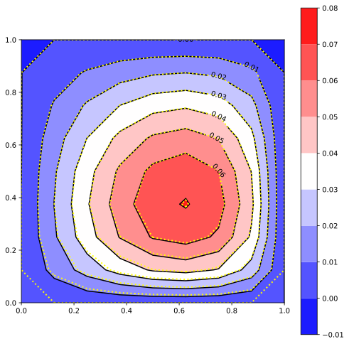 | 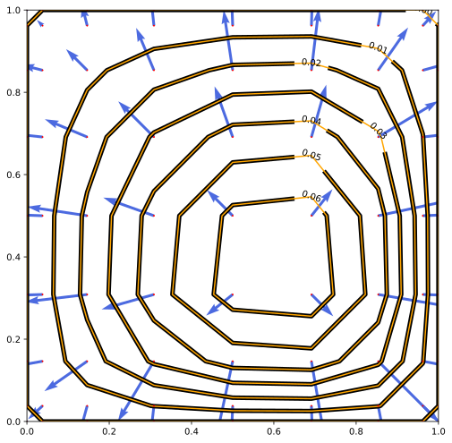 | 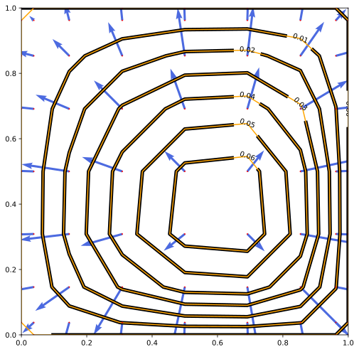 |

### Problem 02 — 2D Poisson `ϕ = y·sin(πx)`

On `[0,1]²` with Dirichlet BCs. Source: `s = −π²y·sin(πx)`. [test code](https://github.com/cpmech/russell/tree/main/russell_pde/tests/test_2d_prob02_fdm.rs)

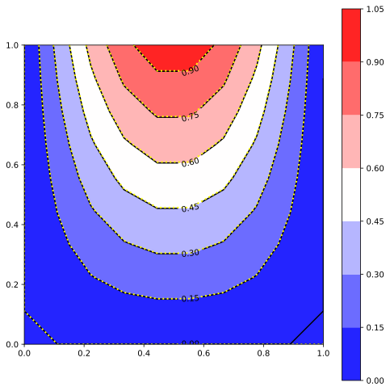

### Problem 03 — 2D Helmholtz/Poisson with mixed BCs

On `[0,1]²` with five combinations of Dirichlet/Neumann BCs (DDDD, NNDD, NDND, DNND, DDNN), tested with and without Helmholtz term. [test code (FDM)](https://github.com/cpmech/russell/tree/main/russell_pde/tests/test_2d_prob03_fdm.rs) · [test code (SPC)](https://github.com/cpmech/russell/tree/main/russell_pde/tests/test_2d_prob03_spc.rs)

| FDM (case a)                                           | FDM (case b)                                           |
| ------------------------------------------------------ | ------------------------------------------------------ |
| 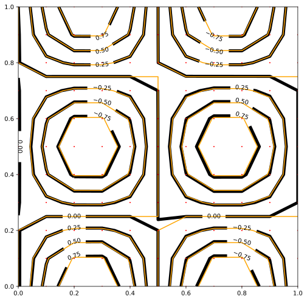 | 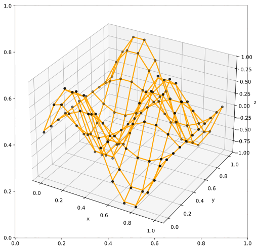 |

| SPC DDDD contour                                                           | SPC DDDD surface                                                                   |
| -------------------------------------------------------------------------- | ---------------------------------------------------------------------------------- |
| 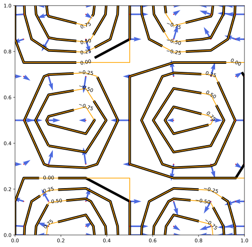 | 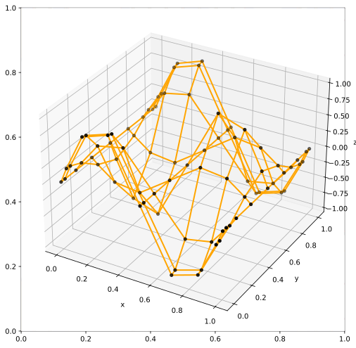 |

| SPC Map DDDD contour                                                               | SPC Map DDDD surface                                                                       |
| ---------------------------------------------------------------------------------- | ------------------------------------------------------------------------------------------ |
| 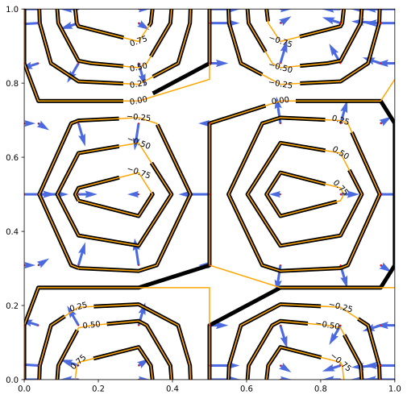 |  |

### Problem 04 — 2D Poisson on `[-1,1]²` (benchmark)

Laplace with source `s = 1` and homogeneous Dirichlet BCs. [test code (FDM)](https://github.com/cpmech/russell/tree/main/russell_pde/tests/test_2d_prob04_fdm.rs) · [test code (SPC)](https://github.com/cpmech/russell/tree/main/russell_pde/tests/test_2d_prob04_spc.rs)

| FDM                                                    | SPC                                                    |
| ------------------------------------------------------ | ------------------------------------------------------ |
| 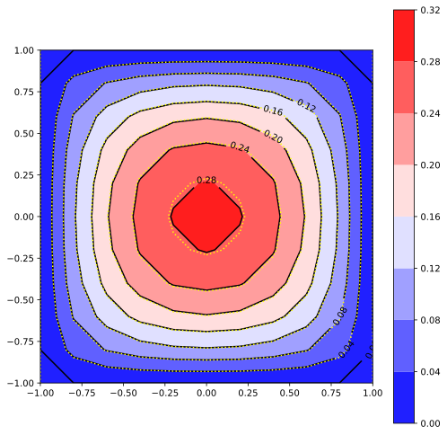 | 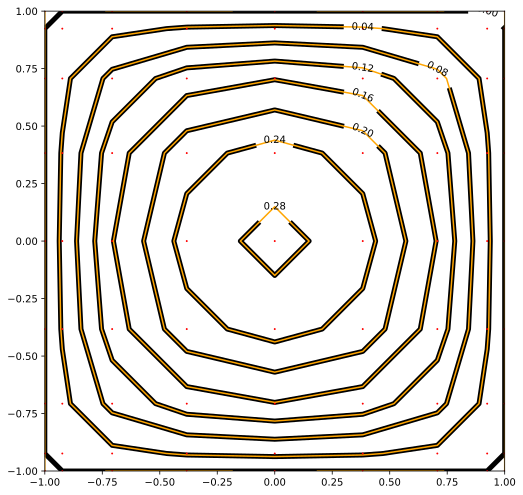 |

### Problem 05 — 2D Poisson polynomial

On `[-1,1]²`, source `s = −6x`, analytical `ϕ = 1 + x³`. Dirichlet on x-edges, Neumann on y-edges. [test code (FDM)](https://github.com/cpmech/russell/tree/main/russell_pde/tests/test_2d_prob05_fdm.rs) · [test code (SPC)](https://github.com/cpmech/russell/tree/main/russell_pde/tests/test_2d_prob05_spc.rs)

| FDM grid (a)                                           | FDM solution (b)                                       | SPC grid (a)                                           | SPC solution (b)                                       |
| ------------------------------------------------------ | ------------------------------------------------------ | ------------------------------------------------------ | ------------------------------------------------------ |
| 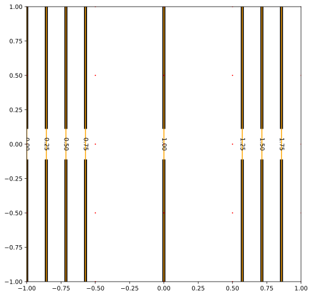 | 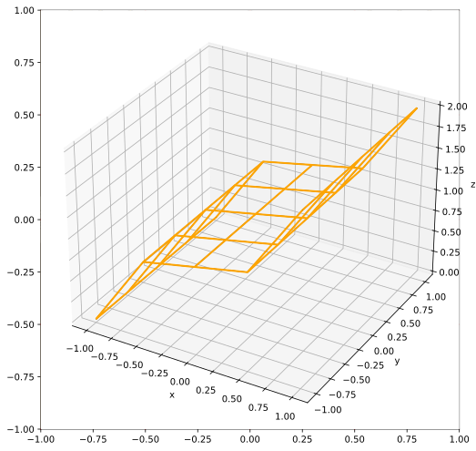 | 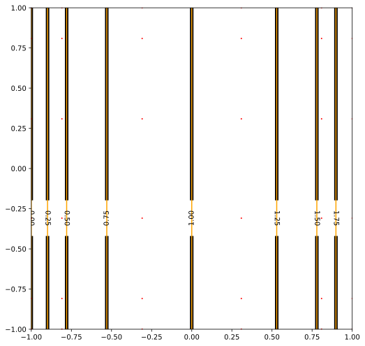 | 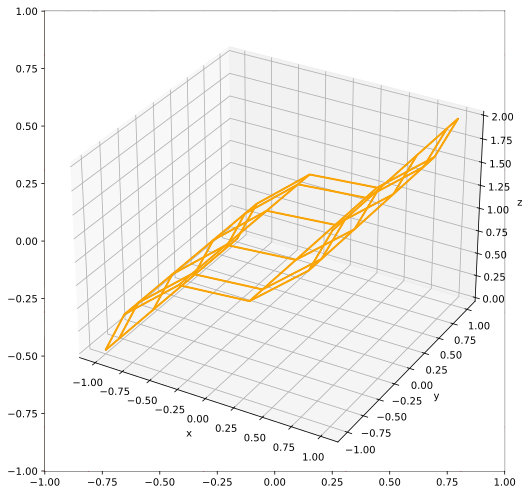 |

### Problem 06 — 2D Poisson `ϕ = tanh(1−x+y)`

On `[-1,1]²` with mixed Dirichlet/Neumann BCs. Source is the Laplacian of the analytical solution. [test code (FDM)](https://github.com/cpmech/russell/tree/main/russell_pde/tests/test_2d_prob06_fdm.rs) · [test code (SPC)](https://github.com/cpmech/russell/tree/main/russell_pde/tests/test_2d_prob06_spc.rs)

| FDM grid (a)                                           | FDM solution (b)                                       | SPC grid (a)                                           | SPC solution (b)                                       |
| ------------------------------------------------------ | ------------------------------------------------------ | ------------------------------------------------------ | ------------------------------------------------------ |
| 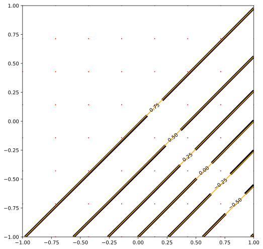 | 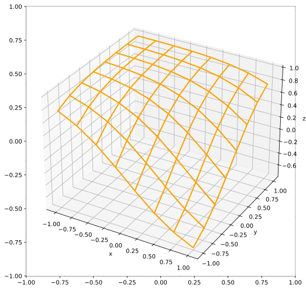 | 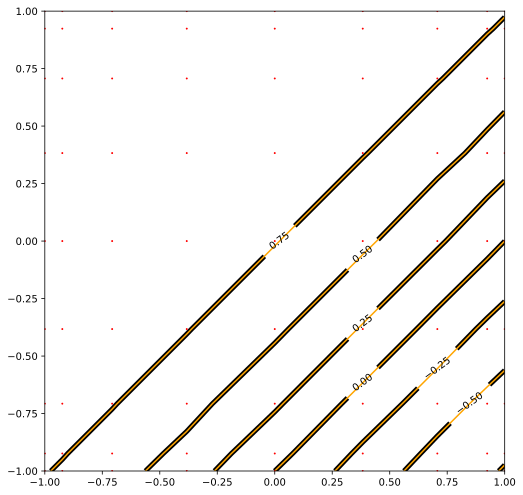 | 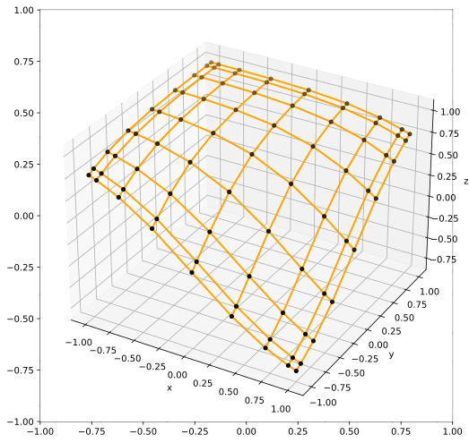 |

### Problem 08 — 2D Poisson on curvilinear domains

Kopriva benchmark 7.1.4: `∇²ϕ = −16·ln(r)/r²·sin(4θ)` on quarter-annulus or perforated lozenge. [test code](https://github.com/cpmech/russell/tree/main/russell_pde/tests/test_2d_prob08_spc.rs)

| Ring domain                                                  | Lozenge domain                                                     |
| ------------------------------------------------------------ | ------------------------------------------------------------------ |
| 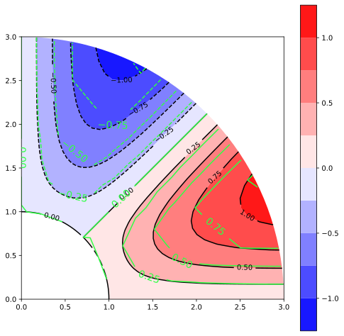 | 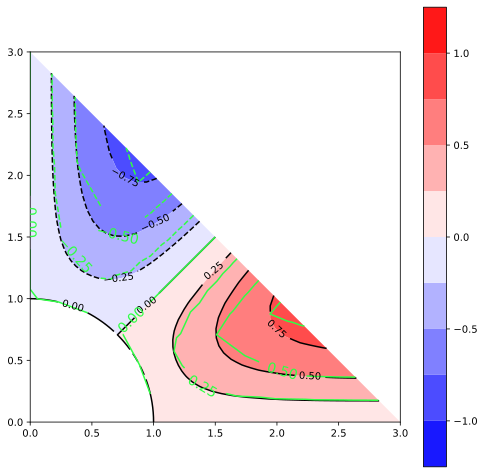 |

### Problem 09 — 2D Laplace (potential flow)

Kopriva benchmark 7.1.5: Potential flow around a cylinder on a half-ring domain. [test code](https://github.com/cpmech/russell/tree/main/russell_pde/tests/test_2d_prob09_spc.rs)

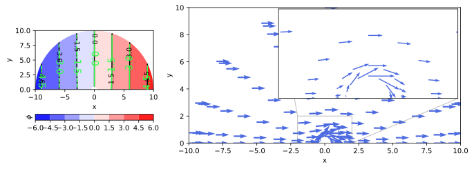

### 1D Problem 02 — Helmholtz heat conduction-convection

`−k·∂²ϕ/∂x² + α·ϕ = α·ϕ∞` on `[0,0.05]` with fixed left temperature (320°C) and insulated right. [test code (FDM)](https://github.com/cpmech/russell/tree/main/russell_pde/tests/test_1d_prob02_fdm.rs) · [test code (SPC)](https://github.com/cpmech/russell/tree/main/russell_pde/tests/test_1d_prob02_spc.rs)

| FDM                                                       | SPC                                                       |
| --------------------------------------------------------- | --------------------------------------------------------- |
| 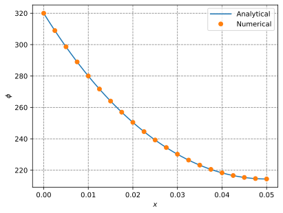 | 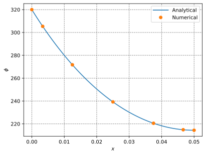 |

### 1D Problem 03 — Helmholtz with flux BC

`−∂²ϕ/∂x² + ϕ = x²` on `[0,1]` with fixed left (2°C) and flux input (−3 W) at right. [test code (FDM)](https://github.com/cpmech/russell/tree/main/russell_pde/tests/test_1d_prob03_fdm.rs) · [test code (SPC)](https://github.com/cpmech/russell/tree/main/russell_pde/tests/test_1d_prob03_spc.rs)

| FDM                                                       | SPC                                                       |
| --------------------------------------------------------- | --------------------------------------------------------- |
| 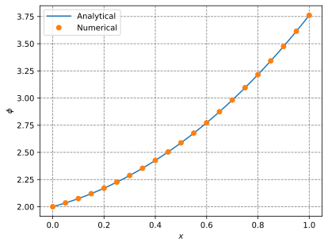 | 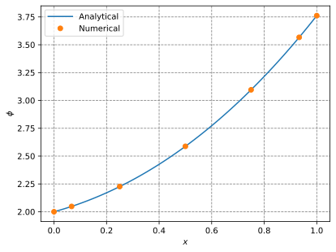 |

### 1D Problem 04 — Trefethen programs 13 and 33

Program 13: homogeneous Dirichlet; Program 33: Neumann left + Dirichlet right. PDE: `∂²ϕ/∂x² = exp(4x)` on `[−1,1]`. [test code](https://github.com/cpmech/russell/tree/main/russell_pde/tests/test_1d_prob04_spc.rs)

| Program 13 (Dirichlet)                                  | Program 33 (Neumann+Dirichlet)                          |
| ------------------------------------------------------- | ------------------------------------------------------- |
| 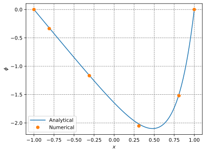 | 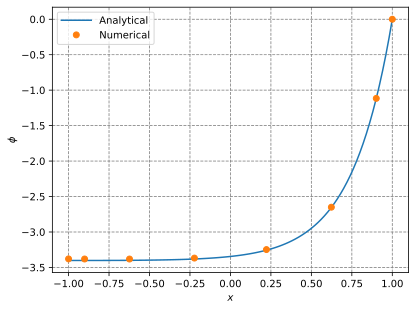 |

### 1D Problem 05 — Pozrikidis Helmholtz

`∂²ϕ/∂x² + β²·ϕ = 0` on `[0,L]` with Neumann left (g0=1) and Dirichlet right (ϕL=0.2). [test code (FDM)](https://github.com/cpmech/russell/tree/main/russell_pde/tests/test_1d_prob05_fdm.rs) · [test code (SPC)](https://github.com/cpmech/russell/tree/main/russell_pde/tests/test_1d_prob05_spc.rs)

| FDM                                                   | SPC                                                   |
| ----------------------------------------------------- | ----------------------------------------------------- |
| 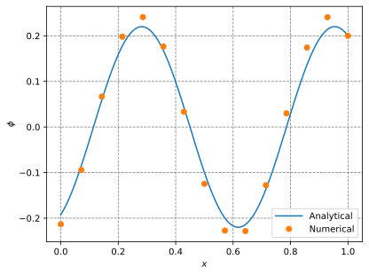 | 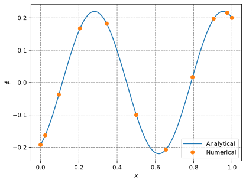 |

### Metrics — Curvilinear coordinates

Covariant and contravariant basis vectors on a curved quadrilateral domain. [test code](https://github.com/cpmech/russell/tree/main/russell_pde/tests/test_metrics2d.rs)

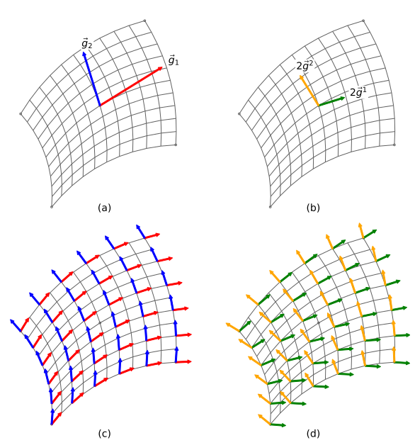
