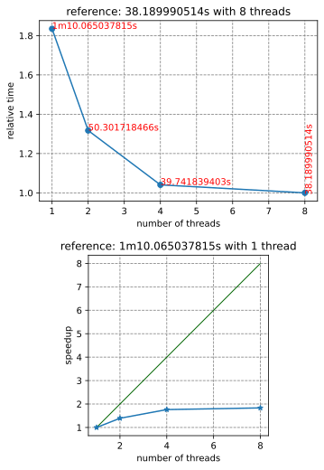
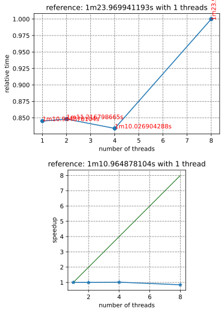
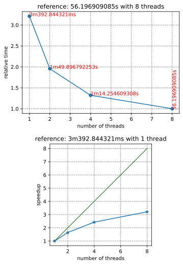
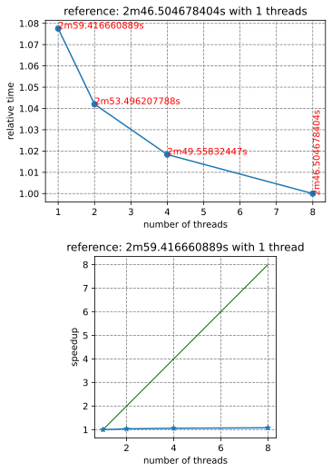
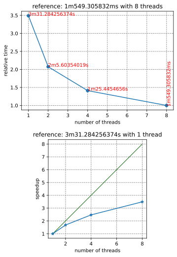
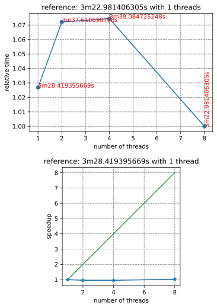

# Russell Sparse - Sparse matrix tools and solvers

_This crate is part of [Russell - Rust Scientific Library](https://github.com/cpmech/russell)_

## Contents

* [Introduction](#introduction)
* [Installation](#installation)
* [Setting Cargo.toml](#cargo)
* [Examples](#examples)
* [Tools](#tools)
* [MUMPS + OpenBLAS issue](#issues)
* [For developers](#developers)

## <a name="introduction"></a> Introduction

This crate implements tools for handling sparse matrices and functions to solve large sparse systems using the best libraries out there, such as [UMFPACK (recommended)](https://github.com/DrTimothyAldenDavis/SuiteSparse) and [MUMPS (for very large systems)](https://mumps-solver.org). Optionally, you may want to use the [Intel DSS solver](https://www.intel.com/content/www/us/en/docs/onemkl/developer-reference-c/2023-2/direct-sparse-solver-dss-interface-routines.html).

We have three storage formats for sparse matrices:

* COO: COOrdinates matrix, also known as a sparse triplet.
* CSC: Compressed Sparse Column matrix
* CSR: Compressed Sparse Row matrix

Additionally, to unify the handling of the above sparse matrix data structures, we have:

* SparseMatrix: Either a COO, CSC, or CSR matrix

The COO matrix is the best when we need to update the values of the matrix because it has easy access to the triples (i, j, aij). For instance, the repetitive access is the primary use case for codes based on the finite element method (FEM) for approximating partial differential equations. Moreover, the COO matrix allows storing duplicate entries; for example, the triple `(0, 0, 123.0)` can be stored as two triples `(0, 0, 100.0)` and `(0, 0, 23.0)`. Again, this is the primary need for FEM codes because of the so-called assembly process where elements add to the same positions in the "global stiffness" matrix. Nonetheless, the duplicate entries must be summed up at some stage for the linear solver (e.g., MUMPS, UMFPACK, and Intel DSS). These linear solvers also use the more memory-efficient storage formats CSC and CSR. See the [russell_sparse documentation](https://docs.rs/russell_sparse) for further information.

This library also provides functions to read and write Matrix Market files containing (huge) sparse matrices that can be used in performance benchmarking or other studies. The [read_matrix_market()] function reads a Matrix Market file and returns a [CooMatrix]. To write a Matrix Market file, we can use the function [write_matrix_market()], which takes a [SparseMatrix] and, thus, automatically convert COO to CSC or COO to CSR, also performing the sum of duplicates. The `write_matrix_market` also writes an SMAT file (almost like the Matrix Market format) without the header and with zero-based indices. The SMAT file can be given to the fantastic [Vismatrix](https://github.com/cpmech/vismatrix) tool to visualize the sparse matrix structure and values interactively; see the example below.


See the documentation for further information:

- [russell_sparse documentation](https://docs.rs/russell_sparse) - Contains the API reference and examples

## <a name="installation"></a> Installation

This crate depends on `russell_lab`, which, in turn, depends on an efficient BLAS library such as [OpenBLAS](https://github.com/OpenMathLib/OpenBLAS) and [Intel MKL](https://www.intel.com/content/www/us/en/docs/onemkl/developer-reference-c/2023-2/overview.html). This crate also depends on [UMFPACK](https://github.com/DrTimothyAldenDavis/SuiteSparse), [MUMPS](https://mumps-solver.org), and, optionally, on [Intel DSS](https://www.intel.com/content/www/us/en/docs/onemkl/developer-reference-c/2023-2/direct-sparse-solver-dss-interface-routines.html).

[The root README file presents the steps to install the required dependencies.](https://github.com/cpmech/russell)

## <a name="cargo"></a> Setting Cargo.toml

[](https://crates.io/crates/russell_sparse)

👆 Check the crate version and update your Cargo.toml accordingly:

```toml
[dependencies]
russell_sparse = "*"
```

## <a name="examples"></a> Examples

See also:

* [russell_sparse/examples](https://github.com/cpmech/russell/tree/main/russell_sparse/examples)

### Solve a tiny sparse linear system using UMFPACK

```rust
use russell_lab::{vec_approx_eq, Vector};
use russell_sparse::prelude::*;
use russell_sparse::StrError;

fn main() -> Result<(), StrError> {
    // constants
    let ndim = 3; // number of rows = number of columns
    let nnz = 5; // number of non-zero values

    // allocate solver
    let mut umfpack = SolverUMFPACK::new()?;

    // allocate the coefficient matrix
    let mut coo = SparseMatrix::new_coo(ndim, ndim, nnz, None, false)?;
    coo.put(0, 0, 0.2)?;
    coo.put(0, 1, 0.2)?;
    coo.put(1, 0, 0.5)?;
    coo.put(1, 1, -0.25)?;
    coo.put(2, 2, 0.25)?;

    // print matrix
    let a = coo.as_dense();
    let correct = "┌                   ┐\n\
                   │   0.2   0.2     0 │\n\
                   │   0.5 -0.25     0 │\n\
                   │     0     0  0.25 │\n\
                   └                   ┘";
    assert_eq!(format!("{}", a), correct);

    // call factorize
    umfpack.factorize(&mut coo, None)?;

    // allocate two right-hand side vectors
    let b = Vector::from(&[1.0, 1.0, 1.0]);

    // calculate the solution
    let mut x = Vector::new(ndim);
    umfpack.solve(&mut x, &coo, &b, false)?;
    let correct = vec![3.0, 2.0, 4.0];
    vec_approx_eq(x.as_data(), &correct, 1e-14);
    Ok(())
}
```

See [russell_sparse documentation](https://docs.rs/russell_sparse) for more examples.

See also the folder `examples`.

## <a name="tools"></a> Tools

This crate includes a tool named `solve_matrix_market` to study the performance of the available sparse solvers (currently MUMPS and UMFPACK).

`solve_matrix_market` reads a [Matrix Market file](https://math.nist.gov/MatrixMarket/formats.html) and solves the linear system:

```text
A ⋅ x = b
```

where the right-hand side (b) is a vector containing only ones.

The data directory contains an example of a Matrix Market file named `bfwb62.mtx`, and you may download more matrices from https://sparse.tamu.edu/

For example, run the command:

```bash
cargo run --release --bin solve_matrix_market -- ~/Downloads/matrix-market/bfwb62.mtx
```

Or

```bash
cargo run --release --bin solve_matrix_market -- --help
```

to see the options.

The default solver of `solve_matrix_market` is UMFPACK. To run with MUMPS, use the `--genie` (-g) flag:

```bash
cargo run --release --bin solve_matrix_market -- -g mumps -x -y ~/Downloads/matrix-market/bfwb62.mtx
```

The output looks like this:

```json
{
  "main": {
    "platform": "Russell",
    "blas_lib": "OpenBLAS",
    "solver": "MUMPS-local"
  },
  "matrix": {
    "name": "bfwb62",
    "nrow": 62,
    "ncol": 62,
    "nnz": 202,
    "symmetry": "Some(General(Lower))"
  },
  "requests": {
    "ordering": "Auto",
    "scaling": "Auto",
    "mumps_num_threads": 0
  },
  "output": {
    "effective_ordering": "Amf",
    "effective_scaling": "RowColIter",
    "openmp_num_threads": 32,
    "umfpack_strategy": "Unknown",
    "umfpack_rcond_estimate": 0.0
  },
  "determinant": {
    "mantissa": 0.0,
    "base": 2.0,
    "exponent": 0.0
  },
  "verify": {
    "max_abs_a": 0.0001,
    "max_abs_ax": 1.0000000000000004,
    "max_abs_diff": 5.551115123125783e-16,
    "relative_error": 5.550560067119071e-16
  },
  "time_human": {
    "read_matrix": "37.654µs",
    "factorize": "5.117697ms",
    "solve": "219.659µs",
    "total_f_and_s": "5.337356ms",
    "verify": "6.638µs"
  },
  "time_nanoseconds": {
    "read_matrix": 37654,
    "factorize": 5117697,
    "solve": 219659,
    "total_f_and_s": 5337356,
    "verify": 6638
  },
  "mumps_stats": {
    "inf_norm_a": 0.00021250000000000002,
    "inf_norm_x": 116611.5333525506,
    "scaled_residual": 2.1281557019905676e-17,
    "backward_error_omega1": 2.1420239141348292e-16,
    "backward_error_omega2": 0.0,
    "normalized_delta_x": 7.516512844561073e-16,
    "condition_number1": 3.50907046133377,
    "condition_number2": 1.0
  }
}
```

## <a name="issues"></a> MUMPS + OpenBLAS issue

We found that MUMPS + OpenBLAS enters an infinite loop when the number of OpenMP threads is left to be automatically set.

This issue has also been discovered by [1](#ref1), who states (page 72) _"We have observed that multi-threading of OpenBLAS library in MUMPS leads to multiple thread conflicts which sometimes result in significant slow-down of the solver."_

Therefore, we have to take one of the two approaches:

* If fixing the number of OpenMP threads for MUMPS, set the number of OpenMP threads for OpenBLAS to 1
* If fixing the number of OpenMP threads for OpenBLAS, set the number of OpenMP threads for MUMPS to 1 

This issue has **not** been noticed with MUMPS + Intel MKL.

### References

1. <a name="ref1"></a> Dorozhinskii R (2019) [Configuration of a linear solver for linearly implicit time integration and efficient data transfer in parallel thermo-hydraulic computations](https://mediatum.ub.tum.de/doc/1486743/1486743.pdf). _Master's Thesis in Computational Science and Engineering._ Department of Informatics Technical University of Munich.

### Performance of MUMPS with Intel MKL and Flan_1565 matrix

We ran `solve_matrix_market` with MUMPS and the [Flan_1565 matrix](https://sparse.tamu.edu/Janna/Flan_1565). The following combinations regarding the number of OpenMP threads have been investigated:

1. Fixed MUMPS number of threads given to `ICNTL(16)` with varying OpenBLAS/Intel MKL threads
2. Fixed OpenBLAS/Intel MKL threads with varying number of threads given to `ICNTL(16)`

The results are shown below and illustrated in the following figures:

```text
... intel-mkl ... varying blas threads ...
nt = 1  time = 1m10.065037815s   error = 2.37e-8
nt = 2  time = 50.301718466s     error = 2.06e-8
nt = 4  time = 39.741839403s     error = 2.32e-8
nt = 8  time = 38.189990514s     error = 2.41e-8
... openblas-compiled ... varying blas threads ...
nt = 1  time = 3m392.844321ms    error = 1.30e-8
nt = 2  time = 1m49.896792253s   error = 1.13e-8
nt = 4  time = 1m14.254609308s   error = 1.07e-8
nt = 8  time = 56.196909085s     error = 1.08e-8
... openblas-debian ... varying blas threads ...
nt = 1  time = 3m31.284256374s   error = 1.07e-8
nt = 2  time = 2m5.60354019s     error = 1.16e-8
nt = 4  time = 1m25.4454656s     error = 1.12e-8
nt = 8  time = 1m549.305832ms    error = 1.12e-8
... intel-mkl ... varying mumps threads ...
nt = 1  time = 1m10.964878104s   error = 2.37e-8
nt = 2  time = 1m11.216798665s   error = 2.37e-8
nt = 4  time = 1m10.026904288s   error = 2.37e-8
nt = 8  time = 1m23.969941193s   error = 2.37e-8
... openblas-compiled ... varying mumps threads ...
nt = 1  time = 2m59.416660889s   error = 1.30e-8
nt = 2  time = 2m53.496207788s   error = 1.30e-8
nt = 4  time = 2m49.55832447s    error = 1.30e-8
nt = 8  time = 2m46.504678404s   error = 1.30e-8
... openblas-debian ... varying mumps threads ...
nt = 1  time = 3m28.419395669s   error = 1.21e-8
nt = 2  time = 3m37.610690768s   error = 1.13e-8
nt = 4  time = 3m38.084725248s   error = 1.09e-8
nt = 8  time = 3m22.981406305s   error = 1.03e-8
```

#### Intel MKL with varying BLAS threads



#### Intel MKL with varying MUMPS-ICNTL(16) threads



#### Locally compiled MUMPS with varying BLAS threads



#### Locally compiled MUMPS with varying MUMPS-ICNTL(16) threads



#### Debian MUMPS with varying BLAS threads



#### Debian MUMPS with varying MUMPS-ICNTL(16) threads



#### Conclusions

1. The fastest run happened with Intel MKL and varying BLAS threads while keeping MUMPS-ICNTL(16) constant and equal to 1.
2. There is no speedup by changing MUMPS-ICNTL(16).
3. The locally compiled compiled library is slightly faster than the one provided by Debian.
4. The speedup with the best run is much worse than the ideal! With 8 threads, we cannot even get a 2x speedup.

The code to analyze the results and generate the figures is available here: [benchmark-russell-sparse](https://github.com/cpmech/benchmark-russell-sparse).

## <a name="developers"></a> For developers

* The `c_code` directory contains a thin wrapper to the sparse solvers (MUMPS, UMFPACK, and Intel DSS)
* The `build.rs` file uses the crate `cc` to build the C-wrappers
* The `zscripts` directory also contains following:
    * `memcheck.bash`: Checks for memory leaks on the C-code using Valgrind
    * `run-examples`: Runs all examples in the `examples` directory
    * `run-solve-matrix-market.bash`: Runs the solve-matrix-market tool from the `bin` directory
